

八、&nbsp;&nbsp;&nbsp;&nbsp;&nbsp;&nbsp;&nbsp;
八、&nbsp;&nbsp;&nbsp; 曲面的基本公式与基本方程

&nbsp;&nbsp;&nbsp;&nbsp;&nbsp;&nbsp; [高斯公式与外因格尔登公式]&nbsp;
设曲面的参数方程为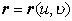，在曲面上每点<i>M</i>取三个不共面的矢量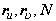，由这三个矢量组成的三面形称为曲面的活动标架或伴随三面形；要注意，在这里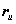和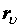不互相垂直，但它们都在切面上而垂直于法线单位矢量<b><i>N</i></b>.

<table cellspacing=0 cellpadding=0 hspace=0 vspace=0 align=left>
 <tr>
  <td valign=top align=left style='padding-top:0mm;padding-right:9.05pt;
  padding-bottom:0mm;padding-left:9.05pt'>
  

  
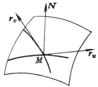

  
&nbsp;&nbsp;&nbsp;&nbsp;&nbsp;&nbsp; 图&nbsp; 7.27

  

  </td>
 </tr>
</table>

&nbsp;&nbsp;&nbsp;&nbsp;&nbsp;&nbsp; 可以把关于<i>u</i>，的偏导数表示为下列形式的线性组合：

<pre style='text-align:right' align=right>&nbsp;&nbsp;&nbsp;&nbsp;&nbsp;&nbsp;&nbsp;&nbsp;&nbsp; 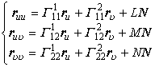&nbsp;&nbsp;&nbsp;&nbsp;&nbsp;&nbsp;&nbsp;&nbsp;&nbsp;&nbsp;&nbsp;&nbsp;&nbsp;&nbsp;&nbsp;&nbsp;&nbsp;&nbsp;&nbsp;&nbsp;&nbsp;&nbsp;&nbsp;&nbsp;&nbsp;&nbsp;&nbsp;&nbsp;（1）</pre><pre style='text-align:
right' align=right>&nbsp;&nbsp;&nbsp;&nbsp;&nbsp;&nbsp;&nbsp;&nbsp;&nbsp; 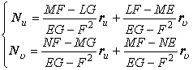&nbsp;&nbsp;&nbsp;&nbsp;&nbsp;&nbsp;&nbsp;&nbsp;&nbsp;&nbsp;&nbsp;&nbsp;&nbsp;&nbsp;&nbsp;&nbsp;&nbsp;&nbsp;&nbsp;&nbsp;&nbsp;（2）</pre>

式中<i>E</i>，<i>F</i>，<i>G</i>和<i>L</i>，<i>M</i>，<i>N</i>分别为曲面的第一和第二基本量；六个系数称为第一基本二次型的第二类克里斯托弗尔记号，它们的表达式是

<pre>&nbsp;</pre><pre>&nbsp;&nbsp;&nbsp;&nbsp;&nbsp;&nbsp;&nbsp; &nbsp;&nbsp;&nbsp;&nbsp;&nbsp;&nbsp;&nbsp;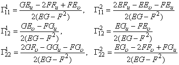</pre>

方程组（1）称为曲面的偏微分方程，又称为高斯公式；方程组（2）称为外因格尔登公式；（1），（2）合称为曲面的基本公式，这些公式的特点是，把矢量的导数用矢量本身的线性组合来表达，其系数仅与曲面的第一、第二基本量有关.

&nbsp;&nbsp;&nbsp;&nbsp;&nbsp;&nbsp; [高斯方程与柯达奇方程]&nbsp;
方程组（1）的可积条件为

<pre style='text-align:center' align=center>&nbsp;&nbsp;&nbsp;&nbsp;&nbsp;&nbsp;&nbsp;&nbsp;&nbsp;&nbsp;&nbsp;&nbsp;&nbsp;&nbsp;&nbsp;&nbsp;&nbsp; 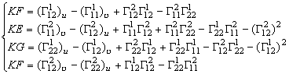&nbsp;&nbsp;&nbsp;&nbsp;&nbsp;&nbsp;&nbsp;&nbsp;&nbsp;&nbsp;&nbsp;&nbsp;&nbsp;&nbsp;（3）</pre>

和&nbsp;&nbsp;&nbsp;&nbsp;&nbsp;&nbsp;&nbsp;&nbsp;&nbsp; 

<pre style='text-align:center' align=center>&nbsp;&nbsp;&nbsp;&nbsp;&nbsp;&nbsp;&nbsp;&nbsp;&nbsp;&nbsp; 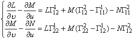&nbsp;&nbsp;&nbsp;&nbsp;&nbsp;&nbsp;&nbsp;&nbsp;&nbsp;&nbsp;&nbsp;&nbsp;&nbsp;&nbsp;&nbsp;&nbsp;&nbsp;&nbsp;&nbsp;&nbsp;&nbsp;&nbsp;&nbsp;&nbsp;&nbsp;（4）</pre>

&nbsp;&nbsp;&nbsp;&nbsp;&nbsp;&nbsp; 方程组（2）的可积条件是（4）.方程组（4）成为柯达奇方程.

从（3）可以得到下列定理：

&nbsp;&nbsp;&nbsp;&nbsp;&nbsp;&nbsp; 1 、高斯定理&nbsp; 曲面的总曲率<i>K</i>可以用第一基本量和它们的一阶，二阶偏导数来表示；因而总曲率是曲面的一个等距不变量.

&nbsp;&nbsp;&nbsp;&nbsp;&nbsp;&nbsp; 2、在等距对应下，曲面的对应点必有相同的总曲率.

&nbsp;&nbsp;&nbsp;&nbsp;&nbsp;&nbsp; 这个重要结果表明，总曲率不同的两个曲面具有很大的差别性，即使允许曲面经过任意的弯曲，也不能使这两个曲面互相贴合.

&nbsp;&nbsp;&nbsp;&nbsp;&nbsp;&nbsp; 总曲率<i>K</i>以<i>E</i>，<i>F</i>，<i>G</i>的表达式称为高斯方程，与柯达奇方程合并起来称为曲面的基本方程.

&nbsp;&nbsp;&nbsp;&nbsp;&nbsp;&nbsp; [波恩涅定理]&nbsp; 给定任意两个二次型

<pre align=center>&nbsp;</pre><pre>&nbsp;&nbsp;&nbsp;&nbsp;&nbsp;&nbsp;&nbsp;&nbsp;&nbsp;&nbsp;&nbsp;&nbsp;&nbsp;&nbsp;&nbsp;&nbsp;&nbsp;&nbsp;&nbsp;&nbsp;&nbsp;&nbsp;&nbsp;&nbsp;&nbsp;&nbsp;&nbsp;&nbsp; 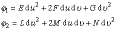</pre>

其中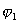是正定的，假定和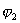的系数满足高斯方程和柯达奇方程，则除了空间位置的差别外，唯一地存在一个曲面，以和分别作为它的第一和第二基本二次型.

