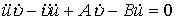

<table cellspacing=0 cellpadding=0 hspace=0 vspace=0 align=left>
 <tr>
  <td valign=top align=left style='padding-top:0mm;padding-right:9.05pt;
  padding-bottom:0mm;padding-left:9.05pt'>
  

  

  
图 7.28

  

  </td>
 </tr>
</table>

九、曲面曲线的测地曲率、测地线与测地坐标

&nbsp;&nbsp;&nbsp;&nbsp;&nbsp;&nbsp; [测地曲率与贝尔特拉米公式]&nbsp;
设<i>M</i>为曲面<i>S</i>上一点，<i>C</i>为<i>S</i>上通过点<i>M</i>的一条曲线，为<i>S</i>在<i>M</i>的切面，为<i>C</i>在上的正射影，则在<i>M</i>的曲率称为<i>C</i>在<i>M</i>的测地曲率，记作.

&nbsp;&nbsp;&nbsp;&nbsp;&nbsp;&nbsp; 设曲面<i>S</i>的参数方程为，曲面曲线<i>C</i>的方程为，则<i>C</i>的测地曲率

<pre style='text-align:center;layout-grid-mode:char' align=center>&nbsp;&nbsp;&nbsp;&nbsp;&nbsp;&nbsp;&nbsp;&nbsp;&nbsp;&nbsp;&nbsp;&nbsp;&nbsp;&nbsp;&nbsp;&nbsp;&nbsp;&nbsp; （1）</pre>

式中&nbsp;&nbsp;&nbsp;&nbsp;&nbsp;&nbsp;&nbsp;&nbsp;&nbsp;&nbsp;&nbsp;&nbsp;&nbsp;&nbsp;&nbsp;&nbsp;&nbsp;&nbsp;
&nbsp;&nbsp;&nbsp;&nbsp;&nbsp;

如果曲线<i>C</i>以弧长<i>s</i>为参数，则

<pre style='text-align:right;layout-grid-mode:char' align=right>&nbsp;&nbsp;&nbsp;&nbsp;&nbsp; &nbsp;&nbsp;&nbsp;&nbsp;&nbsp;&nbsp;&nbsp;&nbsp;&nbsp;&nbsp;&nbsp;&nbsp;&nbsp;&nbsp;&nbsp;&nbsp;&nbsp;&nbsp;&nbsp;&nbsp;&nbsp;&nbsp;&nbsp;&nbsp;&nbsp;&nbsp;&nbsp;&nbsp;&nbsp;&nbsp;&nbsp;&nbsp;&nbsp;&nbsp;&nbsp;&nbsp;&nbsp;&nbsp;&nbsp;&nbsp;（2）</pre>

式中&nbsp;&nbsp;&nbsp;&nbsp;&nbsp;&nbsp;&nbsp;&nbsp;&nbsp;&nbsp;&nbsp;&nbsp;&nbsp;&nbsp;&nbsp;&nbsp;&nbsp;&nbsp;&nbsp;&nbsp;&nbsp;&nbsp;

公式（1）和（2）称为测地曲率的贝尔特拉米公式.

&nbsp;&nbsp;&nbsp;&nbsp;&nbsp;&nbsp; 测地曲率是等距不变量.

&nbsp;&nbsp;&nbsp;&nbsp;&nbsp;&nbsp; [测地线]&nbsp; 如果一条曲面曲线<i>C</i>上每点的测地曲率都等于零，则称<i>C</i>为曲面上的一条测地线.

&nbsp;&nbsp;&nbsp;&nbsp;&nbsp;&nbsp; 测地线的微分方程是

<pre>&nbsp;&nbsp;&nbsp; &nbsp;</pre><pre>&nbsp;&nbsp;&nbsp;&nbsp;&nbsp;&nbsp;&nbsp;&nbsp;&nbsp;&nbsp;&nbsp;&nbsp;&nbsp;&nbsp;&nbsp;&nbsp;&nbsp;&nbsp;&nbsp;&nbsp;&nbsp;&nbsp;&nbsp;&nbsp;&nbsp;&nbsp;&nbsp;&nbsp;&nbsp;&nbsp;&nbsp;&nbsp;&nbsp;&nbsp;</pre>

 
也可写为

<pre>&nbsp;&nbsp;&nbsp;&nbsp;&nbsp;&nbsp;&nbsp;&nbsp;&nbsp;&nbsp;&nbsp;&nbsp;&nbsp;&nbsp;&nbsp;&nbsp;&nbsp;&nbsp;&nbsp;&nbsp;&nbsp;&nbsp;&nbsp;&nbsp;&nbsp;&nbsp;&nbsp;&nbsp;&nbsp;&nbsp;&nbsp;&nbsp;&nbsp; </pre>

 
或

<pre>&nbsp;&nbsp;&nbsp;&nbsp;&nbsp;&nbsp;&nbsp;&nbsp;&nbsp;&nbsp;&nbsp;&nbsp;&nbsp;&nbsp;&nbsp;&nbsp;&nbsp; </pre>

&nbsp;&nbsp;&nbsp;&nbsp;&nbsp;&nbsp; 对于曲面上的测地线的微分方程为

<pre>&nbsp;&nbsp;&nbsp;&nbsp; </pre><pre>&nbsp;</pre><pre>&nbsp;&nbsp;&nbsp;&nbsp; &nbsp;&nbsp; </pre>

 
式中<i>p</i>，<i>q</i>，<i>r</i>，<i>s</i>，<i>t</i>&nbsp; 见前表.

测地线具有性质：

&nbsp;&nbsp;&nbsp;&nbsp;&nbsp;&nbsp; 1、测地线在每点<i>M</i>的曲率小于与它在<i>M</i>相切的任何曲线在<i>M</i>的曲率.

2、如果把曲面曲线<i>C</i>的可展曲面变成平面时，那末只有测地线所对应的曲线是直线.

3、一条曲面曲线<i>C</i>是测地线的充分必要条件是：在<i>C</i>上每点的主法线与该点的曲面法线重合，即<i>C</i>的密切面包含曲面法线.

4、如果两个曲面沿一共同曲线<i>C</i>相切，假设<i>C</i>是其中一个曲面的测地线，则<i>C</i>也是另一个曲面的测地线.

5、通过曲面上每点沿每一方向有一条且有一条测地线.

6、在充分小的邻域里，测地线是短程线，即连接曲面上两个邻近点的一切曲面曲线中，测地线的长度最短.

&nbsp;&nbsp;&nbsp;&nbsp;&nbsp;&nbsp; [测地坐标]&nbsp; 若取坐标线<i>u</i>=常数为测地线<i></i>=常数的正交轨线，则称为测地坐标，这族正交轨线称为测地平行线，这时

<pre>&nbsp;</pre><pre>&nbsp;&nbsp;&nbsp;&nbsp;&nbsp;&nbsp;&nbsp;&nbsp;&nbsp; &nbsp;&nbsp;&nbsp;&nbsp;&nbsp;&nbsp;&nbsp;&nbsp;&nbsp;&nbsp;&nbsp;&nbsp;&nbsp;&nbsp;&nbsp;&nbsp;&nbsp;</pre>

以测地坐标表示的总曲率为

<pre>&nbsp;</pre><pre>&nbsp;&nbsp;&nbsp;&nbsp;&nbsp;&nbsp;&nbsp;&nbsp;&nbsp;&nbsp;&nbsp;&nbsp;&nbsp;&nbsp;&nbsp;&nbsp;&nbsp;&nbsp;&nbsp;&nbsp;&nbsp;&nbsp;&nbsp;&nbsp;&nbsp;&nbsp; </pre>

若测地线<i></i>=常数交于一点<i>O</i>，<i></i>表示测地线<i></i>和测地线的交角，则称为测地极坐标，这时的测地平行线称为测地圆，其半径等于<i>u</i>.

&nbsp;&nbsp;&nbsp;&nbsp;&nbsp;&nbsp; [高涅-波恩涅公式]&nbsp; 设<i>G</i>为曲面<i>S</i>上一个单连通区域，<i>G</i>的边界<i>C</i>是一条逐段光滑并无自交点的闭曲线，其运行的方向是使<i>G</i>总是在它的左侧.

<table cellspacing=0 cellpadding=0 hspace=0 vspace=0 align=left>
 <tr>
  <td valign=top align=left style='padding-top:0mm;padding-right:9.05pt;
  padding-bottom:0mm;padding-left:9.05pt'>
  

  

  
图 7.29

  

  </td>
 </tr>
</table>

&nbsp;&nbsp;&nbsp;&nbsp;&nbsp;&nbsp; 设表示曲线<i>C</i>上任一点的测地曲率，为曲面面积元素，分别为<i>C</i>的角点的内角（图），则在<i>G</i>上的二重积分

<pre>&nbsp;</pre><pre>&nbsp;&nbsp;&nbsp;&nbsp;&nbsp;&nbsp;&nbsp;&nbsp;&nbsp;&nbsp;&nbsp;&nbsp;&nbsp;&nbsp;&nbsp;&nbsp; </pre>

这称为高斯-波恩涅公式.特别

&nbsp;&nbsp;&nbsp;&nbsp;&nbsp;&nbsp; 1、如果<i>C</i>是一条正则曲线（即无角点），这时，则

<pre>&nbsp;</pre><pre>&nbsp;&nbsp;&nbsp;&nbsp;&nbsp;&nbsp;&nbsp;&nbsp;&nbsp;&nbsp;&nbsp;&nbsp;&nbsp;&nbsp;&nbsp;&nbsp; </pre>

&nbsp;&nbsp;&nbsp;&nbsp;&nbsp;&nbsp; 2、如果<i>C</i>是由<i>n</i>条测地线组成的测地多角形，这时（因=0）

<pre>&nbsp;</pre><pre>&nbsp;&nbsp;&nbsp;&nbsp;&nbsp;&nbsp;&nbsp;&nbsp;&nbsp; &nbsp;&nbsp;&nbsp;&nbsp;&nbsp;&nbsp;&nbsp;&nbsp;</pre>

&nbsp;&nbsp;&nbsp;&nbsp;&nbsp;&nbsp; 当时，<i>C</i>为三条测地线组成的测地三角形，这时

<pre>&nbsp;</pre><pre>&nbsp;&nbsp;&nbsp;&nbsp;&nbsp;&nbsp;&nbsp;&nbsp;&nbsp;&nbsp;&nbsp;&nbsp;&nbsp;&nbsp;&nbsp;&nbsp;&nbsp;&nbsp;&nbsp;&nbsp;&nbsp;&nbsp; </pre>

因次，的曲面上的测地三角形三内角之和大于；的曲面上测地三角形三内角之和小于；的曲面上测地三角形三内角之和等于.

