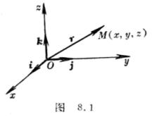

第八章&nbsp;&nbsp;&nbsp;&nbsp;&nbsp;&nbsp;&nbsp;&nbsp;&nbsp;&nbsp;&nbsp;&nbsp;&nbsp;&nbsp;&nbsp;&nbsp;&nbsp;&nbsp;&nbsp;&nbsp;&nbsp;&nbsp;&nbsp;&nbsp;
<b>第八章</b><b>&nbsp;&nbsp;&nbsp;&nbsp;&nbsp;&nbsp; </b><b>&nbsp;&nbsp;</b><b>矢量算法与场论初步·张量</b>

<b>算法与黎曼几何初步</b>

&nbsp;&nbsp;&nbsp; 本章包括两个部分.&nbsp;&nbsp;&nbsp;&nbsp; 

第一部分是矢量代数、矢量分析及其在场论中的应用.主要内容有：矢量的概念、矢量的算法与矢量的坐标表示；以矢量作为工具介绍了场论中的一些基本内容.例如梯度、散度与旋度等基本概念及其计算公式和性质，以及它们在不同坐标系中的表达式；叙述了矢量的积分定理(高斯公式、斯托克斯公式和格林公式)；引进了仿射坐标系，阐述了三维空间中的协变矢量和逆变矢量，同时把这些概念推广到<i>n</i>维空间中去.

第二部分是张量代数、张量分析及其在黎曼几何中的应用.介绍了张量的概念和一些张量算法，然后以张量作为工具来阐述仿射联络空间的基本内容.例如，仿射联络、矢量和张量的平行移动，及协变微分法与自平行曲线等；并在<i>n</i>维空间中引进度量的概念，来定义黎曼空间，从而由具有特殊条件的仿射联络引出了黎曼联络，于是有关仿射联络空间中的一些性质可以搬到黎曼空间中来.可是，因为黎曼空间是由度量定义的，所以与度量有关的一些性质在仿射联络空间中是没有的.

<pre>&nbsp;&nbsp;&nbsp;&nbsp;&nbsp;&nbsp;&nbsp;&nbsp;&nbsp;&nbsp;&nbsp;&nbsp;&nbsp;&nbsp;&nbsp;&nbsp;&nbsp;&nbsp;&nbsp;&nbsp;&nbsp;&nbsp;&nbsp;&nbsp;&nbsp;&nbsp;&nbsp;&nbsp;&nbsp;&nbsp; §<b>1</b>&nbsp;&nbsp; <b>矢量算法</b></pre>

一、&nbsp;&nbsp; 一、 矢量代数

&nbsp;&nbsp;&nbsp;
［矢量概念］&nbsp; 只有大小的量称为标量(也称为数量或纯量).例如温度、时间、质量、面积、能量等都是标量.

&nbsp;&nbsp;&nbsp; 具有大小和方向的量称为矢量(也称为向量).例如力、速度、力矩、加速度、角速度、动量等都是矢量．

&nbsp;&nbsp;&nbsp; 在几何中的有向线段就是一个直观的矢量.通常用空间中的有向线段<i>AB</i>来表示矢量.用长度表示大小，用端点的顺序<i>A</i><i>B</i>表示方向.<i>A</i>称为始点，<i>B</i>称为终点，这个矢量记作，或用黑正体字母<b><i>a</i></b>表示.矢量的大小(或长度)的数值称为它的模或绝对值，用记号或|<b><i>a</i>|</b>表示.

&nbsp;&nbsp;&nbsp; 矢量按其效能可分成三种基本类型：

&nbsp;&nbsp;&nbsp; 具有大小和方向而无特定位置的矢量称为自由矢量.例如力偶.

&nbsp;&nbsp;&nbsp; 沿直线作用的矢量称为滑动矢量.例如作用于刚体的力.

&nbsp;&nbsp;&nbsp; 作用于一点的矢量称为束缚矢量.例如电场强度.

&nbsp;&nbsp;&nbsp; 在这里所讨论的矢量，除特别说明外，都指自由矢量，就是说，所有方向相同，长度相等的矢量，不管始点如何，都看作相同的矢量.

&nbsp;&nbsp;&nbsp; 模等于1的矢量称为单位矢量.

&nbsp;&nbsp;&nbsp; 模等于零的矢量称为零矢量，记作<b>０</b>，它是始点和终点重合的矢量.

&nbsp;&nbsp;&nbsp; 模与矢量<b></b>的模相等而方向相反的矢量称为<b><i>a</i></b>的负矢量，记作-<b><i>a</i></b>.

始点与原点<i>O</i>重合而终点位于一点<i>M</i>的矢

量(图8.1)称为点<i>M</i>的矢径(或向径)，记作

<b><i>r</i></b><b>，</b>原点称为极点.如果<i>M</i>的直角坐标为<i>x</i>，<i>y</i>，<i>z </i>,

则有

&nbsp;&nbsp;&nbsp;&nbsp;&nbsp;&nbsp;&nbsp;
<b><i>r</i></b>＝＝(<i>x</i>，<i>y</i>，<i>z</i>)＝<i>x<b>i</b></i>＋<i>y<b>j</b></i>＋<i>z<b>k</b></i>

式中<b><i>i</i></b><b>，<i>j</i></b><b>，<i>k</i></b>分别为<i>x</i>轴，<i>y</i>轴，<i>z</i>轴的正向单位

矢量，称为坐标单位矢量(或基本矢量).

［矢量的基本公式］

<table class=MsoNormalTable border=0 cellspacing=0 cellpadding=0
 style='border-collapse:collapse'>
 <tr style='height:15.35pt'>
  <td width=194 valign=top style='width:145.4pt;border:solid windowtext 1.0pt;
  border-left:none;padding:0mm 1.4pt 0mm 1.4pt;height:15.35pt'>
  
&nbsp;&nbsp;&nbsp;&nbsp;&nbsp;
  名&nbsp;&nbsp;&nbsp; 称

  </td>
  <td width=232 valign=top style='width:174.0pt;border:solid windowtext 1.0pt;
  border-left:none;padding:0mm 1.4pt 0mm 1.4pt;height:15.35pt'>
  
&nbsp;&nbsp;&nbsp;&nbsp;&nbsp;&nbsp;&nbsp;&nbsp;
  公&nbsp;&nbsp;&nbsp; 式

  </td>
  <td width=208 valign=top style='width:156.0pt;border:none;border-top:solid windowtext 1.0pt;
  padding:0mm 1.4pt 0mm 1.4pt;height:15.35pt'>
  
&nbsp;&nbsp;&nbsp;&nbsp;&nbsp;&nbsp;&nbsp;
  图&nbsp;&nbsp;&nbsp; 形

  </td>
 </tr>
 <tr>
  <td width=194 valign=top style='width:145.4pt;border-top:none;border-left:
  none;border-bottom:solid windowtext 1.0pt;border-right:solid windowtext 1.0pt;
  padding:0mm 1.4pt 0mm 1.4pt'>
  
&nbsp; 矢量<b><i>a</i></b>的坐标表示

  
&nbsp; 坐标单位矢量<b><i>i</i></b>，<b><i>j</i></b>，<b><i>k</i></b>

  
的坐标表示

  
&nbsp; 零矢量的坐标表示

  
&nbsp; <b><i>a</i></b>的长度(或模)

  
&nbsp; <b><i>a</i></b>的方向余弦(,,

  
为<b><i>a</i></b>的方向角)

  
&nbsp; 矢量(两端点 <i>A</i>，

  
<i>Ｂ</i>的坐标分别为( <i>ax</i>,<i>ay</i>,<i>az</i>),

  
(<i>bx</i>,<i>by</i>,<i>bz</i>)

  </td>
  <td width=232 valign=top style='width:174.0pt;border-top:none;border-left:
  none;border-bottom:solid windowtext 1.0pt;border-right:solid windowtext 1.0pt;
  padding:0mm 1.4pt 0mm 1.4pt'>
  
&nbsp; <b><i>a</i></b>＝<i>ax</i><b><i>i</i></b>＋<i>a</i><i>y</i><b><i>j</i></b>＋<i>az</i><b><i>k</i></b>＝(<i>a</i><i>x</i><b>,</b><i> a</i><i>y</i><b>,</b><i> a</i><i>z</i>) 

  
&nbsp; <b><i>i</i></b>＝(１，０，０)

  
&nbsp; <b><i>j</i></b>＝(０，１，０)

  
&nbsp; <b><i>k</i></b>＝(０，０，１)

  
&nbsp; <b>0</b>＝(０，０，０)(<b>0</b>无方向)

  
&nbsp; = <i>a</i>＝

  
&nbsp; 

  
&nbsp; ＝(<i>bx</i>－<i>ax</i>)<b><i>i</i></b>＋(<i>by</i>－<i>ay</i>)<b><i>j</i></b>

  
<b><i>&nbsp;&nbsp;&nbsp;&nbsp;&nbsp;&nbsp;
  </i></b>＋(<i>bz</i>－<i>az</i>)<b><i>k</i></b>

  </td>
  <td width=208 valign=top style='width:156.0pt;border-top:solid windowtext 1.0pt;
  border-left:none;border-bottom:solid windowtext 1.0pt;border-right:none;
  padding:0mm 1.4pt 0mm 1.4pt'>
  

  

  </td>
 </tr>
</table>

&nbsp;&nbsp;&nbsp; ［加法］&nbsp; 若<b><i>a</i></b>＝(<i>ax</i>,<i>ay</i>,<i>az</i>)，<b><i>b</i></b>＝(<i>bx</i>,<i>by</i>,<i>bz</i>)，则

<b><i>a</i></b>＋<b><i>b</i></b>=( <i>ax</i>＋<i>bx</i>,<i>ay</i>＋<i>by</i>,<i>az</i>＋<i>bz</i>)

把矢量的始点移到原点<i>O</i>，以<b><i>a</i></b>，<b><i>b</i></b>为边作平行四边行，由原点作出的对角线就表示和矢量<b><i>a</i></b>＋<b><i>b</i></b>(称为平行四边形法则，见图8.2);或者把二矢量首尾相接,由始点到终点的矢量即为和矢量<b><i>a</i></b>+<b><i>b</i></b>(称为三角形法则，见图８.3). 

<pre>加法运算适合如下规律：</pre>

<b><i>&nbsp;&nbsp;&nbsp; </i>&nbsp;&nbsp;&nbsp;&nbsp;&nbsp;&nbsp;&nbsp;&nbsp;&nbsp;&nbsp;&nbsp;&nbsp;&nbsp;&nbsp;&nbsp;&nbsp;&nbsp;&nbsp;&nbsp;&nbsp;&nbsp;&nbsp;&nbsp;&nbsp;&nbsp;</b>(交换律)

<b>&nbsp;&nbsp;&nbsp;
<i>&nbsp;&nbsp;&nbsp;&nbsp;&nbsp;&nbsp;&nbsp;&nbsp;&nbsp;&nbsp;&nbsp;&nbsp;&nbsp;&nbsp;</i></b>&nbsp;&nbsp;&nbsp;(结合律)

<b>&nbsp;&nbsp;&nbsp; <i>a</i></b>＋<b>０</b>＝<b>０</b>＋<b><i>a</i></b>＝<b><i>a</i></b>，<b><i>a</i></b>＋(<b>－<i>a</i></b>)＝<b>０</b>

&nbsp;&nbsp;&nbsp; ［减法］&nbsp; 若<b><i>a</i></b>＝(<i>ax</i>,<i>ay</i>,<i>az</i>)<b>，<i>b</i></b>＝(<i>bx</i>,<i>by</i>,<i>bz</i>)，则

&nbsp;&nbsp;&nbsp;&nbsp;&nbsp;&nbsp;&nbsp;&nbsp;&nbsp;&nbsp;&nbsp;&nbsp;&nbsp;
<b><i>a</i></b>－<b><i>b</i></b>＝(<i>ax</i>－<i>bx</i>，<i>ay</i>－<i>by</i>，<i>az</i>－<i>bz</i>)

把矢量<b><i>b</i></b>的负矢量与矢量<b><i>a</i></b>相加，得矢量<b><i>a</i></b>－<b><i>b</i></b>

(图8.4).

&nbsp;&nbsp;&nbsp; 对任意两个矢量<b><i>a</i></b>和<b><i>b</i></b>成立三角形不等式： 

<pre>&nbsp;&nbsp;&nbsp;&nbsp;&nbsp;&nbsp;&nbsp;&nbsp;&nbsp;&nbsp;&nbsp;&nbsp;&nbsp;&nbsp;&nbsp;&nbsp;&nbsp;&nbsp;&nbsp;&nbsp;&nbsp;&nbsp;&nbsp;&nbsp;&nbsp; |<b><i>a</i></b>＋<b><i>b</i>|</b>|<b><i>a</i>|</b>＋|<b><i>b</i>|</b></pre>

&nbsp;&nbsp;&nbsp; ［数乘］&nbsp; 以实数乘矢量<b><i>a</i></b>称为数乘，记作<b><i>a</i></b>.当&gt;０时，<b><i>a</i></b>的模伸缩倍，方向保持不变；当&lt;０时，<b><i>a</i></b>的模伸缩||倍，而方向与<b><i>a</i></b>相反(图8.5)，如果<b><i>a</i></b>=(<i>ax</i>,<i>ay</i>,<i>az</i>)则

<b><i>a</i></b>＝(<i>ax</i>, <i>ay</i>, <i>az</i>)

设，为两实数，<b><i>a</i></b><b>，<i>b</i></b>为两矢量，则数乘运算适合

下列规律：

(<b><i>a</i></b>)＝()<b><i>a&nbsp;&nbsp;&nbsp;&nbsp;&nbsp;&nbsp;&nbsp;&nbsp;&nbsp;&nbsp;
</i></b>(结合律)

(＋)<b><i>a</i></b><b>＝</b><b><i>a</i></b>＋<b><i>a&nbsp;&nbsp;&nbsp;&nbsp;&nbsp;&nbsp;
</i></b>(分配律)

(<b><i>a</i></b>＋<b><i>b</i></b>)＝<b><i>a</i></b>＋<b><i>b&nbsp;&nbsp;&nbsp;&nbsp;
</i></b><b><i>&nbsp;&nbsp;&nbsp;&nbsp;</i></b>(分配律)

&nbsp;&nbsp;&nbsp; ［矢量的分解］

&nbsp;&nbsp;&nbsp;
1&nbsp;&nbsp; 设<b><i>a</i></b>，<b><i>b</i></b>，<b><i>c</i></b>为三个共面的矢量，而<b><i>b</i></b>和<b><i>c</i></b>为非共线矢量，如果把它们移到公共始点<i>Ｏ</i>，由矢量<b><i>c</i></b>的终点<i>C</i>作两条平行于<b><i>a</i></b>，<b><i>b</i></b>的&nbsp; 

直线，各交<b><i>a</i></b>，<b><i>b</i></b>(或延长线)于<i>Ｍ</i>，<i>Ｎ</i>(图８.6)，则

<b><i>c</i></b>＝+= <b><i>a</i></b>＋<b><i>b</i></b>

这称为矢量<b><i>c</i></b>对<b><i>a</i></b>，<b><i>b</i></b>的分解.

&nbsp;&nbsp;&nbsp; 2&nbsp;&nbsp; 设<b><i>a</i></b>，<b><i>b</i></b>，<b><i>c</i> </b>为非共面矢量，而<b><i>d</i></b>为任一矢量，把

它们移到公共始点<i>Ｏ</i>，由矢量<b><i>d</i></b>的终点<i>D</i>作三个平面分别

平行于(<b><i>b</i></b>，<b><i>c</i></b>)平面，(<b><i>c</i></b>，<b><i>a</i></b>)平面和(<b><i>a</i></b>，<b><i>b</i></b>)平面，且与<b><i>a</i></b><b>，<i>b</i></b><b>，<i>c</i></b>(或延长线)分别交于<i>Ｌ</i>，<i>Ｍ</i>，<i>Ｎ</i>(图8.7)，则

&nbsp;&nbsp;&nbsp;&nbsp;&nbsp;&nbsp;&nbsp;
<b><i>d</i></b>＝++＝<b><i>a</i></b>＋<b><i>b</i></b>＋<b><i>&nbsp;&nbsp;&nbsp;
</i></b>

称为矢量<b><i>d</i></b>对<b><i>a</i></b>，<b><i>b</i></b>，<b><i>c</i></b>的分解.

&nbsp;&nbsp;&nbsp; 3&nbsp; &nbsp;如果两个非零矢量<b><i>a</i></b>与<b><i>b</i></b>有线性关系

<pre>&nbsp;&nbsp;&nbsp;&nbsp;&nbsp;&nbsp;&nbsp;&nbsp;&nbsp;&nbsp;&nbsp;&nbsp;&nbsp;&nbsp;&nbsp;&nbsp;&nbsp;&nbsp; <b><i>a</i></b>＋<b><i>b</i></b>＝<b>０</b></pre>

式中, 不全为0，则称这两个矢量共线(即

<b><i>a</i></b><i>//<b>b</b></i>)；反之也真.称这两个矢量<b><i>a</i></b>，<b><i>b</i></b>为线性相关.

&nbsp;&nbsp;&nbsp; 4&nbsp;&nbsp; 设<b><i>a</i></b>,<b><i>b</i></b>为两个非零矢量，若<b><i>a</i></b>＋<b><i>b</i></b> ＝<b>０</b>，则有＝０，＝０，这时称<b><i>a</i></b>，<b><i>b</i></b>为线性无关.

&nbsp;&nbsp;&nbsp; 5&nbsp;&nbsp; 若三个非零矢量<b><i>a</i></b>，<b><i>b</i></b>，<b><i>c</i></b>有线性关系<b><i>a</i></b>＋<b><i>b</i></b>＋＝<b>０</b>，式中<b>，</b><b>，</b>不全为零，则这三个矢量共面，反之也真.这时，称<b><i>a</i></b>，<b><i>b</i></b>，<b><i>c</i></b>为线性相关.如果<b><i>a</i></b>，<b><i>b</i></b>，<b><i>c</i></b>为三个非零矢量，而<b><i>a</i></b>＋<b><i>b</i></b>＋＝<b>０</b>，则有＝＝＝０，这时,称<b><i>a</i></b>，<b><i>b</i></b>，<b><i>c</i></b>为线性无关.

&nbsp;&nbsp;&nbsp; 6&nbsp;&nbsp; 四个(或四个以上)矢量<b><i>a</i></b>，<b><i>b</i></b>，<b><i>c</i></b>，<b><i>d</i></b>必有线性关系；就是说它们一定线性相关.这时，必有不全为０的四个数，，，<b></b>，成立<b><i>a</i></b>＋<b><i>b</i></b>＋＋<b><i>d</i></b>＝<b>０</b>.

&nbsp;&nbsp;&nbsp; ［标量积(数量积、点积、内积)］&nbsp; 设<b><i>a</i></b>＝(<i>ax</i>, <i>ay</i>, <i>az</i>)，<b><i>b</i></b>＝(<i>ｂx</i>,<i>ｂy</i>,<i>ｂz</i>)，|<b><i>a</i>|</b>＝<i>a</i>，|<b><i>b</i>|</b>＝<i>b</i>，<b><i>a</i></b>，<b><i>b</i></b>两矢量的夹角为，则称数值<i>ab </i>cos为矢量<b><i>a</i></b>，<b><i>b</i></b>的标量积(也称为数量积、点积或内积).记作

<b><i>&nbsp;&nbsp;&nbsp;&nbsp;
a</i></b><b>·<i>b</i></b>＝<b><i>ab</i></b>＝<i>ab </i>cos(０)

可以看作矢量<b><i>a</i></b>的长度乘以矢量<b><i>b</i></b>在<b><i>a</i></b>上的投影的长度(图8.8).

&nbsp;&nbsp;&nbsp; 标量积运算适合以下的规律：

<b><i>a</i></b><b>·<i>b</i></b>＝<b><i>b</i></b><b>·<i>a&nbsp;&nbsp;&nbsp;&nbsp;&nbsp;&nbsp; </i>&nbsp;&nbsp;&nbsp;&nbsp;&nbsp;&nbsp;&nbsp;&nbsp;&nbsp;&nbsp;&nbsp;&nbsp;</b>(交换律)

<b><i>a</i></b><b>·</b>(<b><i>b</i></b>＋<b><i>c</i></b>)＝<b><i>a</i></b><b>·<i>b</i></b>＋<b><i>a</i></b><b>·<i>c</i>&nbsp;&nbsp;&nbsp;&nbsp;&nbsp;&nbsp;&nbsp;&nbsp;
</b>(分配律)

(<b><i>a</i></b>)<b>·</b>(<b><i>b</i></b>)＝<b><i>a</i></b><b>·<i>b&nbsp;&nbsp; </i></b>(数乘的结合律)

<b><i>a</i></b><b>·<i>a</i></b>＝<b><i>a</i></b>２＝|<b><i>a</i>|</b>２＝<i>a</i>２

若<b><i>a</i></b>，<b><i>b</i></b>为非零矢量，<b><i>a</i></b><b>·<i>b</i></b>＝０，则<b><i>a</i><i>b</i></b>；反之也真.

<b><i>i</i></b><b>·<i>i</i></b>＝<b><i>j</i></b><b>·<i>j</i></b>＝<b><i>k</i></b><b>·<i>k</i></b>＝1，<b><i>i</i></b><b>·<i>j</i></b>＝<b><i>j</i></b><b>·<i>k</i></b>＝<b><i>k</i></b><b>·<i>i</i></b>＝０

<b><i>a</i></b><b>·<i>b</i></b>＝<i>axb</i>x＋<i>ayby</i>＋<i>azbz</i><b>&nbsp;&nbsp;&nbsp;&nbsp;&nbsp;&nbsp;&nbsp;&nbsp;&nbsp;&nbsp;&nbsp;&nbsp;&nbsp;&nbsp;&nbsp;&nbsp;&nbsp;&nbsp;&nbsp;&nbsp;&nbsp;&nbsp;&nbsp;&nbsp;&nbsp;&nbsp;&nbsp;
</b>(即对应坐标相乘之和)

&nbsp;&nbsp;&nbsp; ［矢量积(叉积、外积)］设<b><i>a</i></b>＝(<i>ax</i>,<i>ay</i>,<i>az</i>)，<b><i>b</i></b>＝(<i>bx</i>,<i>by</i>,<i>bz</i>)，|<b><i>a</i>|</b>＝<i>a</i>，|<b><i>b</i>|</b>＝<i>b</i>，<b><i>a</i></b>，<b><i>b</i></b>两矢量的夹角为，则定义<b><i>a</i></b>×<b><i>b</i></b>为两矢量的矢量积(也称为叉积或外积),它是一个矢量,即长度等于以<i>a</i>，<i>b</i>为边的平行四边形的面积(图8.9阴影部分)

&nbsp;&nbsp;&nbsp;&nbsp;&nbsp;&nbsp;&nbsp;&nbsp;
|<b><i>a</i></b>×<b><i>b</i>|</b>＝<i>ab</i>
sin&nbsp;&nbsp;&nbsp;&nbsp;&nbsp;&nbsp;&nbsp;
(０)

它的方向垂直于两矢量<b><i>a</i></b>和<b><i>b</i></b>,并且<b><i>a</i></b>，<b><i>b</i></b>，<b><i>a</i></b>×<b><i>b</i></b>构成

右手系(图8.9).

矢量积运算适合下列规律：

<b><i>a</i></b>×<b><i>b</i></b>＝－<b><i>b</i></b>×<b><i>a</i>&nbsp;&nbsp;&nbsp;&nbsp;&nbsp;&nbsp;&nbsp;&nbsp;&nbsp;
</b>(反交换律)

(<b><i>a</i></b>+<b><i>b</i></b>)×<b><i>c</i></b>＝<b><i>a</i></b>×<b><i>c</i></b>＋<b><i>b</i></b>×<b><i>c</i>&nbsp;&nbsp; </b>(分配律，次序不能交换)

(<b><i>a</i></b>)×(<b><i>b</i></b>)＝(<b><i>a</i></b>×<b><i>b</i></b>)

[(＋)<b><i>a</i></b>]×<b><i>b</i></b>＝(＋)(<b><i>a</i></b>×<b><i>b</i></b>)＝(<b><i>a</i></b>×<b><i>b</i></b>)＋(<b><i>a</i></b>×<b><i>b</i></b>)

<b><i>a</i></b>×<b><i>a</i></b>＝<b>０</b>

&nbsp;&nbsp;&nbsp; 若<b><i>a</i></b>，<b><i>b</i></b>为非零矢量，则<b><i>a</i></b>，<b><i>b</i></b>共线(即<b><i>a</i>//<i>b</i></b>)的充分必要条件是：

<b><i>a</i></b>×<b><i>b</i></b><b>＝０</b>

<b><i>i</i></b>×<b><i>i</i></b>＝<b><i>j</i></b>×<b><i>j</i></b>＝<b><i>k</i></b>×<b><i>k</i></b>＝<b>０</b>，<b><i>i</i></b>×<b><i>j</i></b>＝<b><i>k</i></b>，<b><i>j</i></b>×<b><i>k</i></b>＝<b><i>i</i></b>，<b><i>k</i></b>×<b><i>i</i></b>＝<b><i>j</i></b>

<b><i>a</i></b>×<b><i>b</i></b>＝＝(<i>ay bz</i>-<i> az by</i>)<b><i>i</i></b>+(<i> az bx</i>－<i>ax bz</i>)<b><i>j</i></b>+(<i> ax by</i>－<i>ay bx</i>)<b><i>k</i></b>

<b>&nbsp;&nbsp;&nbsp; </b>[两矢量的夹角]

cos(<b><i>a</i></b>，<b><i>b</i></b>)＝

sin(<b><i>a</i></b>，<b><i>b</i></b>)＝

&nbsp;&nbsp;&nbsp; [拉格朗日恒等式]

(<b><i>a</i></b>×<b><i>b</i></b>)·(<b><i>c</i></b>×<b><i>d</i></b>)＝(<b><i>a</i></b>·<b><i>c</i></b>)(<b><i>b</i></b><b>·</b><b><i>d</i></b>)－(<b><i>a</i></b>·<b><i>d</i></b>)(<b><i>b</i></b><b>·</b><b><i>c</i></b>)

特别 &nbsp;&nbsp;&nbsp;&nbsp;&nbsp;&nbsp;&nbsp;&nbsp;&nbsp;&nbsp;&nbsp;&nbsp;&nbsp;&nbsp;&nbsp;&nbsp;(<b><i>a</i></b>×<b><i>b</i></b>)2=<b><i>a</i></b>2<b><i>b</i></b>2－(<b><i>a</i></b><b><i>b</i></b>)2

即&nbsp;&nbsp;&nbsp;&nbsp;&nbsp;&nbsp;&nbsp;&nbsp;&nbsp;&nbsp;&nbsp;&nbsp;&nbsp;&nbsp;&nbsp;&nbsp;&nbsp;&nbsp;
(<i>ay bx</i>-<i> az by</i>)2+(<i> az bx</i>－<i>ax bz</i>)2+(<i> ax by</i>－<i>ay bx</i>)2

&nbsp;&nbsp;&nbsp;&nbsp;&nbsp;&nbsp;&nbsp;&nbsp;&nbsp;&nbsp;&nbsp;&nbsp;&nbsp;&nbsp;&nbsp;&nbsp;&nbsp;&nbsp;&nbsp;&nbsp;
＝(<i>ax</i>2+<i>ay</i>2+<i>az</i>2)(<i>ｂ</i><i>x</i>2+<i>by</i>2+<i>bz</i>2)－(<i>axbx+ayby+azbz</i>)2

&nbsp;&nbsp;&nbsp; [三个矢量的混合积]&nbsp; 设<b><i>a</i></b>＝(<i>ax</i>,<i>ay</i>,<i>az</i>)，<b><i>b</i></b>＝(<i>bx</i>,<i>by</i>,<i>bz</i>)，<b><i>c</i></b>＝(<i>cx</i>,<i>cy</i>,<i>cz</i>)为三个矢量,则它们的混合积定义为

(<b><i>a</i></b><b><i>bc</i></b>)＝<b><i>a</i></b><b>·</b>(<b><i>b</i></b>×<b><i>c</i></b>)＝＝<i>ax</i>(<i>bycz</i>－<i>bzcy</i>)＋<i>ay</i>(<i>bzcx</i>－<i>bxcz</i>)＋<i>az</i>(<i>bxcy</i>－<i>bycx</i>)

&nbsp;&nbsp;&nbsp; 混合积具有性质:

&nbsp;&nbsp;&nbsp; 1&nbsp; <b><i>a</i></b><b>·</b>(<b><i>b</i></b>×<b><i>c</i></b>)<b>＝</b>(<b><i>a</i></b>×<b><i>b</i></b>)<b>·<i>c</i></b>

<b>&nbsp;&nbsp;&nbsp; </b>注意,一般情况下等式

(<b><i>a</i></b>·<b><i>b</i></b>)<b>·<i>c </i>=<i>a</i></b><b>·</b>(<b><i>b</i></b><b>·<i>c</i></b>)

(<b><i>a</i></b>×<b><i>b</i></b>)<b>×<i>c </i>=<i>a</i></b>×(<b><i>b</i></b>×<b><i>c</i></b>)

不成立.

&nbsp;&nbsp;&nbsp; 2&nbsp;
(<b><i>abc</i></b>)＝(<b><i>bc</i></b><b><i>a</i></b>)＝(<b><i>c</i></b><b><i>ab</i></b>)=－(<b><i>acb</i></b>)=－(<b><i>b</i></b><b><i>ac</i></b>)=－(<b><i>cb</i></b><b><i>a</i></b>)

即有轮换性：

<b><i>a</i></b><b>·</b>(<b><i>b</i></b>×<b><i>c</i></b>)＝<b><i>b</i></b><b>·</b>(<b><i>c</i></b>×<b><i>a</i></b>)＝<b><i>c</i></b><b>·</b>(<b><i>a</i></b>×<b><i>b</i></b>)＝－<b><i>a</i></b>(<b><i>c</i></b>×<b><i>b</i></b>)＝－<b><i>b</i></b>(<b><i>a</i></b>×<b><i>c</i></b>)＝－<b><i>c</i></b>(<b><i>b</i></b>×<b><i>a</i></b>)

&nbsp;&nbsp;&nbsp; 3&nbsp;
混合积(<b><i>abc</i></b>)是一个数，它的绝对值等于以<b><i>a</i></b>，<b><i>b</i></b>，<b><i>c</i></b>为边的平行六面体的体积.

&nbsp;&nbsp;&nbsp; 4&nbsp;
三个矢量共面的充分必要条件是：(<b><i>abc</i></b>)＝0.

&nbsp;&nbsp;&nbsp; [三重矢积]

<b><i>a</i></b>×<b>(<i>b</i></b>×<b><i>c</i>)</b><b>＝</b>(<b><i>a</i></b><b>·<i>c</i></b>)<b><i>b</i></b>－(<b><i>a</i></b><b>·<i>b</i></b>)<b><i>c</i></b>

(<b><i>a</i></b>×<b><i>b</i></b>)×<b><i>c</i></b><b>＝</b>(<b><i>a</i></b><b>·<i>c</i></b>)<b><i>b</i></b>－(<b><i>b</i></b><b>·<i>c</i></b>)<b><i>a</i></b>

采用<b><i>a</i></b>，<b><i>b</i></b>，<b><i>c</i></b>轮换法还可推出其余两个同类公式.

<b>&nbsp;&nbsp;&nbsp; </b>[多重积的几个公式]

<b><i>a</i></b>×(<b><i>b</i></b>×<b><i>c</i></b>)＋<b><i>b</i></b>×(<b><i>c</i></b>×<b><i>a</i></b>)＋<b><i>c</i></b>×(<b><i>a</i></b>×<b><i>b</i></b>)<b>＝０</b>

(<b><i>a</i></b>×<b><i>b</i></b>)<b>·</b>(<b><i>c</i></b>×<b><i>d</i></b>)＝<b></b>＝(<b><i>a</i></b><b>·<i>c</i></b>)(<b><i>b</i></b><b>·<i>d</i></b>)－(<b><i>a</i></b><b>·<i>d</i></b>)(<b><i>b</i></b><b>·<i>c</i></b>)

(<b><i>a</i></b>×<b><i>b</i></b>)×(<b><i>c</i></b>×<b><i>d</i></b>)＝(<b><i>abd</i></b>)<b><i>c</i></b><b>－</b>(<b><i>abc</i></b>)<b><i>d</i></b><b>＝</b>(<b><i>cd</i></b><b><i>a</i></b>)<b><i>b</i></b>－(<b><i>cdb</i></b>)<b><i>a</i></b>

<b><i>a</i></b>×[<b><i>b</i></b>×(<b><i>c</i></b>×<b><i>d</i></b>)]＝(<b><i>b</i></b><b>·<i>d</i></b>)(<b><i>a</i></b>×<b><i>c</i></b>)－(<b><i>b</i></b><b>·<i>c</i></b>)(<b><i>a</i></b>×<b><i>d</i></b>)

(<b><i>a</i></b>×<b><i>b</i>&nbsp;
<i>b</i></b>×<b><i>c</i>&nbsp;
<i>c</i></b>×<b><i>a</i></b>)＝(<b><i>abc</i></b>)２

(<b><i>a</i></b>１<b><i>a</i></b>２<b><i>a</i></b>３)(<b><i>b</i></b>１<b><i>b</i></b>２<b><i>b</i></b>３)＝

(<b><i>a</i></b>×<b><i>b</i>&nbsp;
<i>c</i></b>×<b><i>d </i>&nbsp;<i>e</i></b>×<b><i>f</i></b>)＝(<b><i>abd</i></b>)(<b><i>cef</i></b>)－(<b><i>abc</i></b>)(<b><i>def</i></b>)

