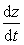

二、&nbsp;&nbsp;&nbsp;&nbsp;&nbsp;&nbsp;&nbsp;
二、&nbsp;&nbsp;&nbsp;
矢量分析

&nbsp;&nbsp;&nbsp; 1．矢量微分

&nbsp;&nbsp;&nbsp; [矢函数]&nbsp; 对于自变量<i>t</i>(标量)的每一个数值都有变动矢量<b><i>a</i></b>的确定量(长度与方向都确定的一个矢量)和它对应，则变(矢)量<b><i>a</i></b>称为变量<i>t</i>的矢函数，记作

<b><i>a</i></b>＝<b><i>f</i></b>(<i>t</i>)

矢函数也可表为

<b><i>a</i></b>=<i>ax<b>i</b></i>＋<i>a</i>ｙ<b><i>j</i></b>＋<i>az<b>k</b></i>

式中

<b><i>a</i></b><i>x</i>＝<b><i>f</i></b><i>x</i>(<i>t</i>)，<b><i>a</i></b><i>y</i>＝<b><i>f</i></b>ｙ(<i>t</i>)，<b><i>a</i></b><i>z</i>＝<b><i>f</i></b><i>z</i>(<i>t</i>)

为三个标函数.

&nbsp;&nbsp;&nbsp; 若把变动矢量表成点<i>M</i>的矢径形式

<b><i>r</i></b>＝<b><i>r</i></b>(<i>t</i>)

则当<i>t</i>变动时，点<i>M</i>在空间中描出一条曲线，称为矢函数的矢端曲线.它的坐标由三个等式给定：

<b><i>r </i></b>=<i>x<b>i</b></i>＋<i>y<b>j</b></i>＋<i>z<b>k</b></i>

<i>x</i>＝<i>x</i>(<i>t</i>)，<i>y</i>＝<i>y</i>(<i>t</i>)，<i>z</i>＝<i>z</i>(<i>t</i>)

&nbsp;&nbsp;&nbsp; [矢函数的极限与连续性]&nbsp; 若对任意给定的&gt;0 , 都存在数&gt;0，使得当|<i>t</i>－<i>t</i>０|&lt;时

|<b><i>r</i></b>(<i>t</i>)－<b><i>r</i></b>０|&lt;

成立，则称<b><i>r</i></b>０为矢函数<b><i>r</i></b>(<i>t</i>)当<i>t</i><i>t</i>０时的极限，记作

= <b><i>r</i>0</b>

&nbsp;&nbsp;&nbsp; 若存在，则

＝<b><i>i</i></b>+<b><i>j</i></b>+<b><i>k</i></b>

<b>&nbsp;&nbsp;&nbsp; </b>若 =<i> <b>r</b></i>(<i>t</i>0),则称矢函数<b><i>r</i></b>(<i>t</i>)在<i>t</i>＝<i>t</i>０处连续.

&nbsp;&nbsp;&nbsp; [矢函数的导数与微分]&nbsp; 如果极限

存在，就称它为矢函数<b><i>a</i></b>＝<b><i>f</i></b>(t)的导数，记作.矢函数<b><i>a</i></b>＝<b><i>f</i></b>(<i>t</i>)的导数仍为矢函数，从而还可求它的导数，即二阶导数，记作，等等.

d<b><i>a</i></b>＝d<i>t</i>

称为矢函数<b><i>a</i></b>＝<b><i>f</i></b>(<i>t</i>)的微分.

&nbsp;&nbsp;&nbsp; [矢函数求导公式]

＝<b>0&nbsp;&nbsp;&nbsp;&nbsp;&nbsp;&nbsp;&nbsp;
</b>(<b><i>c</i></b>为常矢量)

(<i>k</i><b><i>a</i></b>)＝<i>k</i>&nbsp; <b>&nbsp;</b>(<i>k</i>为常数)

(<b><i>a</i></b>＋<b><i>b</i></b>＋<b><i>c</i></b>)＝

(<b><i>a</i></b>)＝<b><i>a</i></b>＋&nbsp; <b>&nbsp;</b>&nbsp;&nbsp;&nbsp;&nbsp;&nbsp;&nbsp;&nbsp;&nbsp;&nbsp;(是<i>t</i>的标函数)

&nbsp;(<b><i>a</i></b><b>·<i>b</i></b>)＝<b>·<i>b</i></b>＋<b><i>a</i></b><b>·</b>&nbsp;&nbsp;&nbsp;&nbsp;&nbsp;&nbsp;&nbsp;&nbsp;
(顺序可以交换)

&nbsp;(<b><i>a</i></b>×<b><i>b</i></b>)＝×<b><i>b</i></b>＋<b><i>a</i></b>×&nbsp;&nbsp;&nbsp;&nbsp;&nbsp;&nbsp;
(顺序不可以交换)

&nbsp;(<b><i>abc</i></b>)=( <b><i>bc</i></b>)+(<b><i>a</i></b><b><i>c</i></b>)+(<b><i>ab</i></b>)&nbsp; (顺序不可以交换)

<pre>&nbsp;&nbsp;&nbsp;&nbsp;&nbsp;&nbsp;&nbsp;&nbsp;&nbsp;&nbsp;&nbsp;&nbsp;&nbsp;&nbsp;&nbsp;&nbsp;&nbsp;&nbsp;&nbsp;&nbsp; &nbsp;&nbsp;&nbsp;&nbsp;&nbsp;<b><i>a</i></b> [(<i>t</i>)]=&nbsp;&nbsp;&nbsp;&nbsp;&nbsp; </pre>

&nbsp;(是<i>t</i>的标函数，这是复合函数的求导公式)

&nbsp;&nbsp;&nbsp; [矢径形式的矢函数求导公式]&nbsp; 设

<b><i>r</i></b>＝<b><i>r</i></b>(<i>t</i>)＝<i>x</i>(<i>t</i>)<b><i>i</i></b>＋<i>y</i>(<i>t</i>)<b><i>j</i></b>＋<i>z</i>(<i>t</i>)<b><i>k</i></b>

表示矢函数的矢端曲线，则

&nbsp;&nbsp;&nbsp; 1&nbsp;
＝=<b><i>i</i></b>＋<b><i>j</i></b>＋<b><i>k</i></b>

表示矢端曲线的切线矢量(图8.10)，指向<i>t</i>增加的方向，式中＝, =, =

&nbsp;&nbsp;&nbsp;
2&nbsp; &nbsp;= <b><i>t</i></b>

式中<i>s</i>为矢端曲线的弧长，<b><i>t</i></b>为切线的单位矢量.

&nbsp;&nbsp;&nbsp; 3&nbsp;
＝<b><i>i</i></b>＋<b><i>j</i></b>＋<b><i>k</i></b>

式中＝,=,=

&nbsp;&nbsp;&nbsp; [矢函数的泰勒公式]

&nbsp;&nbsp;&nbsp;&nbsp;&nbsp;&nbsp;&nbsp; <b><i>r</i></b>(<i>t</i>＋<i>t</i>)＝<b><i>r</i></b>(<i>t</i>)＋(<i>t</i>)<i>t</i>＋(<i>t</i>)(<i>t</i>)２＋···＋<b><i>r</i></b>(<i>n</i>)(<i>t</i>)(<i>t</i>)<i>n</i>＋<b><i>r</i></b><i>n</i>(<i>t</i>)<i>n</i>+1

式中

<b><i>r</i></b><i>n</i>＝<i>x</i>(<i>n</i>+1)(<i>t</i>1)<b><i>i</i></b>＋<i>y</i>(<i>n</i>+1)(<i>t</i>2)<b><i>j</i></b>＋<i>z</i>(<i>n</i>+1)(<i>t</i>3)<b><i>k</i>&nbsp;&nbsp;&nbsp;
</b>(<i>t</i> &lt; <i>t</i>1 , <i>t</i>2 ,
<i>t</i>3 &lt; <i>t</i>＋<i>t</i>)

<b><i>r</i></b>(<i>n</i>)(<i>t</i>)= <i>x</i>(<i>n</i>)(<i>t</i>)<b><i>i</i></b>＋<i>y</i>(<i>n</i>)(<i>t</i>)<b><i>j</i></b>＋<i>z</i>(<i>n</i>)(<i>t</i>)<b><i>k</i></b>

<i>x</i>(<i>n</i>)=, <i>y</i>(<i>n</i>)=, <i>z</i>(<i>n</i>)=

[矢量函数的几个常用性质]

1&nbsp;
定长矢量<b><i>r</i></b>(<i>t</i>)<b></b>(<i>t</i>)，反之也真.从而切线的单位矢量<b><i>ｔ</i></b>的导数与原矢量垂直.

2&nbsp;
定向矢量<b><i>r</i></b>(<i>t</i>)//<b></b>(<i>t</i>)，反之也真.

3&nbsp;
一个变动矢量<b><i>r</i></b>(<i>t</i>)平行于一个定平面的充分必要条件是：混合积

(<b></b>)＝0

