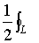

2．矢量积分

[不定积分]&nbsp; 设<b><i>a</i></b>(<i>t</i>)，<b><i>b</i></b>(<i>t</i>)为矢函数，则矢量微分方程

＝<b><i>a</i></b>(<i>t</i>)

的解

(<i>t</i>)d<i>t</i>＝<b><i>b</i></b>(<i>t</i>)＋<b><i>c</i>&nbsp;&nbsp;&nbsp;&nbsp;&nbsp; </b>(式中<b><i>c</i></b>为任意常矢量)

称为矢函数<b><i>a</i></b>(<i>t</i>)的不定积分.

&nbsp;<b>&nbsp;&nbsp; </b>[定积分] 设<b><i>a</i></b>(<i>t</i>)和<b><i>b</i></b>(<i>t</i>)为矢函数，则

<b>&nbsp;<i>a</i></b>(<i>t</i>)d<i>t</i>＝<b><i>b</i></b>(<i>t</i>2)－<b><i>b</i></b>(<i>t</i>1)

称为矢函数<b><i>a</i></b>(<i>t</i>)的定积分，<i>t</i>１，<i>t</i>２分别称为下、上限.

&nbsp;&nbsp;&nbsp; [平面面积矢量]&nbsp; 设

<b><i>r</i></b>＝ <b><i>r</i></b>(<i>t</i>)＝<i>x</i>(<i>t</i>)<b><i>i</i></b>＋<i>y</i>(<i>t</i>)<b><i>j</i></b>＋<i>z</i>(<i>t</i>)<b><i>k</i></b>

d<b><i>r</i></b>＝<b><i>i</i></b>d<i>x</i>＋<b><i>j</i></b>d<i>y</i>＋<b><i>k</i></b>d<i>z</i>

则

<b><i>S</i></b>＝<b><i>r</i></b>×d<b><i>r</i></b>

式中<i>L</i>为<b><i>r</i></b>(<i>t</i>)矢端所画的闭曲线，<b><i>S</i></b>为<i>L</i>所包围的面积矢量，原点在闭曲线<i>Ｌ</i>内.

