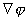
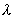
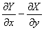

§<b>2&nbsp; </b><b>场论初步</b>

一、&nbsp;&nbsp;
一、场论的基本概念及梯度、散度与旋度

[标量场]&nbsp; 空间区域<i>D</i>的每点<i>M</i>(<i>x</i>,<i>y</i>,<i>z</i>)对应一个数量值(<i>x</i>,<i>y</i>,<i>z</i>)，它在此空间区域<i>D</i>上就构成一个标量场，用点<i>M</i>(<i>x,y,z</i>)的标函数(<i>x</i>，<i>y</i>，<i>z</i>)表示.若<i>M</i>的位置用矢径<b><i>r</i></b>确定，则标量可以看作变矢<b><i>r</i></b>的函数＝(<b><i>r</i></b>).

例如温度场<i>u</i>(<i>x</i>,<i>y</i>,<i>z</i>),密度场,电位场<i>e</i>(<i>x</i>,<i>y</i>,<i>z</i>)都是标量场.

&nbsp;&nbsp;&nbsp; [矢量场]&nbsp; 空间区域<i>D</i>的每点<i>M</i>(<i>x</i>，<i>y</i>，<i>z</i>)对应一个矢量值<b><i>r</i></b>(<i>x</i>，<i>y</i>，<i>z</i>)，它在此空间区域<i>D</i>上就构成一个矢量场，用点<i>M</i>(<i>x</i>，<i>y</i>，<i>z</i>)的矢量函数<b><i>r</i></b>(<i>x</i>，<i>y</i>，<i>z</i>)表示.若<i>M</i>的位置用矢径<b><i>r</i></b>确定，则矢量<b><i>r</i></b>可以看作变矢<b><i>r</i></b>的矢函数<b><i>r</i></b>(<b><i>r</i></b>)：

<b><i>R</i></b>(<b><i>r</i></b>)＝<i>X</i>(<i>x</i>，<i>y</i>，<i>z</i>)<b><i>i</i></b>＋<i>Y</i>(<i>x</i>，<i>y</i>，<i>z</i>)<b><i>j</i></b>＋<i>Z</i>(<i>x</i>，<i>y</i>，<i>z</i>)<b><i>k</i></b>

<b>&nbsp;&nbsp;&nbsp; </b>例如流速场 (<i>x</i>，<i>y</i>，<i>z</i>)，电场<b><i>E</i></b>(<i>x</i>，<i>y</i>，<i>z</i>)，磁场<b><i>H</i></b>(<i>x</i>，<i>y</i>，<i>z</i>)都是矢量场.

与标量场的情况一样，矢量场概念与矢函数概念，实质上是一样的.沿用这些术语(标量场、矢量场)是为了保留它们的自身起源与物理意义.

[梯度]

grad＝(，，)==<b><i>i</i></b>＋<b><i>j</i></b>＋<b><i>k</i></b>

式中<b></b>=<b><i>i</i></b>＋<b><i>j</i></b>＋<b><i>k</i></b>称为哈密顿算子,也称为耐普拉算子.grad有的书刊中记作del.

&nbsp;&nbsp;&nbsp; grad的方向与过点(<i>x</i>，<i>y</i>，<i>z</i>)的等量面＝<i>C</i>的法线方向<b><i>N</i></b>重合，并指向增加的一方，是函数变化率最大的方向，它的长度等于.

梯度具有性质：

grad(＋)＝ grad＋grad&nbsp;&nbsp;&nbsp; (、为常数)

&nbsp;&nbsp;&nbsp;&nbsp;&nbsp;&nbsp;&nbsp;&nbsp;&nbsp;&nbsp;&nbsp;&nbsp;
grad()＝ grad＋ grad

&nbsp;&nbsp;&nbsp;&nbsp;&nbsp;&nbsp;&nbsp;&nbsp;&nbsp;&nbsp;&nbsp;&nbsp;
grad<i>F</i>()＝

[方向导数]

＝<b><i>l</i></b>·grad＝cos＋cos＋cos

式中<b><i>l</i></b>＝(cos,cos,cos)为方向<b><i>l</i></b>的单位矢量,,,为其方向角.

方向导数为在方向<b><i>l</i></b>上的变化律，它等于梯度在方向<b><i>l</i></b>上的投影.

[散度]

div<b><i>r</i></b>＝＋＋=<b></b><b>·<i>r</i></b>=div(<i>X</i> , <i>Y</i> , <i>Z</i>)

式中<b></b>为哈密顿算子.

&nbsp;&nbsp;&nbsp; 散度具有性质：

&nbsp;&nbsp;&nbsp; div(<b><i>a</i></b>＋<b><i>b</i></b>)＝ div<b><i>a</i></b>＋div<b><i>b</i>&nbsp;&nbsp;&nbsp;
</b>(、为常数)

&nbsp;&nbsp;&nbsp; div(<b><i>a</i></b>)＝div <b><i>a</i></b>＋<b><i>a </i></b>grad

&nbsp;&nbsp;&nbsp; div(<b><i>a</i></b>×<b><i>b</i></b>)＝<b><i>b</i></b>·rot <b><i>a</i></b>－<b><i>a</i></b>·rot<b><i>b</i></b>

[旋度]

&nbsp;&nbsp;&nbsp;&nbsp;&nbsp;&nbsp; rot<b><i>r</i></b>＝()<b><i>i</i></b>＋()<b><i>j</i></b>＋()<b><i>k</i></b>=<b></b>×<b><i>r</i></b>=

式中<b></b>为哈密顿算子，旋度也称涡度，rot <b><i>r</i></b>有的书刊中记作curl <b><i>r</i></b>.

旋度具有性质：

rot(<b><i>a</i></b>＋<b><i>b</i></b>)＝ rot <b><i>a</i></b>＋rot <b><i>b</i>&nbsp;&nbsp;&nbsp;
</b>(、为常数)

rot(<b><i>a</i></b>)＝rot <b><i>a</i></b>＋<b><i>a</i></b>×grad

rot(<b><i>a</i></b>×<b><i>b</i></b>)＝(<b><i>b</i></b>·<b></b>)<b><i>a</i></b>－(<b><i>a</i></b>·<b></b>)<b><i>b</i></b>＋(div <b><i>b</i></b>)<b><i>a</i></b>－(div <b><i>a</i></b>)<b><i>b</i></b>

[梯度、散度、旋度混合运算]&nbsp;
运算grad作用到一个标量场产生矢量场grad，运算div作用到一个矢量场 <b><i>r</i></b>产生标量场div <b><i>r</i></b>，运算rot作用到一个矢量场<b><i>r</i></b>产生新的矢量场

rot <b><i>r</i></b>.这三种运算的混合运算公式如下：

div rot <b><i>r</i></b>＝０

rot grad＝<b>０</b>

div grad＝ ＋＋=

grad div <b><i>r</i></b>＝<b></b>(<b><i>r</i></b>)

rot rot <b><i>r</i></b>＝<b></b>×(<b></b>×<b><i>r</i></b>)

div grad(+)= div grad+div grad&nbsp;&nbsp;&nbsp; (、为常数)

div grad()=div grad＋div grad ＋２grad·grad

grad div <b><i>r</i></b>－rot rot <b><i>r</i></b>＝<b><i>r</i></b>

式中&nbsp; <b></b>为哈密顿算子，＝<b></b><b>·</b><b>＝</b>２为拉普拉斯算子.

&nbsp;&nbsp;&nbsp; [势量场(守恒场)]&nbsp; 若矢量场<b><i>r</i></b>(<i>x</i>，<i>y</i>，<i>z</i>)是某一标函数(<i>x</i>，<i>y</i>，<i>z</i>)的梯度，即

<b><i>r</i></b>＝grad 或 <i>X</i>＝，<i>Y</i>＝，<i>Z</i>＝

则<b><i>r</i></b>称为势量场，标函数称为<b><i>r</i></b>的势函数.

矢量场<b><i>r</i></b>为势量场的充分必要条件是：rot <b><i>r</i></b>＝０，或

&nbsp;=,=,=

势函数计算公式

(<i>x</i>，<i>y</i>，<i>z</i>)＝(<i>x</i>0，<i>y</i>0，<i>z</i>0)＋＋

＋

[无散场(管形场)]&nbsp; 若矢量场<b><i>r</i></b>的散度为零，即div <b><i>r</i></b>＝0，则<b><i>r</i></b>称为无散场.这时必存在一个无散场<b><i>T</i></b>，使<b><i>r</i></b>＝rot <b><i>T</i></b>，对任意点<i>M</i>有

<b><i>T</i></b>＝ 

式中<i>r</i>为<i>dV</i>到<i>M</i>的距离，积分是对整个空间进行的.

&nbsp;&nbsp;&nbsp;&nbsp; [无旋场]&nbsp; 若矢量场<b><i>r</i></b>的旋度为零，即rot <b><i>r</i></b>＝0，则<b><i>r</i></b>称为无旋场.势量场总是一个无旋场，这时必存在一个标函数，使<b><i>r</i></b>＝grad，而对任意点<i>M</i>有

＝－ 

式中<i>r</i>为d<i>V</i>到<i>M</i>的距离，积分是对整个空间进行的.

