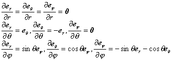

二、&nbsp;&nbsp;&nbsp;&nbsp;&nbsp;&nbsp;&nbsp;
二、&nbsp;&nbsp;&nbsp;
梯度、散度、旋度在不同坐标系中的表达式

&nbsp;&nbsp;&nbsp; 1．单位矢量的变换

&nbsp;&nbsp;&nbsp; [一般公式]&nbsp; 假定<i>x</i>=<i>f</i>(),<i>y</i>=<i>g</i>(),<i>z</i>=<i>h</i>()把()空间的一个区域&nbsp;&nbsp;&nbsp; 一对一地连续映射为(<i>x</i>，<i>y</i>，<i>z</i>)空间的一个区域<i>D</i>，并假定<i>f</i>，<i>g</i>，<i>h</i>都有连续偏导数，因为对应是一对一的，所以有

＝(<i>x</i>，<i>y</i>，<i>z</i>)，<b></b>

再假定也有连续偏导数，则有

或逆变换

沿d<i>x</i>，d<i>y</i>，d<i>z</i>方向的单位矢量记作<b><i>i</i></b>，<b><i>j</i></b>，<b><i>k</i></b>，沿方向的单位矢量记作<b></b>，则有

&nbsp;&nbsp;&nbsp; [圆柱面坐标系的单位矢量]&nbsp; 对于圆柱面坐标系(图8.11)

&nbsp;&nbsp;&nbsp; 

单位矢量为

&nbsp;&nbsp;&nbsp; 它们的偏导数为

&nbsp;&nbsp;&nbsp; [球面坐标系的单位矢量]&nbsp; 对于球面坐标系(图8.12)

&nbsp;&nbsp;&nbsp;&nbsp;&nbsp;&nbsp;&nbsp;&nbsp;&nbsp; 

单位矢量为

&nbsp;&nbsp;&nbsp;&nbsp;&nbsp;&nbsp;&nbsp;&nbsp; 

它们的偏导数为

&nbsp;&nbsp;&nbsp;&nbsp;&nbsp;&nbsp;&nbsp;&nbsp; 

