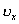
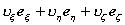
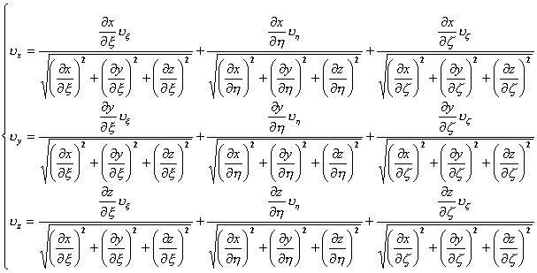
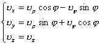
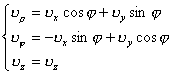
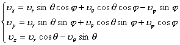
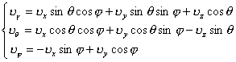

2．矢量的坐标变换

[一般公式]&nbsp; 一个由(<i>x</i>，<i>y</i>，<i>z</i>)坐标系所表达的矢量可以用()坐标系来表达:

＝(，<i>y</i>，<i>z</i>)＝<b><i>i</i></b>＋<i>y</i><b><i> j</i></b>＋<i>z</i><b><i>
k</i></b>＝

式中

[圆柱面坐标系与直角坐标系的互换]&nbsp; 由圆柱面坐标系到直角坐标系的变换公式

由直角坐标系到圆柱面坐标系的变换公式

[球面坐标系与直角坐标系的互换]
由球面坐标系到直角坐标系的变换公式

由直角坐标系到球面坐标系的变换公式

