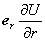

3．各种算子在不同坐标系中的表达式

设<i>U</i>＝<i>U</i>(<i>x</i>，<i>y</i>，<i>z</i>)是一个标函数，<b><i>V</i></b>＝<b><i>V</i></b>(<i>x</i>，<i>y</i>，<i>z</i>)是一个矢函数.

[在圆柱面坐标系中各种算子的表达式]

哈密顿算子&nbsp; ＝++

梯&nbsp;&nbsp;&nbsp;&nbsp;&nbsp; 度&nbsp; grad<i>U</i>＝ <i>U</i>＝++

散&nbsp;&nbsp;&nbsp;&nbsp;&nbsp; 度&nbsp; div<b><i>V</i></b>＝ ·<b><i>V</i></b>＝

旋&nbsp;&nbsp;&nbsp;&nbsp;&nbsp; 度&nbsp; rot<b><i>V</i></b>＝ ×<b><i>V</i></b>＝＋＋

拉普拉斯算子&nbsp; <i>U</i>＝div grad<i>U</i>＝

[在球面坐标系中各种算子的表达式]

哈密顿算子&nbsp; ＝+ +

梯&nbsp;&nbsp;&nbsp;&nbsp;&nbsp; 度&nbsp; grad<i>Ｕ</i>＝ <i>Ｕ</i>＝++

散&nbsp;&nbsp;&nbsp;&nbsp;&nbsp; 度&nbsp; div <b><i>V=</i></b>·<b><i>V</i></b>=

旋&nbsp;&nbsp;&nbsp;&nbsp;&nbsp; 度&nbsp; rot<b><i>V</i></b>＝ ×<b><i>V</i></b>＝

+

＋

拉普拉斯算子&nbsp; <i>U</i>＝div grad<i>U</i>

&nbsp;＝

