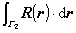
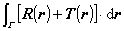
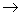

三、&nbsp;&nbsp;&nbsp;&nbsp;&nbsp;&nbsp;&nbsp;
三、&nbsp;&nbsp;&nbsp;
曲线积分、曲面积分与体积导数

[矢量的曲线积分及其计算公式]&nbsp;
矢量场<b><i>r</i></b>(<b><i>r</i></b>)沿曲线的曲线积分定义为

<b><i>r</i></b>(<b><i>r</i></b>)·d<b><i>r</i></b>＝<b><i>r</i></b>()·<b><i>r</i></b><i>i</i>-1

式中<b><i>r</i></b><i>i</i>-1=<b><i>r</i></b><i>i</i>－<b><i>r</i></b><i>i</i>-1，右边极限与的选择无关，曲线

由<i>A</i>到<i>B</i>(图8.13)

若矢函数<b><i>Ｒ</i></b>(<b><i>r</i></b>)是连续的(就是它的三个分量是

连续函数), 曲线也是连续的, 且有连续转动的

切线, 则曲线积分

存在.

若<b><i>Ｒ</i></b>(<b><i>r</i></b>)为一力场，则<i>Ｐ</i>＝就等于把

一质点沿着<i>G </i>移动时力<b><i>Ｒ</i></b>所作的功.

&nbsp;&nbsp;&nbsp; 矢量曲线积分的计算公式如下：

&nbsp;&nbsp;&nbsp;&nbsp;&nbsp;&nbsp;&nbsp; ＝

&nbsp;&nbsp;&nbsp;&nbsp;&nbsp;&nbsp;&nbsp; =＋&nbsp; (图8.14)

&nbsp;&nbsp;&nbsp;&nbsp;&nbsp;&nbsp;&nbsp; =－

&nbsp;&nbsp;&nbsp;&nbsp;&nbsp;&nbsp;&nbsp; =＋

&nbsp;&nbsp;&nbsp;&nbsp;&nbsp;&nbsp;&nbsp; =<i>k</i>&nbsp;&nbsp;&nbsp; (<i>k</i>为常数)

[矢量的环流]&nbsp;
如果<i>G</i>为一闭曲线，则沿曲线<i>G </i>的曲线积分

＝

称为矢量场<b><i>Ｒ</i></b>(<b><i>r</i></b>)沿闭曲线<i>G </i>的环流.

&nbsp;&nbsp;&nbsp; 势量场沿任何闭曲线的环流都等于零.如果<b><i>Ｒ</i></b>(<b><i>r</i></b>)为一势量场，且它的势函数为时，则曲线积分

&nbsp;&nbsp;&nbsp;&nbsp;&nbsp;&nbsp;&nbsp;&nbsp;&nbsp;&nbsp;&nbsp;&nbsp;
=＝(<i>B</i>)－(<i>A</i>)

与连接<i>A</i>，<i>B</i>两点的路径无关，只依赖于<i>A</i>，<i>B</i>两点的

位置(图8.15).

&nbsp;&nbsp;&nbsp; [矢量的曲面积分]&nbsp; 设<i>S</i>为一曲面，令<b><i>N</i></b>＝表示在曲面<i>S</i>上一点的法线单位矢量,<a href="#None" name="_ftnref1" title="">V</a>而d<b><i>S</i></b>＝<b><i>N</i></b>d<i>S</i>表示面积矢量元素.又设(<b><i>r</i></b>)=(<i>x</i>, <i>y</i>,<i>z</i>)是定义在曲面<i>S</i>上的连续标函数，<b><i>R</i></b>(<b><i>r</i></b>)=(<i>X</i>(<i>x</i>, <i>y</i>,<i>z</i>),<i>Y</i>(<i>x</i>,
<i>y</i>,<i>z</i>), <i>Z</i>(<i>x</i>, <i>y</i>,<i>z</i>))是定义在曲面<i>S</i>上的连续矢函数，则曲面积分有如下的三种形式：

&nbsp;&nbsp;&nbsp; 1&nbsp; 标量场的通量(或流量)

&nbsp;&nbsp;&nbsp;&nbsp;&nbsp;&nbsp;&nbsp; d<b><i>S</i></b>=d<i>y</i>d<i>z <b>i</b></i>＋d<i>z</i>d<i>x
<b>j</b></i>＋d<i>x</i>d<i>y
<b>k</b></i>

式中<i>Syz</i>，<i>Szx</i>，<i>Sxy</i>分别表示曲面<i>S</i>在<i>Oyz</i>平面，<i>Ozx</i>平面，

<i>Oxy</i>平面上的投影.<i>Sxy</i>的正负号规定如下：当从<i>ｚ</i>轴正方

向看去时，看到的是曲面<i>S</i>的正面，认为<i>Sxy</i>为正，如果

看到的是曲面的反面，则认为<i>Sxy</i>为负(图8.16).

&nbsp;&nbsp;&nbsp; 2&nbsp; 矢量场的标通量

&nbsp;&nbsp;&nbsp; <b><i>R</i></b><b>·</b>d<b><i>S</i></b>=<i>X</i>d<i>y</i>d<i>z</i>＋<i>Y</i>d<i>z</i>d<i>x</i>＋<i>Z</i>d<i>x</i>d<i>y</i>

式中<i>Syz</i>等的意义同1.

3&nbsp; 矢量场的矢通量

<b><i>R</i></b>×d<b><i>S</i></b>＝(<i>Z<b>j</b></i>－<i>Y<b>k</b></i>)d<i>y</i>d<i>z</i>＋(<i>X<b>k</b></i>－<i>Z<b>i</b></i>)d<i>z</i>d<i>x</i>＋(<i>Y<b>i</b></i>－<i>X<b>j</b></i>)d<i>x</i>d<i>y</i>

式中<i>Syz</i>等的意义同1.

&nbsp;&nbsp;&nbsp; [矢量的体积导数]&nbsp; 如果<i>S</i>是包围体积<i>V</i>的闭曲面，并包含点<b><i>r</i></b>，则沿闭曲面<i>S</i>的曲面积分(d<b><i>S</i>,</b> <b><i>R</i></b><b>·</b>d<b><i>S</i>,</b> <b><i>R</i></b>×d<b><i>S</i></b>)与体积<i>V</i>之比，当<i>V</i>趋于零时(即它的直径０)的极限称为标量场(或矢量场<b><i>R</i></b>)在点<b><i>r</i></b>处的体积导数(或空间导数).

&nbsp;&nbsp;&nbsp; 1&nbsp;
标量场的体积导数就是它的梯度：

grad＝

&nbsp;&nbsp;&nbsp; 2&nbsp; 矢量场<b><i>Ｒ</i></b>的体积导数之一是它的散度：

div <b><i>R</i></b>＝

&nbsp;&nbsp;&nbsp; 3&nbsp; 矢量场<b><i>Ｒ</i></b>的另一个体积导数是它的旋度：

rot <b><i>R</i></b>＝－

 

 

<a href="#None" name="_ftn1" title="">V</a> 这里规定法线单位矢量与曲面分布在切面的两侧.

