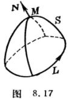
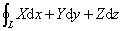

四、&nbsp;&nbsp;&nbsp;&nbsp;&nbsp;&nbsp;&nbsp;
四、&nbsp;&nbsp;&nbsp;
矢量的积分定理

&nbsp;&nbsp;&nbsp; [高斯公式]

<b><i>R</i></b>d<i>V</i>=<b><i>R</i></b><b>·</b>d<b><i>S</i></b>=<b><i>R</i></b><b>·<i>N</i></b>d<i>S</i>

即

式中<i>Ｓ</i>为空间区域<i>Ｖ</i>的边界曲面，<b><i>N</i></b>＝为

在<i>S</i>上一点的法线单位矢量，<b><i>R</i></b>(<b><i>r</i></b>)=(<i>X</i>(<i>x</i>,
<i>y</i>,<i>z</i>),<i>Y</i>(<i>x</i>, <i>y</i>,<i>z</i>),<i>Z</i>(<i>x</i>, <i>y</i>,<i>z</i>))

在<i>V</i>＋<i>S</i>上有连续偏导数.

&nbsp;&nbsp;&nbsp; [斯托克斯公式]

rot <b><i>Ｒ</i></b><b>·</b>d<b><i>S</i></b>＝rot <b><i>R</i></b><b>·<i>N</i></b>d<i>S</i>＝<b><i>R</i></b><b>·</b>d<b><i>r</i></b>

即

&nbsp;&nbsp;&nbsp; 

&nbsp; = 

&nbsp; = 

式中<i>S</i>为一定曲面的一侧，<i>L</i>为曲面<i>S</i>的闭边界曲线(<i>L</i>的正向与<b><i>N</i></b>构成右手系).<i>S</i>的每点有切面，其方向连续地依赖于曲面上的点，而边界曲线<i>L</i>上的每点都有切线(图8.17).<b> <i>R</i></b>(<b><i>r</i></b>)=(<i>X</i>(<i>x</i>,
<i>y</i>,<i>z</i>),<i>Y</i>(<i>x</i>, <i>y</i>,<i>z</i>),<i>Z</i>(<i>x</i>, <i>y</i>,<i>z</i>))在曲面的所有点单值，并在与<i>S</i>足够靠近的点处有连续偏导数.

&nbsp;&nbsp;&nbsp; [格林公式]

&nbsp;&nbsp;&nbsp;&nbsp;&nbsp;&nbsp;&nbsp; ·d<b><i>S</i></b>=

&nbsp;&nbsp;&nbsp;&nbsp;&nbsp;&nbsp;&nbsp; ·d<b><i>S</i></b>=

式中<i>S</i>为空间区域<i>V</i>的边界曲面，为两个标函数，在<i>S</i>上具有连续偏导数，且在<i>V</i>上具有二阶连续偏导数，为拉普拉斯算子，特别

·d<b><i>S</i></b>=

即

