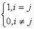
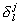

<b>§</b><b>3&nbsp;&nbsp; </b><b>仿射坐标系</b>

一、&nbsp;&nbsp;
一、 仿射坐标系与度量系数

&nbsp;&nbsp;&nbsp; [仿射坐标]&nbsp; 在三维欧氏空间<a href="#None" name="_ftnref1" title="">*</a>中，若取一个直角坐标系，其坐标单位矢量为<b><i>i</i></b><b>，<i>j</i></b><b>，<i>k</i></b>时，则空间中的矢量<b><i>a</i></b>可表示为

<b><i>a</i></b><b>＝</b><i>ax <b>i</b></i>＋<i>a</i><i>y&nbsp;
<b>j</b></i>＋<i>az <b>k</b></i>

<b>&nbsp;&nbsp;&nbsp; </b>一般地，在空间中给定了三个不共面的矢量<b><i>e</i></b>1，<b><i>e</i></b>2，<b><i>e</i></b>3，则空间中任一矢量<b><i>a</i></b>可按这三个矢量分解，令其系数为<i>a</i>1,<i>a</i>2,<i>a</i>3(这里1,2,3不是指数，而是上标)则<b><i>a</i></b>可表示为

<b><i>a</i></b>＝<i>a</i>1<b><i>e</i></b>1＋<i>a</i>2<b><i>e</i></b>2＋<i>a</i>3<b><i>e</i></b>3

或简计作<a href="#None"
name="_ftnref2" title="">*</a>*&nbsp;&nbsp;&nbsp;&nbsp;&nbsp;&nbsp;&nbsp;&nbsp;&nbsp;&nbsp;&nbsp;&nbsp;&nbsp;&nbsp;&nbsp;&nbsp;
<b><i>a</i></b>＝<i>ai<b>e</b>i</i>

<b><i>a</i></b>＝<i>a</i>1,<i>a</i>2,<i>a</i>3＝{<i> a</i>i}<a
href="bword://None" name="_ftnref3" title="">*</a>**

这种坐标系<b><i>e</i></b>1,<b><i>e</i></b>2,<b><i>e</i></b>3称为仿射坐标系，<b><i>e</i></b>1,<b><i>e</i></b>2,<b><i>e</i></b>3称为坐标矢量，<i>a</i>1,<i>a</i>2,<i>a</i>3称为矢量<b><i>a</i></b>的仿射坐标. 

&nbsp;&nbsp;&nbsp; [欧氏空间中度量系数]&nbsp; 当矢量<b><i>a</i></b>写成上面的形式时，则它的长度<i>a</i>由

(<i>a</i>)2＝(<i>ai<b>e</b>i</i>)(<i>aj<b>e</b>j</i>)＝(<b><i>e</i></b><i>i<b>e</b>j</i>)<i>aiaj</i>

给出.令

<b><i>e</i></b><i>i<b>e</b>j</i>＝<i>gij</i>(＝<i>gji</i>)&nbsp;&nbsp; (<i>i</i>，<i>j</i>＝1,2,3)

则称<i>gij</i>为仿射坐标系的度量系数.

&nbsp;&nbsp;&nbsp; 1&nbsp; 矢量<b><i>a</i></b>的长度由

(<i>a</i>)2＝<i>gijaiaj</i>

计算.

&nbsp;&nbsp;&nbsp; 2&nbsp;
两个矢量

<b><i>a</i></b>＝<i>ai<b>e</b>i</i>，<b><i>b</i></b>＝<i>bj<b>e</b>j</i>

的夹角由

cos＝

计算.

&nbsp;&nbsp;&nbsp; 3&nbsp; 因为<i>gijaiaj</i>是正定二次型，所以由<i>gij</i>所作的行列式

混合积

(<b><i>e</i></b>１,<b><i>e</i></b>２,<b><i>e</i></b>３)2= =<i>g</i>

(<b><i>e</i></b>１,<b><i>e</i></b>２,<b><i>e</i></b>３)=

&nbsp;&nbsp;&nbsp; [克罗内克尔符号]&nbsp; 对称矩阵

的逆矩阵用

来表示.由逆矩阵的性质，有<i>gij</i>=<i>gji</i>和

<i>gikgkj</i>=

式中

=

称为克罗内克尔符号.

&nbsp;&nbsp;&nbsp; [互易矢量]&nbsp; 利用这个<i>gij</i>规定

<b><i>ei</i></b>=<i>gij<b>ej</b></i>

因而有

<b><i>ej</i></b>=<i>gij<b>ei</b></i>

<b><i>eie</i></b><i>k</i>=(<i>gij<b>ej</b></i>)<b><i>e</i></b><i>k</i>=<i>gij</i>(<b><i>eje</i></b><i>k</i>)=<i>gijgjk</i>=

<b><i>eiej</i></b>=(<i>gil<b>e</b>l</i>)(<i>gjm<b>em</b></i>)=<i>gilgjm</i>(<b><i>elem</i></b>)=<i>gilgjmglm</i>=<i>gil</i>=<i>gij</i>

<b>&nbsp;&nbsp;&nbsp; </b>对<b><i>e</i></b>１,<b><i>e</i></b>２,<b><i>e</i></b>３，可以得到

<b><i>e</i></b>1=(<b><i>e</i></b>2×<b><i>e</i></b>3),

<b><i>e</i></b>2=(<b><i>e</i></b>3×<b><i>e</i></b>1),<b> <i>e</i></b>3=(<b><i>e</i></b>1×<b><i>e</i></b>2)

<b><i>e</i></b>1,<b><i>e</i></b>2,<b><i>e</i></b>3称为关于坐标矢量<b><i>e</i></b>1,<b><i>e</i></b>2,<b><i>e</i></b>3的互易矢量. <i>gij</i>称为互易矢量的仿射坐标系中的度量系数.

 

 

<a href="#None" name="_ftn1" title="">*</a>欧几里得空间简称欧氏空间，它的定义见第二十一章，§4.

<a href="#None" name="_ftn2" title="">*</a>* 这种缩写是张量算法中的写法.如果每个指标在乘积中出现一次，就表示它取一切可能的值；如果

每个指标在乘积中出现两次，就表示取一切可能的值，而后再把各项相加，求其总和.这种规定称

为爱因斯坦约定.

<a href="#None" name="_ftn3" title="">*</a>** 这是张量写法.

