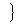

二、&nbsp;&nbsp;&nbsp;&nbsp;&nbsp;&nbsp;&nbsp;
二、&nbsp;&nbsp;&nbsp;
逆变矢量与协变矢量

&nbsp;&nbsp;&nbsp; [逆变矢量与协变矢量]&nbsp; 如果矢量<b><i>a</i></b>在坐标系<b><i>e</i></b>１,<b><i>e</i></b>２,<b><i>e</i></b>３中的仿射坐标<i>a</i>1,<i>a</i>2,<i>a</i>3是由公式

<b><i>a</i></b>＝<i>a</i>1<b><i>e</i></b>1＋<i>a</i>2<b><i>e</i></b>2＋<i>a</i>3<b><i>e</i></b>3=<i>ai<b>e</b>i</i>

给出，则<i>a</i>1,<i>a</i>2,<i>a</i>3称为矢量<b><i>a</i></b>的逆变坐标(或称为抗变坐标)，而矢量<i>ai</i>称为逆变矢量(或称为抗变矢量).

<b>&nbsp;&nbsp;&nbsp; </b>如果关于坐标矢量<b><i>e</i></b>１,<b><i>e</i></b>２,<b><i>e</i></b>３的互易矢量为<b><i>e</i></b>1,<b><i>e</i></b>2,<b><i>e</i></b>3，矢量<b><i>a</i></b>在坐标系<b><i>e</i></b>1,<b><i>e</i></b>2,<b><i>e</i></b>3中的仿射坐标<i>a</i>1<b><i>,</i></b><i>a</i>2<b><i>,</i></b><i>a</i>3是由公式

<b><i>a</i></b>＝<i>a</i>1<b><i>e</i></b>1＋<i>a</i>2<b><i>e</i></b>2＋<i>a</i>3<b><i>e</i></b>3=<i>aj<b>e</b>j</i>

给出，则<i>a</i>1<b><i>,</i></b><i>a</i>2<b><i>,</i></b><i>a</i>3称为矢量<b><i>a</i></b>的协变坐标，而矢量<i>aj</i>称为协变矢量.

&nbsp;&nbsp;&nbsp; 在直角坐标系中，矢量的协变坐标与逆变坐标是一致的.一般地，在仿射坐标系中协变坐标与逆变坐标有关系

<i>ai</i>=<b><i>a</i></b><b>·<i>ei</i></b>=(<i>aj<b>e</b>j</i>)·<b><i>e</i></b><i>i</i>=<i>aj</i>(<b><i>e</i></b><i>j</i>·<b><i>e</i></b><i>i</i>)=<i>ajgji</i>

[逆变矢量与协变矢量的标量积]

<b>&nbsp;&nbsp;&nbsp; </b>如果<b><i>a</i></b> , <b><i>b</i></b>为两个矢量，<i>a</i>1 ,<i>a</i>2
,<i>a</i>3 ; <i>b</i>1 ,<i>b</i>2 ,<i>b</i>3分别为它们的逆变坐标，则

<b><i>a</i></b><b>·<i>b</i></b>=<i>gijaibj</i>

&nbsp;&nbsp;&nbsp; 如果<b><i>a</i></b> , <b><i>b</i></b>为两个矢量，<i>a</i>1 ,<i>a</i>2
,<i>a</i>3 ; <i>b</i>1 ,<i>b</i>2 ,<i>b</i>3分别为它们的协变坐标，则

<b><i>a</i></b><b>·<i>b</i></b>=<i>gijaiaj</i>

如果<b><i>a</i></b>的逆变坐标为<i>a</i>1,<i>a</i>2,<i>a</i>3,<b><i>b</i></b>的协变坐标为<i>b</i>1 ,<i>b</i>2
,<i>b</i>3 , 则

<b><i>a</i></b><b>·<i>b</i></b>=<i>aibi</i>

