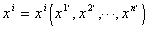

三、<i>n</i>维空间

&nbsp;&nbsp;&nbsp; [<i>n</i>维空间的定义]&nbsp; 如果空间中的点与<i>n</i>个独立实数<i>x</i>1，···，<i>xn</i>的有序组的值建立一对一且双方连续的对应，那末，以这样的点作为元素的集合称为<i>n</i>维实数空间<a href="#None" name="_ftnref1" title="">*</a>(简称<i>n</i>维空间)，记作<i>Rn</i>.所以空间中一点<i>M</i>对应于一组有序数<i>x</i>１，···，<i>xn</i>；反之，一组有序数<i>x</i>１，···，<i>xn</i>对应于一点<i>M</i>.这样的一组有序数(<i>x</i>１，···，<i>xn</i>)称为<i>n</i>维空间<i>Rn</i>中一点<i>M</i>的坐标.

&nbsp;&nbsp;&nbsp; [<i>n</i>维空间中的矢量]&nbsp; 在<i>n</i>维空间<i>Rn</i>中取一定点<i>O</i>，坐标为(0,0,···,0)，另外一点<i>M</i>(<i>x</i>1，<i>x</i>2，···，<i>xn</i>)，<b><i>r</i></b>为对应于两点<i>O</i>和<i>M</i>的矢量，称为点<i>M</i>的矢径.

&nbsp;&nbsp;&nbsp; 假定在<i>Rn</i>中可以引进仿射坐标系，使得矢径<b><i>r</i></b>与点<i>M</i>(<i>xi</i>)的坐标的关系是

<b><i>r</i></b>＝<i>x</i>1<b><i>e</i></b>1＋···＋<i>xn<b>e</b>n</i>＝<i>xi<b>e</b>i</i>

式中<b><i>e</i></b>1，···，<b><i>e</i></b><i>n</i>是<i>Rn</i>中<i>n</i>个线性无关的矢量，这种坐标系<b><i>e</i></b>1,<b>···</b>,<b><i>e</i></b><i>n</i>称为<i>Rn</i>中的仿射坐标系，<i>x</i>1，···，<i>xn</i>称为<i>Rn</i>中矢量<b><i>r</i></b>的仿射坐标.

&nbsp;&nbsp;&nbsp; 在三维空间中所讨论的许多结果，在<i>n</i>维空间中都成立，只要把公式中所出现的指标认为从1到<i>n</i>就行了.

&nbsp;&nbsp;&nbsp; [逆变矢量与协变矢量]&nbsp; 在<i>n</i>维空间<i>Rn</i>中考虑一个任意坐标变换

<pre style='text-align:right' align=right><a href="#None" name="_ftnref2" title="">*</a>*&nbsp;&nbsp; &nbsp;&nbsp;&nbsp;&nbsp;&nbsp;&nbsp;&nbsp;&nbsp;&nbsp;&nbsp;&nbsp;&nbsp;&nbsp;&nbsp;&nbsp;&nbsp;&nbsp;&nbsp;&nbsp;&nbsp;&nbsp;(1)</pre>

其中函数关于<i>xi</i>有连续的各阶导数(讨论中所需要的阶数)，变换的雅可比式不等于零：

因而(1)有逆变换

&nbsp;&nbsp;&nbsp; 设<i>a</i>1,···,<i>an</i>为<i>xi</i>的函数，如果在坐标变换下，它们都按坐标微分一样地变换，即

则称<i>ai</i>为坐标系(<i>xi</i>)中一个矢量的逆变坐标，为坐标系中同一个矢量的逆变坐标.称矢量为逆变矢量.

&nbsp;&nbsp;&nbsp; 如果<i>ai</i>按

的形式变换，则称<i>ai</i>为坐标系(<i>xi</i>)中一个矢量的协变坐标，称 为坐标系中同一矢量的协变坐标，称矢量为协变矢量.

&nbsp;&nbsp;&nbsp; 逆变矢量和协变矢量的变换系数是不同的，但是它们之间有关系式

式中为克罗内克尔符号.

&nbsp;&nbsp;&nbsp; 例&nbsp; 标量场的梯度是一个协变矢量.

&nbsp;&nbsp;&nbsp; 设<i>n</i>维空间的标量场为,它沿一无限小位移d<i>xi</i>上的变更

是一个在坐标变换下的不变量，式中是的梯度的分量.因此在坐标变换下，

则

所以是一个协变矢量.

 

 

<a href="#None" name="_ftn1" title="">*</a> <i>n</i>维实数空间另一定义见第二十一章，§3.

<a href="#None"
name="_ftn2" title="">**</a> 这里用表示同一点<i>M</i>（<i>xi</i>）在另一个坐标系中的坐标，就是说和表示同一点.用同一

个核文字(如<i>x</i>)表示同一个对象，用指标上加一撇表示不同的坐标系（如等），这种记法叫核

标法.

