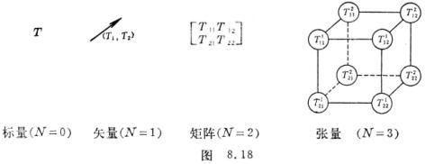

<b>§</b><b>4&nbsp;&nbsp; </b><b>张量算法</b>

一、&nbsp;&nbsp;
一、 张量概念

&nbsp;&nbsp;&nbsp; [张量的一般定义]&nbsp; 若一个量有<i>nN</i>个分量，而每个分量在<i>n</i>维空间<i>Rn</i>中的坐标变换

&nbsp;&nbsp;&nbsp; (<i>i</i>= 1 , ···, <i>n</i>)

之下，按下面的规律变化：

式中是<i>xi</i>的函数，是的函数，则量(共有<i>nN</i>个分量)称为<i>l</i>阶逆变(或抗变)<i>m</i>阶协变的<i>N</i>(=<i>l</i>＋<i>m</i>)阶混合张量(或称为(<i>l</i>＋<i>m</i>)型混合张量).

&nbsp;&nbsp;&nbsp; 张量概念是矢量和矩阵概念的推广，标量是零阶张量，矢量是一阶张量，矩阵(方阵)是二阶张量，而三阶张量(例如)好比“立体矩阵”(图8.18右).更高阶的张量不能用图形表达.下面列出<i>n</i>=2时的张量示意图：

&nbsp;&nbsp;&nbsp; [张量举例] 

&nbsp;&nbsp;&nbsp; 1&nbsp; 可乘张量&nbsp; 设由逆变分量和协变分量所给定的两个矢量<b><i>a</i>
</b>, <b><i>b</i></b>是已知的，则由等式

&nbsp; 确定的都是二阶张量，称为可乘张量.

&nbsp;&nbsp;&nbsp; 2&nbsp; 克罗内克尔符号&nbsp;
&nbsp;克罗内克尔符号是一阶逆变一阶协变的二阶混合张量，这是因为从

可得

&nbsp;&nbsp;&nbsp; [二阶对称张量与反对称张量]&nbsp; 若张量满足等式 

则分别称为二阶对称协变张量、二阶对称逆变张量和二阶对称混合张量.若张量满足等式

则分别称为二阶反对称协变张量、二阶反对称逆变张量和二阶反对称混合张量.

&nbsp;&nbsp;&nbsp; 张量的逆变(协变)指标的对称性质在坐标变换下是不变的.

在三维空间中，二阶反对称张量与矢量等价.

