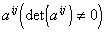
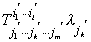
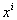

二、&nbsp;&nbsp;&nbsp;&nbsp;&nbsp;&nbsp;&nbsp;
二、&nbsp;&nbsp;&nbsp;
张量代数

&nbsp;&nbsp;&nbsp; [指标的置换]&nbsp; 指标置换是张量代数的最简单运算，利用它可作出新的张量.例如，通过指标置换，可由张量得到新的张量，它的矩阵是张量的矩阵的转置矩阵.

&nbsp;&nbsp;&nbsp; [加(减)法]&nbsp; 同类型的若干个张量的对应分量相加(或相减)就得到一个新的同类型张量的分量，这种运算称为张量的加法(或减法).

&nbsp;&nbsp;&nbsp; 任何二阶张量可分解为对称张量与反对称张量两部分.例如

&nbsp;&nbsp;&nbsp; [张量的乘法]&nbsp; 把两个张量的分量按各种可能情形相乘起来，就会得到一个新张量的分量.这个张量的逆变与协变的阶数分别等于原来两个张量的逆变与协变的阶数之和.这种运算称为张量的乘法.例如&nbsp;&nbsp;&nbsp;&nbsp;&nbsp;&nbsp;&nbsp; 

这是一个<i>l</i>＋<i>k</i>阶逆变<i>m</i>＋<i>h</i>阶协变的混合张量，它的阶数为<i>l</i>＋<i>m</i>＋<i>k</i>＋<i>h</i>.

&nbsp;&nbsp;&nbsp; 注意，张量乘法的次序是不可交换的.

&nbsp;&nbsp;&nbsp; [张量的缩并]&nbsp; 对一个给定的混合张量，把它的一个逆变指标与一个协变指标相等的相加起来，得出阶数较低(逆变和协变各低一阶)的张量，这种运算称为张量的缩并.例如

是一个<i>l</i>－1阶逆变<i>m</i>－1阶协变的混合张量.

&nbsp;&nbsp;&nbsp; [指标的升降]&nbsp; 在应用中经常用二阶逆变张量的相乘与缩并来“升高”张量的协变指标，用二阶协变张量相乘与缩并来“降低”张量的逆变指标.这种运算称为指标的升降.例如<i>Tijk</i>就可由<i>aij</i>和<i>aij</i>升降：

&nbsp;&nbsp;&nbsp; [张量的商律]&nbsp; 设和各为一组<i>xi</i>和的函数，如果对任意逆变矢量与及任一指标<i>jk</i>，使

与

成为张量，则必为张量.这种判别张量的法则称为张量的商律.

&nbsp;&nbsp;&nbsp; 例如&nbsp; 与各为，的函数，而且

则

即

对所有的都成立，所以上式括号中的表达式等于零，因此是张量.

&nbsp;&nbsp;&nbsp; 以任意协变矢量代替逆变矢量可得相仿的结果.

&nbsp;&nbsp;&nbsp; [张量密度]&nbsp; 按下面规律变化的量

称为张量密度，式中为一常数，称为张量密度的权.张量就是权为零的张量密度.根据张量的阶数，还可以定义标量密度和矢量密度.

两个指标的数目相同，且权相同的张量密度之和是一个同类型的张量密度.两个张量相乘时，权相加.

