

三、&nbsp;&nbsp;&nbsp;&nbsp;&nbsp;&nbsp;&nbsp;
三、&nbsp;&nbsp;&nbsp;
张量分析

&nbsp;&nbsp;&nbsp; 上述张量都假定它的分量是空间<i>Rn</i>中点<i>M</i>(<i>xi</i>)的函数：

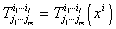

当点<i>M</i>(<i>xi</i>)在空间<i>Rn</i>中某一区域<i>D</i>中变动时，则称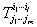是区域<i>D</i>中的一个张量场.上面所建立的张量代数的各种运算，都可以应用到张量场上来.

&nbsp;&nbsp;&nbsp; 对于张量场还有一个不变的运算——绝对微分(也称为协变微分)，这就是张量分析要讨论的内容.

&nbsp;&nbsp;&nbsp; 一个标量场的普通导数是一个协变矢量场(梯度场)的分量.但是，一般说来，一个张量场的普通导数并不构成新的张量场.

&nbsp;&nbsp;&nbsp; [仿射联络空间]&nbsp; 若对空间<i>Rn</i>中的每一坐标系(<i>xi</i>)，在一已知点<i>M</i>给定了一组(<i>n</i>3个)数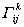，并在坐标变换

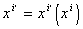

下，它们按下列规律变化

<pre style='text-align:right' align=right>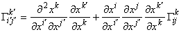&nbsp;&nbsp;&nbsp;&nbsp;&nbsp;&nbsp;&nbsp;&nbsp; &nbsp;&nbsp;&nbsp;&nbsp;&nbsp;&nbsp;&nbsp;&nbsp;&nbsp;&nbsp;&nbsp;&nbsp;&nbsp;&nbsp;&nbsp;&nbsp;&nbsp;&nbsp;&nbsp;(1)</pre>

则称在点<i>M</i>给定了一个联络对象(或联络系数)，其中偏导数是在点<i>M</i>取值的.

&nbsp;&nbsp;&nbsp; 假定在空间<i>Rn</i>中给定了联络对象场

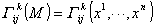

而且这些函数是连续可微的，则称<i>Rn</i>为仿射联络空间，记作<i>Ln</i>.一般说来，

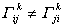

&nbsp;&nbsp;&nbsp; [挠率张量]&nbsp; (1)式中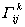的变换规律包括两项：第一项不依赖于旧坐标系中的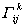；第二项依赖于，并和张量的变换规律的形式完全相同.由于第一项对两个下标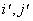是对称的，它一般不等于零，所以不是一个张量.但是

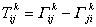

构成一个张量，称为仿射联络空间<i>Ln</i>的挠率张量.如果挠率张量等于零，即

则称所给定的空间是无挠率的仿射联络空间，记作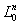.

&nbsp;&nbsp;&nbsp; [矢量的绝对微分与平行移动]&nbsp; 若在空间<i>Ln</i>中给定一个逆变矢量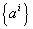，则在坐标变换下有

<pre style='text-align:right' align=right>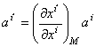&nbsp;&nbsp;&nbsp;&nbsp;&nbsp;&nbsp;&nbsp;&nbsp;&nbsp;&nbsp;&nbsp;&nbsp;&nbsp;&nbsp;&nbsp;&nbsp;&nbsp;&nbsp;&nbsp;&nbsp;&nbsp;&nbsp;&nbsp;&nbsp;&nbsp;&nbsp;&nbsp;&nbsp;&nbsp;&nbsp;&nbsp;&nbsp;&nbsp;&nbsp;&nbsp; (2)</pre>

这构成矢量在点<i>M</i>的变换规律.如果从点<i>M</i>( <i>x</i> <i>i</i>)移到点<i>N</i>(<i>xi</i>＋d<i>xi</i>)，则有

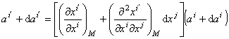

式中d<i>ai</i>表示矢量从<i>M</i>移到<i>N</i>时的改变量的分量.

&nbsp;&nbsp;&nbsp; 在上式中只取一次项就得到

<pre style='text-align:center' align=center>&nbsp;&nbsp;&nbsp;&nbsp;&nbsp;&nbsp;&nbsp; 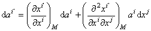&nbsp;&nbsp;&nbsp;&nbsp;&nbsp;&nbsp;&nbsp;&nbsp;&nbsp;&nbsp;&nbsp;&nbsp;&nbsp;&nbsp;&nbsp;&nbsp;&nbsp;&nbsp;&nbsp;&nbsp;&nbsp;(3)</pre>

若变换的二阶偏导数在<i>M</i>不等于零，则一个矢量的改变量决不是一个矢量的分量.

&nbsp;&nbsp;&nbsp; 如果<i>Rn</i>为仿射联络空间，可由(1)，(2)，(3)式得到

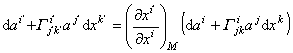

这表明

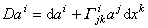

是一个逆变无穷小矢量.称<i>Dai</i>为矢量在点<i>M</i>处关于分量为d<i>xi</i>的位移<i>MN</i>的绝对微分.如果联络对象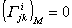，则绝对微分与普通微分一致.

&nbsp;&nbsp;&nbsp; 若矢量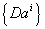等于零，即

=0

就称矢量关于联络从点<i>M</i>平行地移动到点<i>N</i>.当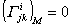，分量<i>ai</i>保持不变(d<i>ai</i>
= 0)时，矢量从点<i>M</i>平行移动到点<i>N</i>，就相当于欧氏空间中的平行移动.

&nbsp;&nbsp;&nbsp; 如果给定一条曲线<i>C</i>

<i>x</i> <i>i</i>
= <i>x</i> <i>i</i> ( <i>t</i> )

和一个逆变矢量，沿这条曲线<i>C</i>可以作伴随于的矢量

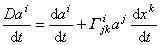

称它为沿曲线<i>C</i>的导矢量.如果的导矢量为零，即

<pre>&nbsp;&nbsp; &nbsp;&nbsp;&nbsp;&nbsp;&nbsp;&nbsp;&nbsp;&nbsp;&nbsp;&nbsp;&nbsp;&nbsp;&nbsp;&nbsp;&nbsp;&nbsp;&nbsp;&nbsp;&nbsp;&nbsp;&nbsp;&nbsp;&nbsp;&nbsp;&nbsp;&nbsp;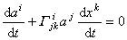&nbsp;&nbsp;&nbsp;&nbsp;&nbsp;&nbsp;&nbsp;&nbsp;&nbsp;&nbsp;&nbsp;&nbsp;&nbsp;&nbsp;&nbsp;&nbsp;&nbsp;&nbsp;&nbsp;&nbsp;&nbsp;&nbsp;&nbsp;&nbsp;(4)</pre>

则矢量<i>ai</i>自身沿曲线<i>C</i>平行地移动，(4)式与坐标系的选择无关，就是说，矢量沿曲线的平行移动在坐标变换下是不变的.

&nbsp;&nbsp;&nbsp; 同样地可以考虑协变矢量的绝对微分与平行移动.称

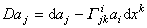

为协变矢量关于位移d<i>xi</i>的绝对微分.平行移动的条件为

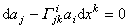

或沿曲线<i>C</i>平行移动的条件为

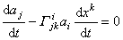

&nbsp;&nbsp;&nbsp; [协变导数]&nbsp; 从逆变矢量与协变矢量的绝对微分的定义公式可以得到量

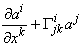和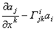

它们是关于指标<i>k</i>协变的二阶张量，分别称为矢量和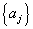的协变导数，分别记作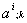和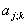或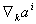和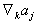.

&nbsp;&nbsp;&nbsp; [张量的绝对微分与平行移动及其协变微分法]

&nbsp;&nbsp;&nbsp; 由乘积的微分公式和张量的定义可以推出张量的平行移动规律.

&nbsp;&nbsp;&nbsp; 例如，三阶张量的平行移动规律为

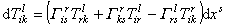

四阶张量的平行移动规律为 

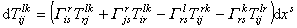

可以看出,张量平行移动规律中所包含的项数与张量的阶数是相同的, 对于张量的逆变指标, 类似于逆变矢量平行移动的规律;
对于张量的协变指标, 类似于协变矢量平行移动的规律.记

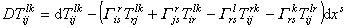

则称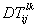为张量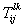的绝对微分.

&nbsp;&nbsp;&nbsp; [张量的协变导数及其运算法则]

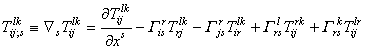

称为张量的协变导数，它是一个五阶张量的分量.

&nbsp;&nbsp;&nbsp; 在普通导数中，对于已微分的张量的每个指标再加上一项就可以构成任意张量的协变导数，对于逆变指标，这项的形式是

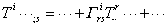

对于协变指标是

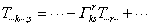

&nbsp;&nbsp;&nbsp; 协变导数的运算法则如下：

&nbsp;&nbsp;&nbsp; 1&nbsp;
若干个同样结构的张量之和的协变导数等于各个张量的协变导数之和，即

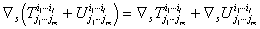

&nbsp;&nbsp;&nbsp; 2&nbsp;
满足积的微分法则，即 

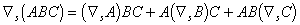

&nbsp;&nbsp;&nbsp; [自平行曲线]&nbsp; 在仿射联络空间中，如果切于曲线上一点<i>M</i>0的每个矢量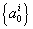沿这曲线平行移动时是切于这曲线的，则称这曲线为自平行曲线.

&nbsp;&nbsp;&nbsp; 设曲线的方程为<i>xi</i>=<i>xi</i>(<i>t</i>),
它的切矢量为<b>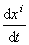</b>，它沿曲线平行移动的条件为

<b>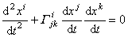</b>

这就是联络<b>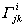</b>的自平行曲线的微分方程.设

<b>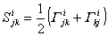</b>

上面的微分方程可写成

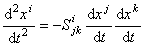

系数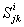显然关于<i>j</i>和<i>k</i>是对称的，并构成一个仿射联络.称构成伴随于的对称仿射联络，如果关于<i>j</i> , <i>k</i>也是对称的，则与一致.

