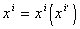

<b>§</b><b>5&nbsp;&nbsp; </b><b>黎曼几何初步</b>

一、&nbsp;&nbsp;
一、 黎曼空间

[黎曼空间及其度量张量]&nbsp; 若<i>n</i>维空间<i>Rn</i>中有一组函数<i>gij</i> ( <i>xi</i>
)=<i>gji</i> ( <i>xi</i> )，使得两邻点<i>xi</i>， 

<i>xi</i>＋<i>d</i> <i>xi</i>之间的距离<i>ds</i>由一个正定二次型

d<i>s</i>2 = <i>gij</i> ( <i>x</i>
)d<i>xi</i>d<i>xj</i>

决定，则称空间<i>Rn</i>为黎曼空间，记作<i>Vn</i>.称黎曼空间<i>Vn</i>中的几何学为黎曼几何.二次型 <i>ds</i>2称为<i>Vn</i>的线素.定义曲线弧长的微分为

而任一曲线<i>xi</i>
=<i>xi</i>(<i>t</i>)的弧长为积分

&nbsp;&nbsp;&nbsp; 因为在坐标变换

下，<i>ds</i>2为一个不变量，所以

这表明<i>gij</i> ( <i>x</i>
)为一个二阶协变张量的分量，它称为黎曼空间<i>Vn</i>的度量张量或基本张量.

&nbsp;&nbsp;&nbsp; [矢量的长度·两矢量的标量积和夹角·伴随张量]&nbsp;&nbsp; 在黎曼空间中关于标量(场)、矢量(场)、张量(场)等的定义类似前面各节，它们的运算法则也相仿.

&nbsp;&nbsp;&nbsp; 设是一个逆变矢量，则其长度的平方为

<i>gijaiaj</i>

&nbsp;&nbsp;&nbsp; 设与是两个逆变矢量，则其标量积为

<i>gijaibj</i>

这两矢量夹角的余弦为

&nbsp;&nbsp;&nbsp; 设

<i>gijai</i> =<i>aj</i> , <i>gijbi</i> =<i>bj</i>

则与都是协变矢量，它们的长度与标量积分别为

<i>gijai</i> <i>aj</i>=<i>ajaj</i>
, <i>gijaibj</i> =<i>ajbj</i>

&nbsp;&nbsp;&nbsp; 张量的伴随张量为

，

式中<i>glj</i>满足等式

式中为克罗内克尔符号.

&nbsp;&nbsp;&nbsp; [黎曼联络与克里斯托弗尔符号]&nbsp; 在黎曼空间中总可以用唯一的方式确定联络，满足条件：

&nbsp;&nbsp;&nbsp; (i)&nbsp; 仿射联络是无挠率的，即

&nbsp;&nbsp;&nbsp; (ii) &nbsp;仿射联络所产生的平行移动保持矢量的长度不变.

&nbsp;&nbsp;&nbsp; 这种称为黎曼联络或勒维－奇维塔联络.

&nbsp;&nbsp;&nbsp; 根据上述两个条件可以得出

如果记

则有

有时用下面的记号：

和

它们分别称为第一类和第二类克里斯托弗尔三指标符号.

&nbsp;&nbsp;&nbsp; 此外，还有等式

或

还要指出，§4中关于协变微分法的一切结果，对黎曼联络都成立.

