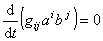

二、&nbsp;&nbsp;&nbsp;&nbsp;&nbsp;&nbsp;&nbsp;
二、&nbsp;&nbsp;&nbsp;
勒维－奇维塔的平行性

&nbsp;&nbsp;&nbsp; 仿射联络空间中的平行移动，是由仿射联络决定的.在具有度量张量<i>gij</i>的黎曼空间<i>Vn</i>中，利用黎曼联络来定义相应的平行移动称为<i>Vn</i>的勒维－奇维塔平行移动.

&nbsp;&nbsp;&nbsp; 设沿<i>Vn</i>中某一曲线 <i>xi</i> =<i>xi</i>(<i>t</i>) 给定了矢量场<i>ai</i>
=<i>ai</i>(<i>t</i>)，如果沿这条曲线作一无穷小位移时，矢量<i>ai</i>(<i>t</i>)按规律

变化，则称矢量<i>ai</i>(<i>t</i>)沿曲线作勒维－奇维塔平行移动.

&nbsp;&nbsp;&nbsp; 勒维－奇维塔平行移动具有性质：

&nbsp;&nbsp;&nbsp; 1&nbsp;
度量张量<i>gij</i>的协变导数等于零，即

还有&nbsp;&nbsp;&nbsp;&nbsp;&nbsp;&nbsp;&nbsp;&nbsp;&nbsp;&nbsp;&nbsp;&nbsp;&nbsp;&nbsp;&nbsp;&nbsp;&nbsp;&nbsp;&nbsp;&nbsp;&nbsp;&nbsp;&nbsp;&nbsp;&nbsp;
,&nbsp;&nbsp; 

&nbsp;&nbsp;&nbsp; 2&nbsp;
若两族矢量<i>ai</i>(<i>t</i>)和<i>bi</i>(<i>t</i>)都沿曲线平行移动，则

所以两矢量的标量积与夹角在平行移动下保持不变.

&nbsp;&nbsp;&nbsp; 3&nbsp;
黎曼空间<i>Vn</i>中的自平行曲线(也称为测地线)和仿射联络空间中自平行曲线的情况完全一样，都由微分方程

所确定.不过这里的是黎曼联络.所以一曲线为测地线的充分必要条件是它的单位切矢量互相平行.

