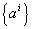
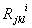

三、&nbsp;&nbsp;&nbsp;&nbsp;&nbsp;&nbsp;&nbsp;
三、&nbsp;&nbsp;&nbsp;
黎曼空间中的曲率

[曲率张量与李奇公式]&nbsp; 张量的协变导数与普通导数的明显区别是：求高阶导数时，张量导数的结果一般与求导的次序有关.例如，运算作用于矢量时，则有&nbsp;&nbsp;&nbsp;&nbsp;&nbsp;&nbsp;&nbsp;&nbsp;&nbsp;

<pre style='text-align:right' align=right>&nbsp;&nbsp;&nbsp;&nbsp;&nbsp;&nbsp;&nbsp;&nbsp;&nbsp;&nbsp;&nbsp;&nbsp;&nbsp;&nbsp;&nbsp; (1)</pre>

记

它是一个三阶协变一阶逆变的四阶混合张量，称为空间<i>Vn</i>的曲率张量或黎曼－克里斯托弗尔张量.由(1)式得

左边称为逆变矢量的交错二阶协变导数；对协变矢量的交错二阶协变导数是

张量的交错二阶协变导数是

这称为李奇公式.

&nbsp;&nbsp;&nbsp; [黎曼符号·李奇张量·曲率标量·爱因斯坦空间]

&nbsp;&nbsp;&nbsp; 曲率张量的协变分量

称为第一类黎曼符号，而称为第二类黎曼符号.

&nbsp;&nbsp;&nbsp; 曲率张量缩并得

称为李奇张量.李奇张量再缩并得

<i>R</i> = <i>gkl</i>
<i>Rkl</i>

称为曲率标量.

&nbsp;&nbsp;&nbsp; 若李奇张量满足

则称此空间为爱因斯坦空间.

&nbsp;&nbsp;&nbsp; [曲率张量的性质]

&nbsp;&nbsp;&nbsp; 1&nbsp;
曲率张量前两个指标<i>j</i>和<i>k</i>是反对称的，即

特别&nbsp;&nbsp;&nbsp;&nbsp;&nbsp;&nbsp;&nbsp; 

&nbsp;&nbsp;&nbsp; 2&nbsp;
曲率张量对三个协变指标作循环置换后相加，使得

这称为李奇恒等式.

&nbsp;&nbsp;&nbsp; 3&nbsp;
第一类黎曼符号<i>Rkjlr</i>可按下式计算：

&nbsp;&nbsp;&nbsp; 因此<i>Rkjlr</i>关于指标<i>j</i> , <i>k</i>与 <i>l</i> , <i>r</i>是反对称的；关于前一对指标与后一对指标是对称的；对前面三个指标作循环置换后相加等于零，即

<i>Rjklr</i> =－<i>Rkjlr</i>

<i>Rjklr</i> =－<i>Rjkrl</i>

<i>Rjklr</i> = <i>Rlrjk</i>

<i>Rjklr</i> ＋<i>Rkljr</i>＋<i>Rljkr</i> = 0

４&nbsp; 李奇张量是对称的，即<i>Rkl</i> = <i>Rlk</i>.

&nbsp;&nbsp;&nbsp; 5&nbsp;
空间<i>Vn</i>中任一点下式成立：

这称为皮安奇恒等式.它表明，按协变导数的指标(<i>i</i>)及曲率张量前两个指标(<i>j</i> , <i>k</i>)作循环置换所得到的和等于零.

&nbsp; &nbsp;&nbsp;[黎曼曲率(截面曲率)与常曲率空间]&nbsp; 对黎曼空间<i>Vn</i>内一点<i>M</i>的两个线性无关矢量和作

这称为<i>pi</i>，<i>qi</i>所确定的平面的黎曼曲率，又称为截面曲率.

&nbsp;&nbsp;&nbsp; 如果对空间<i>Vn</i>(<i>n</i>
&gt; 2)中所有点都有

<i>Rrijk</i>=<i>K</i>(<i>grkgij</i>－<i>grjgik</i>)

则黎曼曲率<i>K</i>为常数，这就是舒尔(Schur)定理.

&nbsp;&nbsp;&nbsp; 黎曼曲率为常数的空间<i>Ｖ</i><i>n</i>称为常曲率空间，这种空间的线素可化为形式

这称为黎曼形式的常曲率空间的度量.

&nbsp;&nbsp;&nbsp; 常曲率空间是爱因斯坦空间.

