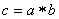
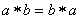
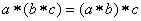
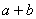
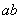

<b>第九章</b><b>&nbsp;&nbsp;&nbsp;&nbsp;&nbsp;&nbsp;&nbsp;&nbsp;&nbsp;&nbsp;
</b><b>抽象代数</b><b>·</b><b>线性空间</b><b>·</b><b>泛函分析</b>

本章内容包括抽象代数、线性空间与泛函分析三个部分，重点介绍线性空间. 为了介绍线性空间的需要，这里简略地介绍了抽象代数的初步知识，即群、环、域等基本概念及其简单的性质. 泛函分析是作为线性空间的理论在分析上应用的一个范例来介绍的，因而也不作系统的叙述. 在这里除了叙述勒贝格积分的基本概念与重要性质外，还扼要地介绍了赋范线性空间、希尔伯特空间、巴拿赫空间和它们的一些简单的性质. 

&nbsp;&nbsp;&nbsp; 在线性空间部分介绍了线性空间、线性变换、酉空间、二次型和埃尔米特型、方阵的若当标准型等的定义、性质以及一些算法. 

<b>§</b><b>1&nbsp; </b><b>抽象代数</b>

一、基本代数系统

&nbsp;&nbsp;&nbsp; [代数运算]&nbsp; 假定对于集（见第二十一章，§1，一）<i>A</i>中任意元素<i>a</i>与集<i>B</i>中任意元素<i>b</i>，按某一法则可以与某一集<i>C</i>中唯一确定的元素<i>c</i>对应，则称这个对应为<i>A</i>，<i>B</i>的一个（二元）代数运算. 集<i>A</i>，<i>B</i>也可以是同一个集，就是对<i>A</i>中任两个元素<i>a</i>，<i>b</i>，可以唯一确定元素<i>c</i>，使，<i>c</i>可属于<i>A</i>或不属于<i>A</i>，若属于<i>A</i>，则称<i>A</i>在运算下是封闭的. 

在二元运算下，若对<i>A</i>的任意两个元素<i>a</i>和<i>b</i>成立，则称<i>A</i>是可交换的. 若对<i>A</i>的任意三个元素<i>a</i>，<i>b</i>，<i>c</i>在下，成立，则称<i>A</i>是可结合的. 若运算是通常的加法或乘法，就分别记作或.
整数集中的加法和乘法都是可交换的与可结合的，因此整数集是可交换和可结合的. 

[代数系统]&nbsp; 如果一个集<i>A</i>具有满足某些法则的代数运算，就称集<i>A</i>为代数系统. 群、环、域就是三个基本的代数系统. 

