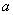
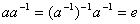
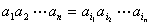

二、群

&nbsp;&nbsp;&nbsp; [群的定义与例子]&nbsp; 设<i>G</i>不是空集（见第二十一章，§1，一），对<i>G</i>给定一个代数运算，若在之下，满足下列四个条件，则称<i>G</i>为一个群：

（i） <i>G</i>在之下是封闭的，即对每一对元素，则有唯一确定的元素，且.

（ii） <i>G</i>在之下是可结合的，即对任意，有 
&nbsp;&nbsp;&nbsp;&nbsp;&nbsp;&nbsp;&nbsp;&nbsp;&nbsp;&nbsp;&nbsp;&nbsp;&nbsp;&nbsp;&nbsp;&nbsp;&nbsp;&nbsp;&nbsp;

（iii） 在<i>G</i>中有一元素<i>e</i>，对任一，满足 
&nbsp;&nbsp;&nbsp;&nbsp;&nbsp;&nbsp;&nbsp;&nbsp;&nbsp;&nbsp;&nbsp;&nbsp;&nbsp;&nbsp;&nbsp;&nbsp;&nbsp;&nbsp;&nbsp;

（iv） 对任一，都有一个，满足 
&nbsp;&nbsp;&nbsp;&nbsp;&nbsp;&nbsp;&nbsp;&nbsp;&nbsp;&nbsp;&nbsp;&nbsp;&nbsp;&nbsp;&nbsp;&nbsp;&nbsp;&nbsp;&nbsp;

条件（iii）中的<i>e</i>称为单位元或恒等元；条件（iv）中的称为的逆元. 

注意，定义中条件（iii）可改为：有一个左单位元<i>e</i>（或右单位元），使（或），对任意成立. 因为由此推出.
因此，群中单位元是唯一的. 定义中条件（iv）可改为：每个元有左（或右）逆元，使（或）成立. 因为由此推出，从而也成立. 因此，群中每个元的逆元是唯一的.

若一个群<i>G</i>的乘法可交换，则称<i>G</i>为交换群或阿贝耳群. 特别在加法之下，交换群称为加法群. 在加法群时，改为，逆元改为负元-，单位元称为零元，记作0. 

例1&nbsp;&nbsp;&nbsp;&nbsp;&nbsp;&nbsp;&nbsp;&nbsp;&nbsp;&nbsp;&nbsp;
整数集<i>N</i>组成一个加法群；有理数集、实数集、复数集各组成一个加法群. 

例2&nbsp;&nbsp;&nbsp;&nbsp;&nbsp;&nbsp;&nbsp;&nbsp;&nbsp;&nbsp;&nbsp;
非零的实数集对于乘法组成一个群. 正的实数集对于乘法也组成一个群. 

例3&nbsp;&nbsp;&nbsp;&nbsp;&nbsp;&nbsp;&nbsp;&nbsp;&nbsp;&nbsp;&nbsp;
一切元在数域<i>F</i>中的<i>n</i>阶可逆矩阵对于矩阵的乘法组成一个群，记作.

例4&nbsp;&nbsp;&nbsp;&nbsp;&nbsp;&nbsp;&nbsp;&nbsp;&nbsp;&nbsp;&nbsp;
设Ω是一个平面图形，是平面上一切使Ω不动的正交变换所组成的集，则组成一个群. 通称为图形Ω的对称群. 

例5&nbsp;&nbsp;&nbsp;&nbsp;&nbsp;&nbsp;&nbsp;&nbsp;&nbsp;&nbsp;&nbsp;
一切<i>n</i>次置换的集合组成一个群，称为置换群，记作.

事实上，若任取两个<i>n</i>次置换：

&nbsp;&nbsp;&nbsp;&nbsp;&nbsp;&nbsp;&nbsp;&nbsp;&nbsp;&nbsp;&nbsp;&nbsp;&nbsp;&nbsp;&nbsp;&nbsp;&nbsp;&nbsp;&nbsp;&nbsp;

可改写为：

 
&nbsp;&nbsp;&nbsp;
&nbsp;&nbsp;&nbsp;&nbsp;&nbsp;&nbsp;&nbsp;&nbsp;&nbsp;&nbsp;&nbsp;&nbsp;&nbsp;&nbsp;&nbsp;&nbsp;&nbsp;&nbsp;&nbsp;&nbsp;&nbsp;&nbsp;&nbsp;&nbsp;

 
对置换和，规定置换

 
&nbsp;&nbsp;&nbsp;&nbsp;&nbsp;&nbsp;&nbsp;&nbsp;&nbsp;&nbsp;&nbsp;&nbsp;&nbsp;&nbsp;&nbsp;&nbsp;&nbsp;&nbsp;&nbsp;&nbsp;&nbsp;&nbsp;&nbsp;&nbsp;&nbsp;&nbsp;&nbsp;

 
和它们对应，即为和的乘积，记作 
&nbsp;&nbsp;&nbsp;&nbsp;&nbsp;&nbsp;&nbsp;&nbsp;&nbsp;&nbsp;&nbsp;&nbsp;&nbsp;&nbsp;&nbsp;&nbsp;&nbsp;&nbsp;&nbsp;&nbsp;&nbsp;&nbsp;&nbsp;&nbsp;&nbsp;&nbsp;&nbsp;&nbsp;&nbsp;&nbsp;
 
在这个乘法之下，不难推出满足群中规定的条件，因而组成一个群. 

例6&nbsp;
非空集<i>S</i>到自身的一切可逆变换（见第二十一章，§1，二）对于变换的乘法组成一个群，称为集<i>S</i>的全变换群，记作.
的子群称为<i>S</i>上的变换群. 

[群的基本性质]

&nbsp;&nbsp;&nbsp; 1o
&nbsp;&nbsp;在群中，对任意元<i>a</i>，<i>b</i>，方程

 
&nbsp;&nbsp;&nbsp;&nbsp;&nbsp;&nbsp;&nbsp;&nbsp;&nbsp;&nbsp;&nbsp;&nbsp;&nbsp;&nbsp;&nbsp;&nbsp;&nbsp;&nbsp;&nbsp;&nbsp;&nbsp;&nbsp;
&nbsp;&nbsp;&nbsp;&nbsp;&nbsp;&nbsp;&nbsp;

 
各有解.
即.  
&nbsp;&nbsp;&nbsp; 2o&nbsp; 消去律成立. 即若，则.
 
&nbsp;&nbsp;&nbsp; 3o&nbsp; 群中一般结合律成立. 即

 
&nbsp;&nbsp;&nbsp;&nbsp;&nbsp;&nbsp;&nbsp;&nbsp;&nbsp;&nbsp;&nbsp;&nbsp;&nbsp;&nbsp;&nbsp;&nbsp;&nbsp;&nbsp;&nbsp;&nbsp;&nbsp;&nbsp;&nbsp;&nbsp;&nbsp;

 
&nbsp;&nbsp;&nbsp; 4o&nbsp; 交换群中一般交换律成立. 即

 
&nbsp;&nbsp;&nbsp;&nbsp;&nbsp;&nbsp;&nbsp;&nbsp;&nbsp;&nbsp;&nbsp;&nbsp;&nbsp;&nbsp;&nbsp;&nbsp;&nbsp;&nbsp;&nbsp;&nbsp;&nbsp;&nbsp;&nbsp;&nbsp;&nbsp;

 
式中是的任一排列. 

[子群]&nbsp; 设群<i>G</i>的非空子集<i>H</i>对于<i>G</i>的运算也组成一个群，则称<i>H</i>为<i>G</i>的一个子群.

群<i>G</i>的非空子集<i>H</i>是子群的充分必要条件是：若，则.

任意个子群的交集（见第二十一章，§1，三）是一个子群. 

[循环群]&nbsp; 一个元<i>a</i>的一切乘幂的全体组成一个群，称为循环群. 循环群是交换群. 

&nbsp;&nbsp;&nbsp; 若序列中没有两个元素相等的，则称<i>G</i>为无限循环群. 若有相等的元素，即

&nbsp;&nbsp;&nbsp;&nbsp;&nbsp;&nbsp;&nbsp;&nbsp;&nbsp;&nbsp;&nbsp;&nbsp;&nbsp;
&nbsp;&nbsp;&nbsp;&nbsp;&nbsp;&nbsp;&nbsp;&nbsp;&nbsp;&nbsp;&nbsp;&nbsp;

可推出<i>G</i>为<i>n</i>个元的集，即

 
&nbsp;&nbsp;&nbsp;&nbsp;&nbsp;&nbsp;&nbsp;&nbsp;&nbsp;&nbsp;&nbsp;&nbsp;&nbsp;&nbsp;&nbsp;&nbsp;&nbsp;&nbsp;&nbsp;&nbsp;&nbsp;&nbsp;&nbsp;&nbsp;&nbsp;&nbsp;&nbsp;

 
这时称<i>G</i>为有限循环群，<i>n</i>称为<i>G</i>的阶，即<i>n</i>为使的最小正整数. 

循环群的子群还是循环群. 

[不变子群·陪集·商群]&nbsp;
设<i>H</i>为群<i>G</i>的一个子群，若对每个元, 有 

 
&nbsp;&nbsp;&nbsp;&nbsp;&nbsp;&nbsp;&nbsp;&nbsp;&nbsp;&nbsp;&nbsp;&nbsp;&nbsp;&nbsp;&nbsp;&nbsp;&nbsp;&nbsp;&nbsp;&nbsp;&nbsp;&nbsp;&nbsp;&nbsp;&nbsp;&nbsp;&nbsp;&nbsp;&nbsp;&nbsp;&nbsp;

 
(这里表示<i>g</i>与<i>H</i>中一切元素的乘积，例如），即，则称<i>H</i>为<i>G</i>的一个不变子群（或正规子群）. 和分别称为<i>G</i>对<i>H</i>含元素<i>g</i>的左陪集和右陪集. 因此含同一元素的不变子群的左陪集和右陪集是重合的. 

把陪集看作元素时，一切陪集构成一个群，称为<i>G</i>对<i>H</i>的商群，记作<i>G</i>/<i>H</i>. 

拉格朗日定理&nbsp; 有限群<i>G</i>的子群的阶是群<i>G</i>的阶的一个因数.

<i>G</i>的不变子群<i>H</i>的商群的阶为的阶被的阶除所得的商. 

交换群的一切子群都是不变子群. 

若群<i>G</i>除自身外，无任何其他不变子群，则称<i>G</i>为单群. 

[同构与自同构]&nbsp; 设两个群，若使中任意两元<i>a</i>，<i>b</i>的乘积与中相应元的乘积对应，而且只与这个乘积对应，即

&nbsp;&nbsp;&nbsp;&nbsp;&nbsp;&nbsp;&nbsp;&nbsp;&nbsp;&nbsp;&nbsp;&nbsp;&nbsp;&nbsp;&nbsp;&nbsp;&nbsp;&nbsp;&nbsp;&nbsp;&nbsp;

具有这个性质的到上的一对一的对应，称为一个同构，又称与是同构的，记作.
群<i>G</i>到自身的同构称为自同构.

同构有以下性质：

1o在同构之下，一个群的单位元、逆元、子群分别对应到另一个群的单位元、逆元、子群. 

2o同构是一个等价关系，即

&nbsp;(i) 反身性&nbsp; ；

&nbsp;(ii) 对称性&nbsp; 若，则；

&nbsp;(iii) 传递性&nbsp; 若，，则.

&nbsp;3o凯莱定理&nbsp;
任一群<i>G</i>都同构于它的元素集的某一变换群.
&nbsp;&nbsp;&nbsp;&nbsp;

[同态与自同态]&nbsp; 有两个群,,与一个映射：.
设，若满足

&nbsp;&nbsp;&nbsp;&nbsp;&nbsp;&nbsp;&nbsp;&nbsp;&nbsp;&nbsp;&nbsp;&nbsp;&nbsp;&nbsp;&nbsp;&nbsp;&nbsp;&nbsp;&nbsp;&nbsp;&nbsp;&nbsp;&nbsp;&nbsp;&nbsp;&nbsp;

则称为一个同态. 为的一个同态象，记作~. 群到自身的同态称自同态. 

&nbsp;&nbsp;&nbsp; 同态有以下性质：

1o一对一的同态就是同构. 

2o在同态之下，单位元映到单位元，逆元映到逆元. 

3o假定<i>f</i>是群<i>G</i>到的一个同态，则<i>G</i>中对应于的单位元的一切元素所成的集<i>N</i>是<i>G</i>的一个不变子群. <i>N</i>称为同态<i>f</i>的核，记作. 

4o假定群<i>G</i>，同态，则<i>G</i>中对应于的任一固定元素的一切元素所成的集是<i>G</i>对同态核<i>N</i>的一个陪集. 

5o同态基本定理&nbsp; 假定<i>G</i>，同态，群<i>G</i>对<i>N</i>的陪集与的元素之间的一一对应是与商群<i>G</i>/<i>N</i>之间的一个同构. 它表明<i>G</i>的同态象与对应的商群<i>G</i>/<i>N</i>同构. 

