

三、环

[环的定义与例子]&nbsp; 一个非空集<i>R</i>有加法和乘法两个二元运算，若满足下列三个条件，就称<i>R</i>为一个环：

（i）<i>R</i>是一个加法群；

（ii）对乘法满足结合律.
即对任何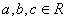，有

 
&nbsp;&nbsp;&nbsp;&nbsp;&nbsp;&nbsp;&nbsp;&nbsp;&nbsp;&nbsp;&nbsp;&nbsp;&nbsp;&nbsp;&nbsp;&nbsp;&nbsp;&nbsp;&nbsp;&nbsp;&nbsp;&nbsp;&nbsp;&nbsp;&nbsp;&nbsp;&nbsp;&nbsp;&nbsp;
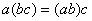

（iii）对加法和乘法满足左、右分配律. 即对任何，有

 
&nbsp;&nbsp;&nbsp;&nbsp;&nbsp;&nbsp;&nbsp;&nbsp;&nbsp;&nbsp;&nbsp;&nbsp;&nbsp;&nbsp;&nbsp;&nbsp;&nbsp;&nbsp;&nbsp;&nbsp;&nbsp;&nbsp;
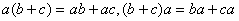

 
一个环若满足乘法的交换律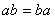，则称<i>R</i>为交换环. 

例1&nbsp;&nbsp;&nbsp;&nbsp;&nbsp;&nbsp;&nbsp;&nbsp;&nbsp;
一切整数全体是一个环，称为整数环. 

例2&nbsp;&nbsp;&nbsp;&nbsp;&nbsp;&nbsp;&nbsp;&nbsp;&nbsp;
设<i>F</i>是一个数域，则域<i>F</i>上的多项式的全体是一个环，记作<i>F</i>[<i>x</i>]. 

例3&nbsp;&nbsp;&nbsp;&nbsp;&nbsp;&nbsp;&nbsp;&nbsp;&nbsp;
如果数集<i>R</i>中任意两个数的和、差、积仍属于<i>R</i>，则<i>R</i>也是一个环，称为数环.
单个数零也是一个数环， 
称为零环，显然，数环总是交换环. 

例4&nbsp;&nbsp;&nbsp;&nbsp;&nbsp;&nbsp;&nbsp;&nbsp;&nbsp;
若<i>R</i>是一个环，一切用<i>R</i>的元所成的<i>n</i>阶方阵在矩阵的加法与乘法之下，构成一个环，称为<i>R</i>上的<i>n</i>阶全方阵环，记作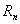.
当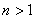时，为非交换环. 

[环的基本性质]&nbsp; 因为环是一个加法群，所以它具有加法群的一切性质. 因此只介绍由乘法所表示的各种性质. 

1o 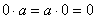

2o 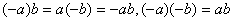

3o 对减法分配律成立，即 
&nbsp;&nbsp;&nbsp;&nbsp;&nbsp;&nbsp;&nbsp;&nbsp;&nbsp;&nbsp;&nbsp;&nbsp;&nbsp;&nbsp;&nbsp;&nbsp;

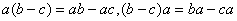

4o 一般结合律成立，即

 
&nbsp;&nbsp;&nbsp;&nbsp;&nbsp;&nbsp;&nbsp;&nbsp;&nbsp;&nbsp;&nbsp;&nbsp;&nbsp;&nbsp;&nbsp;&nbsp;&nbsp;&nbsp;
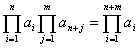

5o 一般分配律成立，即

 
&nbsp;&nbsp;&nbsp;&nbsp;&nbsp;&nbsp;&nbsp;&nbsp;&nbsp;&nbsp;&nbsp;&nbsp;&nbsp;&nbsp;&nbsp;
&nbsp;&nbsp;&nbsp;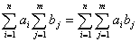

6o 对任意整数<i>m</i>，有

 
&nbsp;&nbsp;&nbsp;&nbsp;&nbsp;&nbsp;&nbsp;&nbsp;&nbsp;&nbsp;&nbsp;&nbsp;&nbsp;&nbsp;&nbsp;&nbsp;&nbsp;&nbsp;
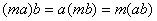

7o 对正整数的指数定律成立，即

 
&nbsp;&nbsp;&nbsp;&nbsp;&nbsp;&nbsp;&nbsp;&nbsp;&nbsp;&nbsp;&nbsp;&nbsp;&nbsp;&nbsp;&nbsp;&nbsp;&nbsp;&nbsp;
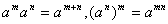

 
对交换环还有

 
&nbsp;&nbsp;&nbsp;&nbsp;&nbsp;&nbsp;&nbsp;&nbsp;&nbsp;&nbsp;&nbsp;&nbsp;&nbsp;&nbsp;&nbsp;&nbsp;&nbsp;&nbsp;
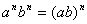

[零因子与单位元]&nbsp; 在环<i>R</i>中，若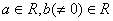，使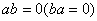，则称<i>a</i>为<i>R</i>的左（右）零因子，记作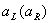. 又称<i>a</i>为<i>b</i>的左（右）零化元. 一个元同时是左、右零因子，就称它为零因子. 若环中无零因子，就称它为无零因子环. <i>n</i>阶全方阵环就是无零因子环.

若环<i>R</i>中有元素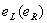，对任一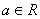，有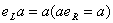，则称为<i>R</i>的左（右）单位元. 若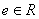同时是左、右单位元，即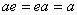，则称<i>e</i>为<i>R</i>的单位元. 这时称<i>R</i>为有单位元环. 例如整数环是单位元环，1就是它的单位元；<i>n</i>阶全方阵环有单位元，就是单位矩阵<i>I</i>. 

若<i>R</i>有单位元，则单位元是唯一的；若<i>R</i>有单位元<i>e</i>，并对有逆元，则是唯一的. 

有单位元而无零因子的交换环称为整环. 例如整数环、数域都是整环. 

[子环与扩张环]&nbsp; 设<i>S</i>是环<i>R</i>的一个子集，若<i>S</i>对<i>R</i>的两个运算组成一个环，则称<i>S</i>为<i>R</i>的一个子环，称<i>R</i>为<i>S</i>的扩张环. 

环本身可以看作是它的子环，零环也是它的子环. 异于本身与零环的子环称为真子环. 

环<i>R</i>的子集<i>S</i>成为<i>R</i>的子环的充分必要条件是：

(i)&nbsp; <i>S</i>为非空集；

(ii) 若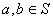，则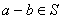；

(iii) 若，则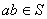.

[理想与主理想]&nbsp; 设<i>R</i>是一个环，<i>I</i>是<i>R</i>的一个子集，若<i>I</i>中任意两个元素之差以及<i>I</i>中任意元素<i>a</i>与<i>R</i>中任意元素<i>r</i>的乘积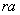和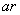都属于<i>I</i>，则称<i>I</i>为<i>R</i>的一个理想. 例如偶数全体是整数环的一个理想. 每一个理想是已知环的子环，其逆不真. 

一个环的任意多个理想的交集仍是这个环的理想. 特别，环中含有某一固定元素<i>r</i>的一切理想的交集仍是这个环的理想，即它是由一个元素<i>r</i>生成的理想，称为主理想，记作（<i>r</i>）.

