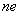

四、域

[域的定义与例子]&nbsp; 一个具有单位元的交换环<i>R</i>，若至少含有一个非零元，并且每个非零元<i>a</i>恒有逆，则称<i>R</i>为一个域. 

例1&nbsp;&nbsp;&nbsp;&nbsp;&nbsp;&nbsp;&nbsp;&nbsp;&nbsp;&nbsp;&nbsp;&nbsp;&nbsp;&nbsp;&nbsp;&nbsp;&nbsp;&nbsp;&nbsp;&nbsp;&nbsp;&nbsp;&nbsp;
例1&nbsp;&nbsp;&nbsp;&nbsp;&nbsp;&nbsp;&nbsp;&nbsp;&nbsp;
数域<i>F</i>（有理数域<b>Q</b>、实数域<b>R</b>、复数域<b>C</b>等）都是域. 

例2&nbsp;&nbsp;&nbsp;&nbsp;&nbsp;&nbsp;&nbsp;&nbsp;&nbsp;&nbsp;&nbsp;&nbsp;&nbsp;&nbsp;&nbsp;&nbsp;&nbsp;&nbsp;&nbsp;&nbsp;&nbsp;&nbsp;&nbsp;
例2&nbsp;&nbsp;&nbsp;&nbsp;&nbsp;&nbsp;&nbsp;&nbsp;&nbsp;
数域<i>F</i>上的一切有理分式 （且）在有理分式的加法和乘法之下组成一个域，称为数域<i>F</i>上的有理分式域. 

[域的基本性质]

1o域没有零因子. 

2o若集<i>F</i>在两个二元运算（加法和乘法）下满足下列条件，则<i>F</i>为一个域：

(i)&nbsp; <i>F</i>是以零为单位元的加法群；

(ii) 由除零外的<i>F</i>的一切元组成的集在乘法下是一个交换群；

(iii) 乘法对加法是可分配的，即.

3o在域<i>F</i>中，方程（，且）有唯一的解，并可记作. 

4o在域<i>F</i>中，成立指数定律：

&nbsp;&nbsp;&nbsp;&nbsp;
&nbsp;&nbsp;&nbsp;&nbsp; &nbsp;&nbsp;&nbsp;&nbsp; &nbsp;&nbsp;&nbsp;&nbsp;
&nbsp;&nbsp;&nbsp;&nbsp; &nbsp;&nbsp;&nbsp;&nbsp; &nbsp;&nbsp;&nbsp;&nbsp;
&nbsp;&nbsp;&nbsp;&nbsp; &nbsp;&nbsp;&nbsp;&nbsp; &nbsp;&nbsp;&nbsp;&nbsp; 

式中<i>m</i>，<i>n</i>为任意整数，<i>a</i>，<i>b</i>为<i>F</i>中任意两个元素，只对非零元素才能有负整数的幂. 

5o若把域<i>F</i>的单元<i>e</i>的<i>n</i>倍简记作<i>n</i>，则<i>F</i>中任一元<i>a</i>的<i>n</i>倍就是<i>n</i>与<i>a</i>的积. 

