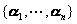

<b>§</b><b>2&nbsp; </b><b>线性空间与线性子空间</b>

一、一、线性空间

[线性运算]&nbsp;&nbsp; 设<i>F</i>是一个域，其元素<i>a</i>，<i>b</i>，<i>c</i>，…作为数量；<i>V</i>是任一种类对象的集，其元素用希腊字母<i>α</i>,<i>β</i>,<i>γ</i>,…表示. 确定两个运算法则： 
&nbsp;&nbsp;&nbsp; 1o&nbsp; <i>V</i>中元素的加法.&nbsp; 对<i>V</i>中任二元素<i>α</i>，<i>β</i>，总有唯一确定的元素<i>γ</i>与它们对应，称为<i>α</i>与<i>β</i>之和，记作. 
&nbsp;&nbsp;&nbsp; 2o <i>F</i>中的数量与<i>V</i>中元素的乘法.&nbsp; 对<i>F</i>中任一数<i>a</i>与<i>V</i>中任一元<b><i>α</i></b>，总有唯一确定的元素<i>δ</i>与它们对应，称为<i>a</i>与<i>α</i>的数乘，记作

&nbsp;这两个运算法则称为线性运算.  
&nbsp;&nbsp;&nbsp; [线性空间及其性质]&nbsp;&nbsp; 设<i>F</i>是一个域，<i>V</i>是任一种类对象的集，若对线性运算满足以下条件，则称<i>V</i>为域<i>F</i>上的线性空间： 
&nbsp;&nbsp;&nbsp; (i)&nbsp; <i>V</i>是一个加法群； 
&nbsp;&nbsp;&nbsp; (ii)&nbsp; 对任意元<i>a</i>∈<i>F</i>与<b><i>α</i></b>∈<i>V</i>，对应着唯一确定的一个元 
&nbsp;&nbsp;&nbsp; (iii) 满足分配律和结合律，即对有&nbsp;&nbsp;&nbsp;&nbsp;&nbsp;&nbsp;&nbsp;&nbsp;&nbsp;&nbsp;&nbsp;&nbsp;&nbsp;&nbsp;
&nbsp;

<pre style='text-align:center' align=center></pre>

 
域<i>F</i>的元素称为线性空间的数量，<i>V</i>的元素称为它的矢量，因而线性空间又称矢量空间. 加法群的单位元称为零矢量，记作0，（-1）<i>α</i>是<i>α</i>∈<i>V</i>的逆元，称为负矢量.  
&nbsp;&nbsp;&nbsp; 实数域上的线性空间称为实线性空间；复数域上的线性空间称为复线性空间. 

&nbsp;&nbsp;&nbsp; 例1&nbsp; 三维空间中的矢量全体组成一个实线性空间. 

&nbsp;&nbsp;&nbsp; 例2&nbsp; 数域<i>F</i>上的多项式环<i>F</i>[<i>x</i>]，按照通常的多项式加法与多项式乘法，组成数域<i>F</i>上的线性空间. 

&nbsp;&nbsp;&nbsp; 例3&nbsp; 元素属于数域<i>F</i>的<i>m</i>×<i>n</i>矩阵，按照矩阵的加法和矩阵与数的乘法，组成数域<i>F</i>上的线性空间. 

&nbsp;&nbsp;&nbsp; 例4&nbsp; 按照通常的加法和乘法，实数全体是实数域<b>R</b>上的线性空间. 复数全体是复数域<b>C</b>上的线性空间. 任一域是用自己当作数量域的线性空间. 

&nbsp;&nbsp;&nbsp; 例5&nbsp; 把在一个实区间（<i>a</i>，<i>b</i>）中定义的每个连续实函数当作一个元素，任意两个元素<i>f</i>与g的和记作，是在中定义的一个连续实函数，它在每一点<i>x</i>的值规定为

&nbsp;&nbsp;&nbsp;&nbsp;

又把一个元素<i>f</i>乘实数<i>c</i>所得到的元素规定为

<pre align=left>&nbsp;&nbsp;&nbsp;&nbsp;&nbsp;&nbsp;&nbsp;&nbsp;&nbsp;&nbsp;&nbsp;&nbsp;&nbsp;&nbsp;&nbsp;&nbsp;&nbsp;&nbsp;&nbsp;&nbsp;&nbsp;&nbsp;&nbsp;&nbsp;&nbsp;&nbsp;&nbsp;&nbsp; &nbsp;&nbsp;&nbsp;&nbsp;&nbsp;&nbsp;&nbsp;&nbsp;&nbsp;&nbsp;&nbsp;&nbsp;&nbsp;&nbsp;&nbsp;&nbsp;&nbsp;&nbsp;&nbsp;&nbsp;</pre>

则这些元素全体组成一个实线性空间. 

线性空间有以下性质：

1o零矢量是唯一的. 

2o负矢量是唯一的.

3o.

4o若则<i>c</i>=0或<b><i>α</i></b>=<b>0</b>. 

[线性相关与线性无关]&nbsp; 域<i>F</i>上的线性空间<i>V</i>中一组有限个矢量,如果对,仅当时等式

<pre>&nbsp;&nbsp;&nbsp;&nbsp;&nbsp;&nbsp;&nbsp;&nbsp;&nbsp;&nbsp;&nbsp;&nbsp;&nbsp;&nbsp;&nbsp;&nbsp;&nbsp;&nbsp;&nbsp;&nbsp;&nbsp;&nbsp;&nbsp;&nbsp;&nbsp;&nbsp; &nbsp;&nbsp;&nbsp;&nbsp;&nbsp;&nbsp;&nbsp;&nbsp;</pre>

才成立，则称矢量组为线性无关，否则称为线性相关. 若矢量组线性相关，则其中至少有一个矢量是其余矢量的一个线性组合：

&nbsp;&nbsp;&nbsp; 含零矢量<b>0</b>的任一组矢量是线性相关的.  
&nbsp;&nbsp;&nbsp; 假定域<i>F</i>上的线性空间<i>V</i>上又定义了收敛性（第二十一章，§3，四）,<i>V</i>中一组无限多个矢量,如果对<i>F</i>中的仅当时等式 
&nbsp;&nbsp;&nbsp;&nbsp;&nbsp;&nbsp;&nbsp;&nbsp;&nbsp;&nbsp;&nbsp;&nbsp;&nbsp;&nbsp;&nbsp;&nbsp;&nbsp;&nbsp;&nbsp;&nbsp;&nbsp;&nbsp;&nbsp;&nbsp;&nbsp;&nbsp;&nbsp;
 
才成立，则称矢量为线性无关，否则称为线性相关. 

&nbsp;&nbsp;&nbsp; [基底与坐标]&nbsp; 域<i>F</i>上的线性空间<i>V</i>中一组矢量如果满足

&nbsp;&nbsp;&nbsp; (i) 是线性无关的; 

&nbsp;&nbsp;&nbsp; (ii) <i>V</i>中任一矢量都是矢量的一个有限线性组合；则称为<i>V</i>的一个有限基底，也称生成（或张成）这个空间，为空间的一组生成元. 

设为<i>V</i>的一组基底，则<i>V</i>中任一矢量<b><i>α</i></b>一定可以用的线性组合来表示： 

<pre style='text-align:center'></pre>

式中复数是唯一确定的，它称为矢量<b><i>α</i></b>关于基底的坐标. 

如果<i>V</i>有一个有限基底，就称<i>V</i>是一个有限维线性空间，否则，称为无限维空间. 有限维线性空间<i>V</i>的基底的矢量个数称为<i>V</i>的维数，记作. 

&nbsp;&nbsp;&nbsp; [第一维数定理]&nbsp; 域<i>F</i>上有限维线性空间<i>V</i>的任意两个基底有相同个数的元素. 

&nbsp;&nbsp;&nbsp; 推论&nbsp; 设为一个<i>n</i>维线性空间<i>V</i>中一组线性无关的矢量，显然，则在<i>V</i>中存在一个基底使得是它的一部分. 

