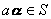
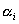

二、线性子空间

&nbsp;&nbsp;&nbsp; [线性子空间]&nbsp; 设<i>S</i>是域<i>F</i>上线性空间<i>V</i>的一个非空子集，若<i>S</i>对于<i>V</i>的线性运算也构成线性空间，则称<i>S</i>为<i>V</i>的一个线性子空间，简称为子空间. 

设<i>S</i>是域<i>F</i>上线性空间<i>V</i>的一个子集，若关于线性运算是封闭的，即

(i) 若则；

(ii) 若,则；

则<i>S</i>是<i>V</i>的子空间. 

例如，在线性空间<i>V</i>中的单个零矢量所组成的子集是<i>V</i>的一个子空间，称为零子空间. <i>V</i>本身也是<i>V</i>的一个子空间. 这两个子空间称为<i>V</i>的平凡子空间. 

设为域<i>F</i>上线性空间<i>V</i>中的一组矢量，这组矢量的一切线性组合

<pre style='text-align:center' align=center>&nbsp;</pre>

构成<i>V</i>的一个子空间，称为由生成（或张成）的子空间. 这是<i>V</i>的非平凡子空间. 

&nbsp;&nbsp;&nbsp; [子空间的交与和]&nbsp;
设<i>S</i>，<i>T</i>是域<i>F</i>上线性空间<i>V</i>的子空间，属于<i>S</i>又属于<i>T</i>的<i>V</i>中一切矢量所构成的子集称为<i>S</i>与<i>T</i>的交（通集），记作. 由能表示为的一切矢量构成的子集称为<i>S</i>与<i>T</i>的和（和集），记作（或）. 

设<i>S</i>与<i>T</i>是<i>F</i>上线性空间<i>V</i>的两个子空间，则<i>S</i>与<i>T</i>的交以及和都是<i>V</i>的子空间. 

[第二维数定理]&nbsp; 设<i>S</i>与<i>T</i>是线性空间<i>V</i>的两个子空间，则&nbsp;&nbsp;&nbsp;&nbsp;&nbsp;&nbsp;&nbsp;&nbsp;&nbsp;&nbsp;&nbsp;

<pre style='text-align:center'></pre>

（这里表示线性空间<i>V</i>的维数）.

推论&nbsp; 若<i>n</i>维线性空间<i>V</i>中两个子空间<i>S</i>与<i>T</i>的维数之和大于<i>n</i>，则<i>S</i>，<i>T</i>必含有公共非零矢量. 

例如，三维空间中两个不同平面（二维子空间）交于一条直线，由于，但，所以. 

[子空间的直和]&nbsp; 设是线性空间<i>V</i>的子空间，若和中每个矢量<b><i>α</i></b>的分解式&nbsp;&nbsp; 

<pre style='text-align:center'></pre>

是唯一的. 这个和就称为直和，记作&nbsp;&nbsp;&nbsp;&nbsp;&nbsp;&nbsp;&nbsp;&nbsp;&nbsp;&nbsp;&nbsp;&nbsp;&nbsp;&nbsp;&nbsp;&nbsp;&nbsp;&nbsp;

<pre style='text-align:center'></pre>

子空间的直和具有以下性质：

1o和是直和的充分必要条件是：&nbsp;&nbsp;&nbsp;&nbsp;&nbsp;&nbsp;&nbsp;&nbsp;&nbsp;&nbsp;&nbsp;&nbsp;&nbsp;&nbsp;

<pre style='text-align:center'></pre>

仅当全为零矢量时才成立. 

2o和是直和的充分必要条件是：

<pre>&nbsp;&nbsp;&nbsp;&nbsp;&nbsp;&nbsp;&nbsp;&nbsp;&nbsp;&nbsp;&nbsp;&nbsp;&nbsp;&nbsp;&nbsp;&nbsp;&nbsp;&nbsp;&nbsp;&nbsp;&nbsp;&nbsp;&nbsp;&nbsp;&nbsp;&nbsp;&nbsp;&nbsp;&nbsp;&nbsp;&nbsp;&nbsp;&nbsp;&nbsp;&nbsp; <i>Φ</i>（空集）</pre>

3o设是线性空间<i>V</i>的子空间，若&nbsp;&nbsp;&nbsp;&nbsp;&nbsp;&nbsp;&nbsp;&nbsp;&nbsp;&nbsp;&nbsp;&nbsp;&nbsp;&nbsp;&nbsp;&nbsp;

<pre style='text-align:center'></pre>

则 

其逆也真. 

这表明对于子空间的直和，维数是可加的. 由此可见，若 

<pre style='text-align:center'></pre>

把子空间的基&nbsp;&nbsp;&nbsp;&nbsp;&nbsp;&nbsp;&nbsp;&nbsp;&nbsp;&nbsp;&nbsp;&nbsp;&nbsp;&nbsp;&nbsp;

<pre style='text-align:center'></pre>

合并起来就得到子空间<i>W</i>的一组基. 

[商空间]&nbsp; 设<i>S</i>是<i>V</i>的一个子空间，并设两个矢量，若，则说和是等价的，记作. 实际上，这个关系具有等价关系的三个性质： 
&nbsp;&nbsp;&nbsp; (i) 反身性&nbsp; 对每个，有； 
&nbsp;&nbsp;&nbsp; (ii) 对称性&nbsp; 若，则； 
&nbsp;&nbsp;&nbsp; (iii) 传递性&nbsp; 若，，则.  
&nbsp;&nbsp;&nbsp; 和集合的情形一样，称两个等价的矢量和是属于同一类. 每个矢量恰好包含在一个类中，这一类记作. <i>V</i>中的零矢量<b>0</b>包含在与子空间<i>S</i>重合的类中. 

若把每个类作为一个元素，则这一切元素组成的集是一个线性空间，称为<i>V</i>关于<i>S</i>的商空间，记作. 商空间的零矢量是， 
且有

由此可见，若，则商空间的维数是零；又若<i>S</i>是零空间，则商空间的维数与<i>V</i>的维数相同. 

