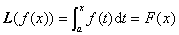

<b>§</b><b>3&nbsp; </b><b>线性变换</b>

一、&nbsp;&nbsp;&nbsp; 一、基本概念

[线性变换]&nbsp; 设和是同一域<i>F</i>上的两个线性空间，映射满足下面两个条件：

(i) ，对任意;

(ii) ，对任意；

则称<b><i>L</i></b>为线性映射或线性变换，又称同态. 若与是同一线性空间，则称<b><i>L</i></b>为空间<i>V</i>到自身的线性变换，或称为自同态. 

&nbsp;&nbsp;&nbsp; 例1&nbsp; 在一个线性空间<i>V</i>上的一个线性函数（见本节三）是<i>V</i>到域<i>F</i>（考虑为一维线性空间）的一个线性变换. 

&nbsp;&nbsp;&nbsp; 例2&nbsp; 设是线性空间<i>V</i>上的线性函数，则由&nbsp;&nbsp;&nbsp;&nbsp;&nbsp;&nbsp;&nbsp;&nbsp;&nbsp;&nbsp;&nbsp;&nbsp;&nbsp;&nbsp;&nbsp;&nbsp;

<pre style='text-align:center' align=center></pre>

所确定的映射是<i>V</i>到<i>m</i>维空间的一个线性变换. 

&nbsp;&nbsp;&nbsp; 例3&nbsp; 设<i>V</i>是区间[<i>a</i>，<i>b</i>]上所有连续函数组成的实线性空间. 若令

<pre style='text-align:center'></pre>

则<b><i>L</i></b>就是<i>V</i>的一个线性变换. 事实上，因为对任意实数<i>b</i>，<i>c</i>，有&nbsp;&nbsp;&nbsp;&nbsp;&nbsp; 

<pre style='text-align:center'></pre>

&nbsp;&nbsp;&nbsp; 例4&nbsp; 设<i>V</i>为一切实系数多项式<i>f</i>（<i>x</i>）组成的线性空间. 若令

&nbsp;&nbsp;&nbsp;&nbsp;&nbsp;&nbsp;&nbsp;&nbsp;&nbsp;&nbsp;&nbsp;&nbsp;
&nbsp;&nbsp;&nbsp;&nbsp;&nbsp;（为的导数）

则<b><i>L</i></b>是<i>V</i>的一个线性变换. 

&nbsp;&nbsp;&nbsp; [线性变换的性质]

&nbsp;&nbsp;&nbsp; 1o线性变换定义中的条件(i)，(ii)等价于：对任意&nbsp;&nbsp;&nbsp;&nbsp;&nbsp; 

<pre style='text-align:center'></pre>

重复应用这公式，导出 

&nbsp;&nbsp;&nbsp; 2o若是线性无关的，是一个线性变换，则&nbsp;&nbsp;&nbsp;&nbsp;&nbsp;&nbsp;&nbsp;&nbsp; 

<pre style='text-align:center'></pre>

也是线性无关的. 

&nbsp;&nbsp;&nbsp; 3o若构成<i>V</i>的一个基底，又设，则唯一地存在一个线性变换<b><i>L</i></b>，使

<pre style='text-align:center'></pre>

[零变换·恒等变换·逆变换]&nbsp; 将线性空间<i>V</i>的任一矢量<b><i>α</i></b>都变为线性空间的零矢量的变换，称为零变换记作<b><i>O</i></b>. 即对任一，有

&nbsp;&nbsp;&nbsp;&nbsp;&nbsp;&nbsp;&nbsp;&nbsp;&nbsp;&nbsp;&nbsp;&nbsp;&nbsp;&nbsp;&nbsp;&nbsp;&nbsp;&nbsp;
&nbsp;&nbsp;（为的零矢量）

将线性空间<i>V</i>中任一矢量<b><i>α</i></b>都变为自己的变换，称为恒等变换. 记作<b><i>I</i></b>，即对任一，有&nbsp;&nbsp;&nbsp;&nbsp;&nbsp;&nbsp;&nbsp; 

<pre style='text-align:center'></pre>

零变换和恒等变换都是线性变换. 

对的线性变换<b><i>L</i></b>，若存在上的线性变换<b><i>M</i></b>，使，则称<b><i>M</i></b>为<b><i>L</i></b>的逆变换，记作. 

[线性变换的矩阵]&nbsp; 设是线性空间<i>V</i>的一组基底，是的基底，是线性变换，那末可表为&nbsp;&nbsp;&nbsp;&nbsp;&nbsp;&nbsp;&nbsp; 

<pre style='text-align:center'></pre><pre style='text-align:center'>&nbsp;</pre>

由系数所组成的矩阵 

<pre style='text-align:center'></pre>

称为线性变换<b><i>L</i></b>关于基{}和{}的矩阵. 

特别，当<i>V</i>与的维数相同，或<b><i>L</i></b>是<i>V</i>自身的线性变换，则<i>A</i>为方阵. 

在基底确定之后，线性变换和它的矩阵建立了一对一的对应关系. 零变换的矩阵是零矩阵，恒等变换的矩阵是单位矩阵. 

&nbsp;&nbsp;&nbsp; [线性变换的特征值与特征矢量]&nbsp;
如果存在，使得自同态满足 

<pre style='text-align:center'>&nbsp;</pre><pre
style='text-align:center'></pre>

那末称为线性变换<b><i>L</i></b>的特征值（特征根），称为对应于的特征矢量. 

一个线性变换的特征值与特征矢量分别等于该变换的矩阵的特征值与特征矢量. 

[象·象源·核·线性变换的秩]&nbsp; 若是一个线性变换，则称为<i>V</i>的象，称<i>V</i>为象源，称为核. 的维数称为<b><i>L</i></b>的秩，的维数称为退化次数. 

一个线性变换的核与象分别为<i>V</i>和的线性子空间，核的维数与象的维数之和等于象源的维数.
即&nbsp;&nbsp;&nbsp;&nbsp;&nbsp;&nbsp;&nbsp;&nbsp;&nbsp;&nbsp;&nbsp;&nbsp;

<pre style='text-align:center'></pre>

一个线性变换的秩等于该变换的矩阵的秩. 

