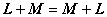
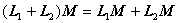

二、线性变换的运算

[线性变换的和与数乘]&nbsp; 从空间<i>V</i>到空间的线性变换的集，记作 

<pre style='text-align:center'></pre>

设，按照下列公式定义: 

<pre style='text-align:center'></pre>

这两个新的变换都是线性的，并且

<pre style='text-align:center'></pre>

分别称为线性变换的和与数乘. 

按上面定义的线性变换的和与数乘，集组成<i>F</i>上的线性空间. 它的维数等于<i>V</i>和的维数<i>n</i>和<i>m</i>的积. 

&nbsp;&nbsp;&nbsp; [线性变换的乘积]&nbsp;
设为三个线性空间，若，则定义

<pre style='text-align:center'>&nbsp;</pre>

显然是从的线性变换，称为线性变换的乘积. 

&nbsp;&nbsp;&nbsp; 线性变换的乘积满足：

&nbsp;&nbsp;&nbsp; 1o分配律&nbsp; 若则

<pre style='text-align:center'></pre>

&nbsp;&nbsp;&nbsp; 2o结合律&nbsp; 若. 

<pre style='text-align:center'></pre>

&nbsp;&nbsp;&nbsp; [幂等变换]&nbsp; 如果<b><i>L</i></b>是线性空间<i>V</i>到自身的线性变换，满足等式

<pre style='text-align:center'></pre>

那末称<b><i>L</i></b>为幂等变换. 

&nbsp;&nbsp;&nbsp; [同构与自同构]&nbsp; 若线性变换是一对一的，则称<b><i>L</i></b>是同构，或称<b><i>L</i></b>是正则的. <i>V</i>到自身的一个同构称为自同构. 若<i>V</i>到自身的线性变换不是自同构，则称它为奇异线性变换，否则就称为非奇异线性变换（或正则自同态）. 

&nbsp;&nbsp;&nbsp; 同构有以下性质：

&nbsp;&nbsp;&nbsp; 1o是一个同构的充分必要条件是：

<pre style='text-align:center'></pre>

&nbsp;&nbsp;&nbsp; 2o若<b><i>L</i></b>和<b><i>M</i></b>是同构的，，则 

<pre style='text-align:center'></pre>

特别，对自同构，上式也成立. 

&nbsp;&nbsp;&nbsp; 3o域<i>F</i>上线性空间<i>V</i>的一切自同构所成的集<i>G</i>在乘法之下构成一个群. 称<i>G</i>为<i>V</i>的线性变换群，记作，其中<i>n</i>为<i>V</i>的维数. 

&nbsp;&nbsp;&nbsp; 4o域<i>F</i>上线性空间<i>V</i>的一切线性变换（自同态）所成的集<i>R</i>在加法和乘法之下构成一个环，称<i>R</i>为<i>A</i>的线性变换环. 

