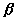

三、对偶空间与对偶映射

&nbsp;&nbsp;&nbsp; [数量积与对偶空间]&nbsp; 设<i>V</i>和是两个实（复）线性空间. 若对任意一对矢量确定了一个数量，并满足下列条件：

(i)&nbsp;&nbsp;&nbsp;&nbsp;&nbsp;&nbsp;&nbsp;&nbsp;&nbsp;&nbsp;&nbsp;&nbsp;&nbsp;&nbsp;&nbsp;&nbsp;&nbsp;&nbsp;&nbsp;&nbsp;&nbsp;&nbsp;&nbsp;&nbsp;&nbsp;&nbsp;&nbsp;&nbsp;&nbsp;&nbsp;&nbsp;&nbsp;&nbsp;
(i)&nbsp;&nbsp;&nbsp;&nbsp;&nbsp; 

<pre>&nbsp;&nbsp;&nbsp;&nbsp; </pre>

(ii) 对一个固定的和一切,若则；反之，对一个固定的和一切,若则.则称函数为数量积. 

若，则称是正交的. (ii)表明，一个空间中一个矢量与另一个空间中一切矢量正交，只当它是零矢量时才成立. 

定义了数量积的两个线性空间称为对偶空间. 

对偶空间的维数相等. 

[对偶基底]&nbsp; 若<i>V</i>和的两个基底和满足关系式：

<pre style='text-align:center'></pre>

则称它们为对偶基底. 

&nbsp;&nbsp;&nbsp; <i>V</i>和是对偶空间，则对于<i>V</i>的一个已知基底，恰有一个对偶基底. 

[正交补空间]&nbsp; 设是<i>V</i>的一个子空间，则空间<i>V</i>中与的一切矢量都正交的矢量组成的集合是<i>V</i>的一个子空间，称为的正交补空间，记作. 

正交补空间有以下性质：

1o空间和的维数之和等于空间<i>V</i>的维数，即

<pre style='text-align:center'>&nbsp; </pre>

2o

3o若，则；而且和是一对对偶空间，和也是一对对偶空间. 

&nbsp;&nbsp;&nbsp; [共轭空间]&nbsp; 设<i>V</i>是域<i>F</i>上的线性空间，若对，在<i>F</i>上有唯一的一个数与对应，则称这个对应关系为定义在<i>V</i>上的一个函数. 

&nbsp;&nbsp;&nbsp; 函数

<pre style='text-align:center'></pre>

若对任二矢量与任意，都有

<pre style='text-align:center'></pre>

则称为线性函数，又称为线性泛函. 令，则有，因此又称线性函数为线性齐次函数或线性型. 

<i>&nbsp;&nbsp;&nbsp; V</i>中线性函数的集的两个函数，的和与数乘按通常的方式定义如下：

<pre style='text-align:center'></pre>

则构成一个线性空间，称为<i>V</i>的共轭空间，的零矢量是一个恒等于零的函数. 

&nbsp;&nbsp;&nbsp; 可以证明和<i>V</i>是一对对偶空间，若{}是<i>V</i>的一组基底，则由下列方程定义的函数为的一个基底：

<pre style='text-align:center'></pre>

因而{}又是{}的共轭基底. 

[对偶映射]&nbsp; 设<i>V</i>，与<i>W</i>，是两对对偶空间；若两个线性映射：

<pre>&nbsp;&nbsp;&nbsp;&nbsp;&nbsp;&nbsp;&nbsp;&nbsp;&nbsp;&nbsp;&nbsp;&nbsp;&nbsp;&nbsp;&nbsp;&nbsp;&nbsp;&nbsp;&nbsp;&nbsp;&nbsp;&nbsp;&nbsp;&nbsp;&nbsp;&nbsp;&nbsp;&nbsp;&nbsp;&nbsp;&nbsp;&nbsp;&nbsp;&nbsp;&nbsp;&nbsp;&nbsp;&nbsp;&nbsp;&nbsp; 与</pre>

对于一切与一切，都有

<pre style='text-align:center'></pre>

则称<b><i>L</i></b>，为对偶映射. 

对偶映射有以下性质：

1O对一个已知的线性映射，恰有一个对偶映射. 

2O对偶映射<b><i>L</i></b>和的秩相等. 

3O一个矢量包含在象空间中的充分必要条件是：与核中的一切矢量正交. 

