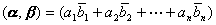

<b>§</b><b>4&nbsp; </b><b>酉空间</b>

一、一、酉空间的定义与性质

&nbsp;&nbsp;&nbsp; [酉空间与欧氏空间]&nbsp;
设<i>V</i>为一个复数域<i>F</i>上的线性空间，若在<i>V</i>中定义了两个矢量的内积（数量积），记作（），且满足：

(i) （）=（），其中（）是（）的共轭复数；

(ii) （），等号当且仅当时成立；

(iii) ，对任意成立；

则称<i>V</i>为一酉（<i>U</i>）空间，又称为内积空间. 

若<i>F</i>是实数域，这时内积是可交换的. 有限维实酉空间称为欧氏空间. 

例&nbsp; <i>n</i>维线性空间中，若规定

<pre>&nbsp;&nbsp;&nbsp;&nbsp;&nbsp;&nbsp;&nbsp;&nbsp;&nbsp;&nbsp;&nbsp;&nbsp;&nbsp;&nbsp;&nbsp; </pre><pre>&nbsp;&nbsp;&nbsp;&nbsp;&nbsp;式中 </pre>

　　　　　　　　　

则是一个酉空间. 

酉空间<i>Ｖ</i>中的内积具有性质： 

1o（）＝

2o 

3o 一般，则

　　　　　　　　　&nbsp;&nbsp;&nbsp;&nbsp; 

4o 

[模(范数)]&nbsp; 由于，所以是实的. 令

　　　　　　　&nbsp;&nbsp;&nbsp;&nbsp;&nbsp;&nbsp;&nbsp;&nbsp;&nbsp;&nbsp; 　&nbsp;&nbsp; 　

称它为酉空间<i>Ｖ</i>中矢量的模或范数. 模为１的矢量称为单位矢量或标准矢量. 

设<b><i>α</i></b>，<b><i>β</i></b>为酉空间的矢量，<i>c</i>为一复数，则

1o

2o&nbsp;&nbsp;&nbsp; （柯西-施瓦兹不等式）

等号当且仅当<b><i>α</i></b>和<b><i>β</i></b>线性相关时成立. 

3o

这些性质与空间的维数无关. 

[正交与标准正交基]&nbsp; 酉空间<i>V</i>中，若，则称矢量<b><i>α</i></b>正交于<b><i>β</i></b>. 显然，若<b><i>α</i></b>正交于<b><i>β</i></b>，则<b><i>β</i></b>也正交于<b><i>α</i></b>. 

酉空间中，任意一组两两正交非零矢量是线性无关的. 

如果一组单位矢量两两正交，则称它为一个标准正交组. 若这矢量组又生成整个空间<i>V</i>，则称它为<i>V</i>的标准正交基. 

设{}为酉空间<i>V</i>的一组标准正交矢量，，则

1o&nbsp;&nbsp;&nbsp;&nbsp; （贝塞耳不等式）

2o正交于

3o当<i>V</i>是有限维空间时，{}成为<i>V</i>的基底的充分必要条件是：任一个矢量可表示为

&nbsp;&nbsp;&nbsp;&nbsp;&nbsp;&nbsp;&nbsp;&nbsp;&nbsp;&nbsp;&nbsp;&nbsp;&nbsp;&nbsp;

且&nbsp;&nbsp;&nbsp;&nbsp;&nbsp;&nbsp;&nbsp;&nbsp;&nbsp;&nbsp;&nbsp;&nbsp;&nbsp;
&nbsp;&nbsp;&nbsp;

[子空间的正交补空间]&nbsp; 设<i>V</i>为复数域上的酉空间，<i>S</i>为<i>V</i>的一个子空间，若

(i) 

(ii) 对和有 
则称<i>T</i>为<i>S</i>的正交补空间. 

由(i)立刻可知（空集）. 

若<i>S</i>是一个有限维酉空间的一个子空间，则中有一个子空间<i>T</i>为<i>S</i>的正交补空间. 

