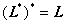

二、酉空间上的特殊线性变换

[共轭变换]&nbsp; 对域<i>F</i>上酉空间<i>V</i>上的一个线性变换<b><i>L</i></b>，由关系式

<pre align=center>&nbsp;</pre><pre>&nbsp;&nbsp;&nbsp;&nbsp;&nbsp;&nbsp;&nbsp;&nbsp;&nbsp;&nbsp;&nbsp;&nbsp;&nbsp;&nbsp;&nbsp;&nbsp;&nbsp;&nbsp;&nbsp;&nbsp;&nbsp;&nbsp;&nbsp;&nbsp;&nbsp;&nbsp;&nbsp;&nbsp;&nbsp;&nbsp;&nbsp;&nbsp;&nbsp;&nbsp; </pre>

所定义的变换是线性变换, 称为<b><i>L</i></b>的共轭变换. 若，则称<b><i>L</i></b>为正规变换. 

共轭变换有以下性质：

1o

2o

3o

4o

5o若<b><i>L</i></b>是非奇异线性变换，则也是非奇异线性变换，并且

<pre>&nbsp;&nbsp;&nbsp;&nbsp;&nbsp;&nbsp;&nbsp;&nbsp;&nbsp;&nbsp;&nbsp;&nbsp;&nbsp;&nbsp;&nbsp;&nbsp;&nbsp;&nbsp;&nbsp;&nbsp;&nbsp;&nbsp;&nbsp;&nbsp;&nbsp;&nbsp;&nbsp;&nbsp;&nbsp;&nbsp;&nbsp;&nbsp;&nbsp;&nbsp;&nbsp; </pre>

6o若在某一标准正交基下<b><i>L</i></b>的矩阵为<i>A</i>，则共轭变换关于这同一基底的矩阵为<i>A</i>的共轭转置矩阵. 

&nbsp;&nbsp;&nbsp; [自共轭变换（埃尔米特变换）]&nbsp; 若，则称<b><i>L</i></b>为自共轭变换或埃尔米特变换. 

自共轭变换有以下性质：

&nbsp;1o若<b><i>L</i></b>，<b><i>M</i></b>为自共轭变换，则也是自共轭变换. 当<b><i>L</i></b>，<b><i>M</i></b>可交换时，<b><i>LM</i></b>也是自共轭变换. 

&nbsp;2o在标准正交基下，自共轭变换的矩阵是埃尔米特矩阵. 反之，线性变换关于一标准正交基的矩阵是埃尔米特矩阵，则必为自共轭变换. 

&nbsp;3o自共轭变换的特征值是实的. 

4o有适当的标准正交基使自共轭变换<b><i>L</i></b>对应于一个实对角线矩阵，其主对角线上的元素是<b><i>L</i></b>的全部特征值. 

&nbsp;&nbsp;&nbsp; [酉变换]&nbsp; 若对酉空间<i>V</i>中的任意，有线性变换<b><i>L</i></b>，使

<pre>&nbsp;</pre><pre>&nbsp;&nbsp;&nbsp;&nbsp;&nbsp;&nbsp;&nbsp;&nbsp;&nbsp;&nbsp;&nbsp;&nbsp;&nbsp;&nbsp;&nbsp;&nbsp;&nbsp;&nbsp;&nbsp;&nbsp;&nbsp;&nbsp;&nbsp;&nbsp; </pre>

则称<b><i>L</i></b>为酉变换. 

&nbsp;&nbsp;&nbsp; 酉变换有以下性质：

1o恒等变换为酉变换. 

2o若<b><i>L</i></b>，<b><i>M</i></b>为酉变换，则<b><i>LM</i></b>也为酉变换. 

3o若<b><i>L</i></b>为酉变换，则也为酉变换. 

4o<b><i>L</i></b>为酉变换的充分必要条件是：

&nbsp;&nbsp; &nbsp;&nbsp;&nbsp;&nbsp;&nbsp;&nbsp;&nbsp;&nbsp;&nbsp;&nbsp;&nbsp;&nbsp;&nbsp;&nbsp;&nbsp;&nbsp;&nbsp;&nbsp;或&nbsp; 

5o在标准正交基下，酉变换<b><i>L</i></b>的矩阵是酉矩阵. 反之，线性变换关于一标准正交基的矩阵是酉矩阵，则必为酉变换. 

6o酉变换的特征值的绝对值都是1. 

