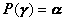

三、射影

&nbsp;&nbsp;&nbsp; [射影及其性质]&nbsp; 对线性空间<i>V</i>上的一个线性变换<b><i>P</i></b>，若有<i>V</i>的两个互补子空间<i>S</i>和<i>T</i>使得若，则

&nbsp;&nbsp;&nbsp;&nbsp;&nbsp;&nbsp;&nbsp;&nbsp;&nbsp;&nbsp;&nbsp;&nbsp;&nbsp;&nbsp;&nbsp;&nbsp;&nbsp;&nbsp;&nbsp;&nbsp;&nbsp;&nbsp;&nbsp;&nbsp;

这种变换<b><i>P</i></b>称为<i>V</i>沿<i>T</i>在<i>S</i>上的射影. 

射影有以下性质：

1o若<b><i>P</i></b>是一个射影，则

&nbsp;&nbsp;&nbsp;&nbsp;&nbsp;&nbsp;&nbsp;&nbsp;&nbsp;&nbsp;&nbsp;&nbsp;&nbsp;&nbsp;&nbsp;&nbsp;&nbsp;&nbsp;&nbsp;&nbsp;&nbsp;&nbsp;&nbsp;&nbsp;&nbsp;

因此射影是一个幂等变换；反之，幂等变换必为射影. 

2o若是线性空间<i>V</i>分别沿在上和沿在上的射影，则

(i) 是一个射影，当且仅当若时，则，并且是沿在上的射影. 

(ii) 若，则<b><i>P</i></b>是沿在上的射影. 

3o设<i>T</i>，<i>S</i>为有限维线性空间的两个互补子空间，<b><i>P</i></b>为沿子空间<i>T</i>在子空间<i>S</i>上的射影，则<b><i>P</i></b>的矩阵可化为如下形式：

<pre>&nbsp; &nbsp;&nbsp;&nbsp;&nbsp;&nbsp;&nbsp;&nbsp;&nbsp;&nbsp;&nbsp;&nbsp;&nbsp;&nbsp;&nbsp;&nbsp;&nbsp;&nbsp;&nbsp;&nbsp;&nbsp;&nbsp;&nbsp;&nbsp;&nbsp;&nbsp;&nbsp;</pre>

式中<i>A</i>是<i>k</i>阶方阵. 

[正射影]&nbsp; 设<i>S</i>，<i>T</i>为复数域上一酉空间&nbsp;&nbsp;&nbsp; <i>V</i>的互补子空间，则<i>V</i>沿<i>T</i>在<i>S</i>上的射影称为<i>V</i>在<i>S</i>上的正射影. 

[自共轭变换的分解]&nbsp; 设<b><i>L</i></b>是有限维酉空间<i>V</i>上一个自共轭变换. 令为<b><i>L</i></b>的不同特征值，令为使的矢量<b><i>α</i></b>的集合，则是<i>V</i>的子空间. 显然对，和是<i>V</i>的正交补空间. 若{}是<i>Si</i>的一个标准正交基，其中是的维数，则由一切这些所组成的集{}是<i>V</i>的一个标准正交基. 最后使<b><i>P</i></b><i>i</i>为<i>V</i>在<i>Si</i>上的射影，则关于上面的基底，<b><i>L</i></b>的矩阵有如下的形式：

&nbsp;

<pre>&nbsp;&nbsp;&nbsp;&nbsp;&nbsp;&nbsp;&nbsp;&nbsp;&nbsp;&nbsp;&nbsp;&nbsp;&nbsp;&nbsp;&nbsp;&nbsp;&nbsp;&nbsp;&nbsp;&nbsp; =</pre>

式中表示阶单位矩阵. 另一方面，关于这个基底射影<b><i>P</i></b><i>i</i>的矩阵为

<pre style='text-align:center'></pre>

式中表示阶的零矩阵. 

因此自共轭变换可以写成射影的一个线性组合. 

<pre>&nbsp;&nbsp;&nbsp;&nbsp;&nbsp;&nbsp;&nbsp;&nbsp;&nbsp;&nbsp; </pre>
