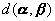
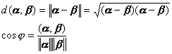
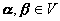

四、酉空间中的度量

&nbsp;&nbsp;&nbsp; 在本节第一段中，已经引入酉空间中的每个矢量<b><i>α</i></b>的模（范数）. 酉空间中两“点”（即矢量）<b><i>α</i></b>，<b><i>β</i></b>的距离与任二矢量<b><i>α</i></b>，<b><i>β</i></b>之间的角度的定义如下：

<pre>&nbsp;&nbsp;&nbsp;&nbsp;&nbsp;&nbsp;&nbsp;&nbsp;&nbsp;&nbsp;&nbsp;&nbsp;&nbsp;&nbsp;&nbsp;&nbsp;&nbsp; </pre>

由上述方程所定义的函数满足尺度空间（见第二十一章，§4，一）中的一切条件. 

&nbsp;&nbsp;&nbsp; 若<i>V</i>是一个实酉空间，则对一切，角度必须是实的. 

