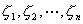
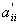
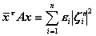

二、埃尔米特(<i>H</i>)型

&nbsp;&nbsp;&nbsp; [<i>H</i>型]&nbsp; 关于<i>n</i>个实（或复）变数的一个二次型

<pre>&nbsp;&nbsp;&nbsp;&nbsp;&nbsp;&nbsp;&nbsp;&nbsp;&nbsp;&nbsp;&nbsp;&nbsp;&nbsp;&nbsp;&nbsp;&nbsp;&nbsp;&nbsp;&nbsp;&nbsp;&nbsp;&nbsp;&nbsp;&nbsp;&nbsp;&nbsp; </pre>

称为一个埃尔米特型（<i>H</i>型），式中<i>A</i>为一个<i>n</i>阶埃尔米特矩阵（第四章，§2，四），即. 

如果一个<i>H</i>型对任一组不全为零的复数，使得，，或，则分别称<i>H</i>型为正定的，负定的，半正定的或半负定的.其他一切<i>H</i>型称为不定的（即的符号与有关）或恒等于零. 

[化<i>H</i>型为标准型]

1o一个线性变换（3）把每个<i>H</i>型变为关于新变数的一个新的<i>H</i>型

<pre>&nbsp;&nbsp;&nbsp;&nbsp;&nbsp;&nbsp;&nbsp;&nbsp;&nbsp;&nbsp;&nbsp;&nbsp;&nbsp;&nbsp;&nbsp;&nbsp;&nbsp;&nbsp;&nbsp;&nbsp;&nbsp;&nbsp; </pre>

式中&nbsp;&nbsp;&nbsp;&nbsp;&nbsp;&nbsp;&nbsp;&nbsp;&nbsp;&nbsp;&nbsp;&nbsp;&nbsp;&nbsp;&nbsp;&nbsp;&nbsp;

或&nbsp;&nbsp;&nbsp;&nbsp;&nbsp;&nbsp;&nbsp;&nbsp;&nbsp;&nbsp;&nbsp;&nbsp;&nbsp;&nbsp;&nbsp;&nbsp;&nbsp;&nbsp;&nbsp;

2o对每个<i>H</i>型，存在线性变换（3），使得

<pre>&nbsp;&nbsp;&nbsp;&nbsp;&nbsp;&nbsp;&nbsp;&nbsp;&nbsp;&nbsp;&nbsp;&nbsp;&nbsp;&nbsp;&nbsp;&nbsp;&nbsp;&nbsp;&nbsp; &nbsp;&nbsp;&nbsp;&nbsp;&nbsp;&nbsp;&nbsp;&nbsp;&nbsp;&nbsp;&nbsp;&nbsp;&nbsp;&nbsp;&nbsp;&nbsp;&nbsp;&nbsp;&nbsp;&nbsp;&nbsp;&nbsp;&nbsp;&nbsp;&nbsp;&nbsp;（7）</pre>

在（7）式中系数不等于零的个数<i>r</i>与所采用的对角化的变换无关，并且等于已知矩阵A的秩，<i>r</i>称为<i>H</i>型的秩. 

&nbsp;&nbsp;&nbsp; 3o特别，对每个<i>H</i>型存在一个对应于对角线酉矩阵<i>T</i>的线性变换，可把<i>H</i>型化为标准型

<pre>&nbsp;&nbsp;&nbsp;&nbsp;&nbsp;&nbsp;&nbsp;&nbsp;&nbsp;&nbsp;&nbsp;&nbsp;&nbsp;&nbsp;&nbsp;&nbsp;&nbsp;&nbsp;&nbsp; &nbsp;&nbsp;&nbsp;&nbsp;&nbsp;&nbsp;&nbsp;&nbsp;&nbsp;&nbsp;&nbsp;&nbsp;&nbsp;&nbsp;&nbsp;&nbsp;&nbsp;&nbsp;&nbsp;&nbsp;&nbsp;&nbsp;&nbsp;&nbsp;&nbsp;&nbsp;（8）</pre>

式中实数组是已知矩阵<i>A</i>的特征值. 

4o再施行变换，表达式（8）化为

<pre>&nbsp;&nbsp;&nbsp;&nbsp;&nbsp;&nbsp;&nbsp;&nbsp;&nbsp;&nbsp;&nbsp;&nbsp;&nbsp;&nbsp;&nbsp;&nbsp;&nbsp;&nbsp;&nbsp;&nbsp;&nbsp;&nbsp;&nbsp;&nbsp; </pre>

式中等于1，或0，分别对应于特征值是正的，负的或零. 

[两个<i>H</i>型的联立简化]&nbsp; 给定两个<i>H</i>型与，其中是正定的，存在一个变换（3），使得

<pre>&nbsp;&nbsp;&nbsp;&nbsp;&nbsp;&nbsp;&nbsp;&nbsp;&nbsp;&nbsp;&nbsp;&nbsp;&nbsp;&nbsp;&nbsp;&nbsp;&nbsp;&nbsp;&nbsp;&nbsp;&nbsp;&nbsp; </pre><pre>&nbsp;&nbsp;&nbsp;&nbsp;&nbsp;&nbsp;&nbsp;&nbsp;&nbsp;&nbsp;&nbsp;&nbsp;&nbsp;&nbsp;&nbsp;&nbsp;&nbsp;&nbsp;&nbsp;&nbsp;&nbsp;&nbsp;</pre>

实数是矩阵的特征值，它们是<i>n</i>次代数方程

<pre>&nbsp;&nbsp;&nbsp;&nbsp;&nbsp;&nbsp;&nbsp;&nbsp;&nbsp;&nbsp;&nbsp;&nbsp;&nbsp;&nbsp;&nbsp;&nbsp;&nbsp;&nbsp;&nbsp;&nbsp;&nbsp;&nbsp;&nbsp; </pre>

的根. 

[正定等的判别法]

&nbsp;&nbsp;&nbsp; 1o一个<i>H</i>型是正定，负定，半正定，半负定，不定或恒等于零的充分必要条件是：矩阵<i>A</i>的特征值（一定是实的）分别都是正的，都是负的，都是非负的，都是非正的，符号不同或都等于零. 

&nbsp;&nbsp;&nbsp; 2o一个埃尔米特矩阵<i>A</i>（和相应的<i>H</i>型）是正定或半正定的充分必要条件是：的每个主子式都是正的或非负的. 

&nbsp;&nbsp;&nbsp; 3o一个埃尔米特矩阵<i>A</i>（和相应的<i>H</i>型）是负定或半负定的充分必要条件是：－<i>A</i>分别是正定或半正定. 

&nbsp;&nbsp;&nbsp; 4o一个矩阵<i>A</i>是一个半正定的埃尔米特矩阵的充分必要条件是：

<pre>&nbsp;&nbsp;&nbsp;&nbsp;&nbsp;&nbsp;&nbsp;&nbsp;&nbsp;&nbsp;&nbsp;&nbsp;&nbsp;&nbsp;&nbsp;&nbsp;&nbsp;&nbsp;&nbsp;&nbsp;&nbsp;&nbsp;&nbsp; </pre>
