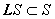
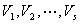
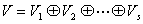
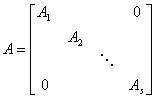
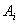
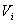
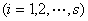

<b>§</b><b>6&nbsp; </b><b>方阵的若当标准形</b>

一、&nbsp;&nbsp; 一、&nbsp;&nbsp;&nbsp;&nbsp;&nbsp;&nbsp;&nbsp; 不变子空间

设<b><i>L</i></b>为一个实（或复）线性空间<i>V</i>的一个线性变换，<i>S</i>为<i>V</i>的一个子空间，若，则称<i>S</i>为关于<b><i>L</i></b>的一个不变子空间. 

设是<i>n</i>维线性空间<i>V</i>的一个线性变换<b><i>L</i></b>的不变子空间，<i>V</i>可以用它们的直和：

来表示的充分必要条件是：在某基底下线性变换<b><i>L</i></b>对应的矩阵<i>A</i>可化为分块对角矩阵

式中的阶数分别等于的维数. 

