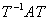

二、方阵的标准化

[若当块与若当标准方阵]&nbsp; 形为

的<i>m</i>阶方阵称为若当块，式中是一特征值. 

&nbsp;一个方阵的分块矩阵在主对角线上的子阵都是若当块，而其余的子阵都是零矩阵，即

<pre>&nbsp;&nbsp;&nbsp;&nbsp;&nbsp;&nbsp;&nbsp;&nbsp;&nbsp;&nbsp;&nbsp;&nbsp;&nbsp;&nbsp;&nbsp;&nbsp;&nbsp;&nbsp;&nbsp;&nbsp;&nbsp;&nbsp;&nbsp;&nbsp;&nbsp; &nbsp;&nbsp;&nbsp;&nbsp;&nbsp;&nbsp;&nbsp;&nbsp;&nbsp;&nbsp;&nbsp;&nbsp;&nbsp;&nbsp;&nbsp;&nbsp;&nbsp;&nbsp;&nbsp;&nbsp;&nbsp;&nbsp;&nbsp;&nbsp;&nbsp;（1）</pre>

则称其为若当标准方阵或若当标准形. 注意，不同块里的这些未必两两不同. 

[方阵的标准化]

1o特征值都不同的情形&nbsp; 若一个方阵<i>A</i>的特征值都不相等，则<i>A</i>可以化为对角矩阵，

<pre>它的主对角线上的元素就是这些特征值：</pre><pre>&nbsp;&nbsp;&nbsp;&nbsp;&nbsp;&nbsp;&nbsp;&nbsp;&nbsp;&nbsp;&nbsp;&nbsp;&nbsp;&nbsp;&nbsp;&nbsp;&nbsp;&nbsp;&nbsp;&nbsp;&nbsp;&nbsp;&nbsp;&nbsp;&nbsp;&nbsp;&nbsp;&nbsp;&nbsp;&nbsp;&nbsp;&nbsp;&nbsp;&nbsp;&nbsp;&nbsp;&nbsp;&nbsp;&nbsp;&nbsp;&nbsp;&nbsp; </pre>

2o特征值有相等的情形&nbsp; 任意方阵<i>A</i>都可以化为与它相似的若当标准形（1），其中

是它的特征值，是特征值的重数. 如不计若当块的次序，则A的标准形是唯一的. 

当且仅当一切若当块的阶都等于1时，可化为对角矩阵. 这就是1o的情形. 

以上说明，假定<i>A</i>是一个方阵，那末总可找到一个非奇异的方阵<i>T</i>，使得方阵与<i>A</i>相似.  
&nbsp;&nbsp;&nbsp;&nbsp;&nbsp;&nbsp;&nbsp;&nbsp;&nbsp;&nbsp;&nbsp;&nbsp;&nbsp;&nbsp;&nbsp;&nbsp;&nbsp;&nbsp;&nbsp;&nbsp;&nbsp;&nbsp;&nbsp;&nbsp;&nbsp;&nbsp;&nbsp;&nbsp;

