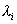

三、方阵标准化的方法与步骤

[<i>λ</i>矩阵]&nbsp; 假定一个<i>n</i>阶方阵<i>A</i>的元素都是变数<i>λ</i>的复系数多项式 
&nbsp;&nbsp;&nbsp;&nbsp;&nbsp;&nbsp;&nbsp;&nbsp;&nbsp;&nbsp;&nbsp;&nbsp;&nbsp;&nbsp;&nbsp;&nbsp;&nbsp;&nbsp;&nbsp;&nbsp;
 
则称为<i>λ</i>矩阵. 一个<i>λ</i>矩阵的不恒等于零的子式的最高阶数<i>r</i>称为的秩. 

&nbsp;&nbsp;&nbsp; [不变因子与初等因子]&nbsp; 设<i>r</i>为的秩，<i>k</i>是正整数，为的一切<i>k</i>阶子式的最高公因式，则是一个的多项式，规定的最高次项系数是1；此外规定

<pre>&nbsp;&nbsp;&nbsp;&nbsp;&nbsp;&nbsp;&nbsp;&nbsp;&nbsp;&nbsp;&nbsp;&nbsp;&nbsp;&nbsp;&nbsp;&nbsp;&nbsp; </pre>

称

<pre>&nbsp;&nbsp;&nbsp;&nbsp;&nbsp;&nbsp;&nbsp;&nbsp;&nbsp;&nbsp;&nbsp;&nbsp;&nbsp;&nbsp;&nbsp;&nbsp;&nbsp;&nbsp;&nbsp;&nbsp;&nbsp;&nbsp; </pre>

为的不变因子. 

把每个分解为一次因子，得到

<pre>&nbsp;&nbsp;&nbsp;&nbsp;&nbsp;&nbsp;&nbsp;&nbsp;&nbsp; </pre>

式中指数有的可能是零，当时，称为的一个初等因子. 

&nbsp;&nbsp;&nbsp; [初等变换·矩阵的等价]&nbsp; 对<i>λ</i>矩阵的下列三种变换的有限次组合称为的初等变换. 

（i）任何两行（列）互换；

（ii）把任何一行（列）的各元素乘上同一个<i>λ</i>的多项式后加到另一行（列）的相应的元素上；

（iii）把任何一行（列）的元素乘上同一个不等于零的复数. 

应当指出，适当地施行（ii），（iii）两种变换可以得到（i）. 

若可由经过有限次初等变换得到，则称与等价，记作. 

<i>λ</i>矩阵经过初等变换后，其不变因子和初等因子都不变. 

[<i>λ</i>矩阵的标准形]&nbsp; 设<i>λ</i>矩阵的秩为<i>r</i>，不变因子为，则

<pre>&nbsp;&nbsp;&nbsp;&nbsp;&nbsp;&nbsp;&nbsp;&nbsp;&nbsp;&nbsp;&nbsp;&nbsp;&nbsp; </pre>

称右边的方阵为的标准形. 它是由唯一确定的. 

等价的<i>λ</i>矩阵具有相同的标准形. 

[特征矩阵]&nbsp; 方阵<i>A</i>的特征矩阵是一个特殊的<i>λ</i>矩阵. 所以

1o若的初等因子为

<pre>&nbsp;&nbsp;&nbsp;&nbsp;&nbsp;&nbsp;&nbsp;&nbsp;&nbsp;&nbsp;&nbsp;&nbsp;&nbsp;&nbsp;&nbsp;&nbsp;&nbsp; </pre>

其中各未必两两不同，则

<pre>&nbsp;&nbsp;&nbsp;&nbsp;&nbsp;&nbsp;&nbsp;&nbsp;&nbsp;&nbsp;&nbsp;&nbsp;&nbsp;&nbsp;&nbsp;&nbsp;&nbsp;&nbsp;&nbsp; </pre>

且有

<pre>&nbsp;&nbsp;&nbsp;&nbsp;&nbsp;&nbsp; </pre>

&nbsp;&nbsp;&nbsp; 2o如果<i>n</i>阶<i>λ</i>矩阵

<pre>&nbsp;&nbsp;&nbsp;&nbsp;&nbsp;&nbsp;&nbsp;&nbsp;&nbsp;&nbsp;&nbsp;&nbsp;&nbsp; </pre>

其中，则

式中<i>J</i>为<i>A</i>的若当标准形. 

3o若<i>A</i>的特征矩阵的初等因子为

<pre>&nbsp;&nbsp;&nbsp;&nbsp;&nbsp;&nbsp;&nbsp;&nbsp;&nbsp;&nbsp;&nbsp; </pre>

则&nbsp;&nbsp;&nbsp;&nbsp;&nbsp;&nbsp;&nbsp;&nbsp;&nbsp;&nbsp;&nbsp;&nbsp;&nbsp;&nbsp;&nbsp;&nbsp;&nbsp;&nbsp;&nbsp;&nbsp;&nbsp;&nbsp;&nbsp;&nbsp;&nbsp;&nbsp;&nbsp;&nbsp;&nbsp;

<i>J</i>为<i>A</i>的若当标准形. 

&nbsp;&nbsp;&nbsp; [方阵标准化的步骤]&nbsp;
把方阵<i>A</i>化为<i>A</i>的若当标准形的步骤如下：

&nbsp;&nbsp;&nbsp; (1)&nbsp; 利用初等变换把化为对角矩阵，分解对角线上的多项式，就得到的全部初等因子. 

(2)&nbsp; 相应于每个初等因子，作出一个<i>m</i>阶的若当块

<pre>&nbsp;</pre><pre>&nbsp;&nbsp;&nbsp;&nbsp;&nbsp;&nbsp;&nbsp;&nbsp;&nbsp;&nbsp;&nbsp;&nbsp;&nbsp;&nbsp;&nbsp;&nbsp;&nbsp;&nbsp;&nbsp;&nbsp;&nbsp;&nbsp;&nbsp;&nbsp; </pre>

&nbsp;&nbsp;&nbsp; (3)&nbsp; 把全部若当块合并起来就得到<i>A</i>的若当标准形. 

&nbsp;&nbsp;&nbsp; 例1&nbsp; 求方阵&nbsp; &nbsp;&nbsp;&nbsp;&nbsp;&nbsp;&nbsp;&nbsp;

<pre>&nbsp;&nbsp;&nbsp;&nbsp;&nbsp;&nbsp;&nbsp; &nbsp;</pre>

的若当标准形. 

&nbsp;&nbsp;&nbsp; 解

<pre>&nbsp;&nbsp;&nbsp;&nbsp;&nbsp;&nbsp;&nbsp;&nbsp;&nbsp;&nbsp;&nbsp;&nbsp;&nbsp;&nbsp;&nbsp;&nbsp;&nbsp;&nbsp;&nbsp;&nbsp;&nbsp;&nbsp;&nbsp;&nbsp; </pre>

容易求出它的不变因子为1，1，，所以初等因子是，因此得到<i>A</i>的若当标准形

&nbsp;&nbsp;&nbsp; 例2&nbsp; 求方阵

<pre>&nbsp;&nbsp;&nbsp;&nbsp;&nbsp;&nbsp;&nbsp;&nbsp;&nbsp;&nbsp;&nbsp;&nbsp;&nbsp;&nbsp;&nbsp;&nbsp;&nbsp;&nbsp;&nbsp;&nbsp;&nbsp;&nbsp;&nbsp;&nbsp;&nbsp;&nbsp; </pre>

的若当标准形. 

解&nbsp;&nbsp;&nbsp; 

<pre>&nbsp;&nbsp;&nbsp;&nbsp;&nbsp;&nbsp;&nbsp;&nbsp;&nbsp;&nbsp;&nbsp;&nbsp;&nbsp;&nbsp;&nbsp;&nbsp;&nbsp;&nbsp;&nbsp;&nbsp;&nbsp;&nbsp;&nbsp; </pre>

经过初等变换可以把它化为如下形式的对角线矩阵

<pre>&nbsp;&nbsp;&nbsp;&nbsp;&nbsp;&nbsp;&nbsp;&nbsp;&nbsp;&nbsp;&nbsp;&nbsp;&nbsp;&nbsp;&nbsp;&nbsp;&nbsp;&nbsp;&nbsp;&nbsp;&nbsp;&nbsp;&nbsp;&nbsp;&nbsp;&nbsp;&nbsp;&nbsp;&nbsp;&nbsp;&nbsp; </pre>

所以初等因子为，，相应的若当块为

所以<i>A</i>的若当标准形为

