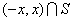

<b>§</b><b>7&nbsp; </b><b>泛函分析初步</b>

一、一、勒贝格积分

1、&nbsp;&nbsp; 1、
测度与可测函数

[测度与可测集]&nbsp; 设<i>S</i>为某一区间内的任一有界点集，则把覆盖<i>S</i>的一组区间的长度之和的下确界称为<i>S</i>的外测度，记作. 包含<i>S</i>的任一有界区间的长度与<i>S</i>关于的余集（即内不属于<i>S</i>的点的全体）的外测度之差称为<i>S</i>的内测度，记作. =的集<i>S</i>称为可测集，其测度记作. 

设<i>S</i>为直线上的一个无界点集，若对一切大于零的<i>x</i>，是可测的，则称这个无界点集<i>S</i>是可测的. 在这种情形下，定义无界点集<i>S</i>的测度为

<pre>&nbsp;&nbsp;&nbsp;&nbsp;&nbsp;&nbsp;&nbsp;&nbsp;&nbsp;&nbsp;&nbsp; </pre>

这里可以有限或无限. 

每个有界开集都是可测的. 

可测集的概念可以推广到<i>n</i>维空间的点集上去. 

[几乎处处]&nbsp; 若一个性质对区间上除了一个测度为零的集合之外，在其他点都成立，则称这个性质在已知区间上几乎处处成立. 

[可测函数]&nbsp; 设函数在可测集<i>S</i>上定义，而<i>c</i>是任意实数. 若在<i>S</i>上使的一切点<i>x</i>所构成的集是可测的，则称函数为在<i>S</i>上的一个可测函数. 

在这个定义中，条件可用，，中任一条件来代替. 

在内任一连续函数是内的可测函数. 

若都是内的可测函数，则（<i>a</i>为常数），和（极限存在）也都是内的可测函数. 

