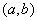
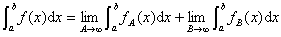

2、勒贝格积分

&nbsp;&nbsp;&nbsp; [有界函数的勒贝格积分]&nbsp;
在有界区间内给定一个有界可测的实函数，在（）的变化范围内插入分点：

<pre>&nbsp;&nbsp;&nbsp;&nbsp;&nbsp;&nbsp;&nbsp;&nbsp;&nbsp;&nbsp;&nbsp;&nbsp;&nbsp;&nbsp;&nbsp;&nbsp;&nbsp;&nbsp; &nbsp;&nbsp;&nbsp;&nbsp;&nbsp;&nbsp;&nbsp;&nbsp;&nbsp;&nbsp;&nbsp;&nbsp;&nbsp;&nbsp;&nbsp;&nbsp;&nbsp;&nbsp;&nbsp;&nbsp;&nbsp;&nbsp;&nbsp;（1）</pre>

并用表示使在内的点<i>x</i>所构成的集，对每个分法（1）的序列，当时，和式趋于唯一的有限极限<i>I</i>，记作

<pre>&nbsp;&nbsp;&nbsp;&nbsp;&nbsp;&nbsp;&nbsp;&nbsp;&nbsp;&nbsp;&nbsp;&nbsp;&nbsp;&nbsp;&nbsp;&nbsp;&nbsp;&nbsp;&nbsp;&nbsp; </pre>

这个量称为在内按勒贝格意义的定积分，又称为勒贝格积分，称在内是可积（在勒贝格意义下，下同）的. 

&nbsp;&nbsp;&nbsp; [无界函数的勒贝格积分]&nbsp;&nbsp;
若在有界区间内是无界可测函数，则勒贝格积分定义如下：

<pre>&nbsp;&nbsp;&nbsp;&nbsp;&nbsp;&nbsp;&nbsp;&nbsp;&nbsp;&nbsp;&nbsp;&nbsp;&nbsp;&nbsp;&nbsp;&nbsp;&nbsp;&nbsp;&nbsp;&nbsp;&nbsp; </pre>

式中

<pre>&nbsp;</pre>

[在无界区间上的勒贝格积分]&nbsp; 若对一切存在，则定义勒贝格积分如下：

<pre>&nbsp;&nbsp;&nbsp;&nbsp;&nbsp;&nbsp;&nbsp;&nbsp;&nbsp;&nbsp;&nbsp;&nbsp;&nbsp;&nbsp;&nbsp;&nbsp;&nbsp; </pre>

 
式中&nbsp;&nbsp;&nbsp;&nbsp;&nbsp;&nbsp;&nbsp;&nbsp;&nbsp; 

同样可以定义和. 

[在一个点集上的勒贝格积分]&nbsp; 上述有界和无界函数的勒贝格积分的定义可推广到任一个可测集<i>S</i>上的勒贝格积分. 还可推广到<i>n</i>维空间的区域或可测集上的多重勒贝格积分. 

[勒贝格积分的存在性与性质]

1o每个有界可测集函数在任一有界可测集上是可积的，在一可测集<i>S</i>上的可积函数在<i>S</i>的每个子集上都是可积的. 

2o勒贝格积分存在的充分必要条件是：勒贝格积分存在. 

3o在一个测度等于零的集上的勒贝格积分等于零. 

4o设为一组可数的互不相交（即）的可测集，假定在和上的勒贝格积分都存在，则

<pre>&nbsp;&nbsp;&nbsp;&nbsp;&nbsp;&nbsp;&nbsp;&nbsp;&nbsp;&nbsp;&nbsp;&nbsp;&nbsp;&nbsp;&nbsp;&nbsp;&nbsp;&nbsp; &nbsp;&nbsp;&nbsp;&nbsp;&nbsp;&nbsp;&nbsp;&nbsp;&nbsp;</pre>

5o连续性定理&nbsp; 设和一个正的函数在一个可测集<i>S</i>上都是可测的，并且对一切<i>n</i>与<i>S</i>中一切<i>x</i>，不等式

<pre>&nbsp;&nbsp;&nbsp;&nbsp;&nbsp;&nbsp;&nbsp;&nbsp;&nbsp;&nbsp;&nbsp;&nbsp;&nbsp;&nbsp;&nbsp;&nbsp;&nbsp;&nbsp;&nbsp;&nbsp;&nbsp;&nbsp;&nbsp;&nbsp;&nbsp;&nbsp;&nbsp;&nbsp;&nbsp;&nbsp;&nbsp; </pre>

几乎处处成立；又设对<i>S</i>中几乎一切<i>x</i>，使成立，则

<pre>&nbsp;&nbsp;&nbsp;&nbsp;&nbsp;&nbsp;&nbsp;&nbsp;&nbsp;&nbsp;&nbsp;&nbsp;&nbsp;&nbsp;&nbsp;&nbsp;&nbsp;&nbsp;&nbsp;&nbsp;&nbsp;&nbsp;&nbsp;&nbsp;&nbsp;&nbsp;&nbsp;&nbsp;&nbsp;&nbsp;&nbsp; </pre>

存在，且

<pre>&nbsp;&nbsp;&nbsp;&nbsp;&nbsp;&nbsp;&nbsp;&nbsp;&nbsp;&nbsp;&nbsp;&nbsp;&nbsp;&nbsp;&nbsp;&nbsp;&nbsp;&nbsp;&nbsp;&nbsp;&nbsp;&nbsp;&nbsp;&nbsp;&nbsp;&nbsp; </pre>

6o勒贝格基本定理&nbsp; 设<i>S</i>是一个可测集，不一定有界. 

若

&nbsp;&nbsp;&nbsp; (i) 都是<i>S</i>上非负的可测函数；

&nbsp;&nbsp;&nbsp; (ii)

则&nbsp;&nbsp;&nbsp;&nbsp;&nbsp;&nbsp;&nbsp;&nbsp;&nbsp;&nbsp;&nbsp;&nbsp;&nbsp;&nbsp;&nbsp;&nbsp;&nbsp;&nbsp;&nbsp;

