

二、希尔伯特空间

&nbsp;&nbsp;&nbsp; [希尔伯特（<i>H</i>）空间]&nbsp; 若无限维酉空间<i>V</i>中每个基本序列收敛于<i>V</i>中一个元素，则称<i>V</i>为完备的. 一个完备的无限维酉空间称为希尔伯特空间，或简称<i>H</i>空间. 

在<i>n</i>维空间中的矢量定义为<i>n</i>个数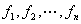的全体. 类似地，无限维空间中的矢量定义为<i>t</i>从<i>a</i>变到<i>b</i>的函数. 

矢量的加法与数乘定义为函数的加法与函数和数的乘法. 

在<i>H</i>空间中两矢量的内积（数量积）公式为

<pre>&nbsp;&nbsp;&nbsp;&nbsp;&nbsp;&nbsp;&nbsp;&nbsp;&nbsp;&nbsp;&nbsp;&nbsp;&nbsp;&nbsp;&nbsp;&nbsp;&nbsp;&nbsp;&nbsp;&nbsp;&nbsp;&nbsp;&nbsp;&nbsp; 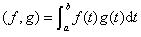&nbsp;&nbsp;&nbsp;&nbsp;&nbsp;&nbsp;&nbsp;&nbsp;&nbsp;&nbsp;&nbsp;&nbsp;&nbsp;&nbsp;&nbsp;&nbsp;&nbsp;&nbsp;&nbsp;&nbsp;&nbsp;&nbsp;&nbsp;&nbsp;&nbsp;&nbsp;&nbsp;&nbsp;&nbsp;&nbsp;&nbsp;&nbsp;&nbsp;&nbsp;（1）</pre>

&nbsp;&nbsp;&nbsp; [<i>H</i>空间的度量]&nbsp; 设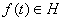，则

<pre>&nbsp;&nbsp;&nbsp;&nbsp;&nbsp;&nbsp;&nbsp;&nbsp;&nbsp;&nbsp;&nbsp;&nbsp;&nbsp;&nbsp;&nbsp;&nbsp;&nbsp; &nbsp;&nbsp;&nbsp;&nbsp;&nbsp;&nbsp;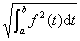</pre>

为矢量的长度. 设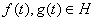，则矢量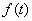与之间的距离等于

<pre>&nbsp;&nbsp;&nbsp;&nbsp;&nbsp;&nbsp;&nbsp;&nbsp;&nbsp;&nbsp;&nbsp;&nbsp;&nbsp;&nbsp;&nbsp;&nbsp;&nbsp;&nbsp;&nbsp;&nbsp;&nbsp;&nbsp;&nbsp; 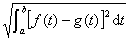</pre>

这个表达式称为函数与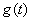的均方差. 就是以均方差作为希尔伯特空间<i>H</i>中两元素间的距离的度量. 

在<i>H</i>空间中两矢量，间的角度定义为

<pre>&nbsp;&nbsp;&nbsp;&nbsp;&nbsp;&nbsp;&nbsp;&nbsp;&nbsp;&nbsp;&nbsp;&nbsp;&nbsp;&nbsp;&nbsp;&nbsp;&nbsp;&nbsp;&nbsp;&nbsp;&nbsp;&nbsp; 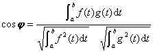&nbsp;&nbsp;&nbsp;&nbsp;&nbsp;&nbsp;&nbsp;&nbsp;&nbsp;&nbsp;&nbsp;&nbsp;&nbsp;&nbsp;&nbsp;&nbsp;&nbsp;&nbsp;&nbsp;&nbsp;&nbsp;&nbsp;&nbsp;&nbsp;&nbsp;&nbsp;（2）</pre>

因为对任意两个函数与都有不等式

&nbsp;

<pre>&nbsp;&nbsp;&nbsp;&nbsp;&nbsp;&nbsp;&nbsp;&nbsp;&nbsp;&nbsp;&nbsp;&nbsp;&nbsp;&nbsp;&nbsp;&nbsp;&nbsp;&nbsp;&nbsp;&nbsp;&nbsp;&nbsp; 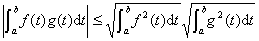</pre>

所以等式（2）的右端可以看作某角度的余弦. 

&nbsp;&nbsp;&nbsp; [正交函数与正交函数系]&nbsp;
若非零矢量<i>f</i>与<i>g</i>的内积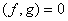，则由（1）与（2）可知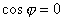，即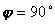. 因此称矢量<i>f</i>和<i>g</i>是正交的. 这时

<pre>&nbsp;&nbsp;&nbsp;&nbsp;&nbsp;&nbsp;&nbsp;&nbsp;&nbsp;&nbsp;&nbsp;&nbsp;&nbsp;&nbsp;&nbsp;&nbsp;&nbsp;&nbsp;&nbsp;&nbsp;&nbsp;&nbsp;&nbsp; 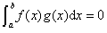</pre>

设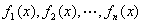表示两两正交的函数，而

<pre>&nbsp;&nbsp;&nbsp;&nbsp;&nbsp;&nbsp;&nbsp;&nbsp;&nbsp;&nbsp;&nbsp;&nbsp;&nbsp;&nbsp;&nbsp;&nbsp;&nbsp;&nbsp;&nbsp;&nbsp;&nbsp;&nbsp;&nbsp; 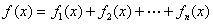</pre>

为它们的和，则的长度平方等于的长度平方和. 

因为<i>H</i>空间中矢量的长度是用积分给出的，所以这时类似于商高定理由下面的公式给出：

<pre>&nbsp;&nbsp;&nbsp;&nbsp;&nbsp;&nbsp;&nbsp;&nbsp;&nbsp;&nbsp; 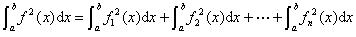</pre>

以上所述的积分，例如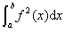,是指勒贝格积分有意义而言的. 

若<i>H</i>空间中函数系

<pre>&nbsp;&nbsp;&nbsp;&nbsp;&nbsp;&nbsp;&nbsp;&nbsp;&nbsp;&nbsp;&nbsp;&nbsp;&nbsp;&nbsp;&nbsp;&nbsp;&nbsp;&nbsp;&nbsp;&nbsp;&nbsp;&nbsp;&nbsp;&nbsp;&nbsp; 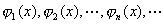</pre>

中的任意两函数相互正交，即

<pre>&nbsp;&nbsp;&nbsp;&nbsp;&nbsp;&nbsp;&nbsp;&nbsp;&nbsp;&nbsp;&nbsp;&nbsp;&nbsp;&nbsp;&nbsp;&nbsp;&nbsp;&nbsp;&nbsp;&nbsp;&nbsp;&nbsp;&nbsp;&nbsp;&nbsp;&nbsp;&nbsp;&nbsp;&nbsp; 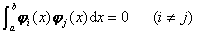</pre>

则称这个函数系为正交函数系. 若还满足

<pre>&nbsp;&nbsp;&nbsp;&nbsp;&nbsp;&nbsp;&nbsp;&nbsp;&nbsp;&nbsp;&nbsp;&nbsp;&nbsp;&nbsp;&nbsp;&nbsp;&nbsp;&nbsp;&nbsp;&nbsp;&nbsp;&nbsp;&nbsp;&nbsp;&nbsp;&nbsp;&nbsp;&nbsp;&nbsp; 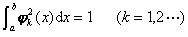</pre>

则称此函数系为标准正交系. 

&nbsp;&nbsp;&nbsp; [依标准正交函数系的分解]&nbsp;
若在<i>H</i>空间中给定一个完备的标准正交函数系（即不可能再加一个不恒为零的函数与系中的一切函数正交），则一切函数都可依这个系中函数展开成级数（平均收敛）：

<pre>&nbsp;&nbsp;&nbsp;&nbsp;&nbsp;&nbsp;&nbsp;&nbsp;&nbsp;&nbsp;&nbsp;&nbsp;&nbsp;&nbsp;&nbsp;&nbsp;&nbsp;&nbsp;&nbsp;&nbsp; 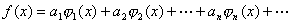</pre>

式中函数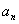等于矢量在标准正交系中的矢量上的投影：

<pre>&nbsp;&nbsp;&nbsp;&nbsp;&nbsp;&nbsp;&nbsp;&nbsp;&nbsp;&nbsp;&nbsp;&nbsp;&nbsp;&nbsp;&nbsp;&nbsp;&nbsp;&nbsp;&nbsp;&nbsp; 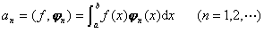</pre>

可以证明：

<pre>&nbsp;&nbsp;&nbsp;&nbsp;&nbsp;&nbsp;&nbsp;&nbsp;&nbsp;&nbsp;&nbsp;&nbsp;&nbsp;&nbsp;&nbsp;&nbsp;&nbsp;&nbsp;&nbsp;&nbsp;&nbsp;&nbsp;&nbsp;&nbsp;&nbsp;&nbsp;&nbsp; 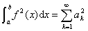</pre>

它的几何意义是，<i>H</i>空间中矢量的长度平方等于该矢量在完备的标准正交系中的矢量上的投影平方和. 

