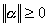
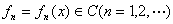
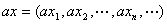

三、巴拿赫空间

&nbsp;&nbsp;&nbsp; [赋范线性空间]&nbsp; 设<i>V</i>为一个线性空间，对于<i>V</i>中每个元素<i>α</i>，有一个实数与之对应，且具有下列性质：

(i) ，当且仅当时<a
href="bword://None" name="_ftnref1" title="">*</a>，；

(ii) ，特别；

(iii) ；

则称<i>V</i>为赋范线性空间. 称为<i>α</i>的范数或模. 

对于赋范线性空间<i>V</i>，

<pre>&nbsp;&nbsp;&nbsp;&nbsp;&nbsp;&nbsp;&nbsp;&nbsp;&nbsp;&nbsp;&nbsp;&nbsp;&nbsp;&nbsp;&nbsp;&nbsp;&nbsp;&nbsp;&nbsp;&nbsp;&nbsp;&nbsp;&nbsp;&nbsp;&nbsp;&nbsp; </pre>

则<i>V</i>成为一个尺度空间. 以后讲到赋范线性空间，总认为它是一个尺度空间，并且用（1）式表示它的距离. 

[巴拿赫空间的定义与例子]&nbsp; 完备的赋范线性空间称为巴拿赫空间. 

例1&nbsp; 是巴拿赫空间.

&nbsp;&nbsp;&nbsp; 例2&nbsp; 设在内所定义的一切连续函数的全体记为<i>C</i>，令，属于<i>C</i>，<i>c</i>是任一实数，定义

<pre>&nbsp;&nbsp;&nbsp;&nbsp;&nbsp;&nbsp;&nbsp;&nbsp;&nbsp;&nbsp;&nbsp;&nbsp;&nbsp;&nbsp;&nbsp;&nbsp;&nbsp;&nbsp;&nbsp;&nbsp;&nbsp;&nbsp;&nbsp;&nbsp;&nbsp;&nbsp; </pre>

易知<i>C</i>是一个线性空间，对于<i>C</i>中的，定义

<pre>&nbsp;&nbsp;&nbsp;&nbsp;&nbsp;&nbsp;&nbsp;&nbsp;&nbsp;&nbsp;&nbsp;&nbsp;&nbsp;&nbsp;&nbsp;&nbsp;&nbsp;&nbsp;&nbsp;&nbsp;&nbsp;&nbsp;&nbsp;&nbsp;&nbsp;&nbsp;&nbsp;&nbsp;&nbsp;&nbsp;&nbsp;&nbsp; </pre>

则<i>C</i>为一赋范线性空间，这种空间称为空间. &nbsp;&nbsp;

设，则由可得函数序列一致收敛于. 

可以证明，空间是完备的，所以是巴拿赫空间. 

例3&nbsp;&nbsp;&nbsp;&nbsp;&nbsp;&nbsp;&nbsp;
例3&nbsp; &nbsp;&nbsp;设有界实数列

<pre>&nbsp;&nbsp;&nbsp;&nbsp;&nbsp;&nbsp;&nbsp;&nbsp;&nbsp;&nbsp;&nbsp;&nbsp;&nbsp;&nbsp;&nbsp;&nbsp;&nbsp;&nbsp;&nbsp;&nbsp;&nbsp;&nbsp;&nbsp;&nbsp;&nbsp;&nbsp;&nbsp;&nbsp;&nbsp; </pre>

的全体记为<i>M</i>.设与是两个有界数列，<i>a</i>是任一实数. 定义和，数乘与范数如下：

<pre>&nbsp;&nbsp;&nbsp;&nbsp;&nbsp;&nbsp;&nbsp;&nbsp;&nbsp;&nbsp;&nbsp;&nbsp;&nbsp;&nbsp;&nbsp;&nbsp;&nbsp;&nbsp;&nbsp; </pre><pre>&nbsp;&nbsp;&nbsp;&nbsp;&nbsp;&nbsp;&nbsp;&nbsp;&nbsp;&nbsp;&nbsp;&nbsp;&nbsp;&nbsp;&nbsp;&nbsp;&nbsp;&nbsp;&nbsp;&nbsp;&nbsp;&nbsp;&nbsp;&nbsp;&nbsp;&nbsp;&nbsp;&nbsp;&nbsp;</pre><pre>&nbsp;&nbsp;&nbsp;&nbsp;&nbsp;&nbsp;&nbsp;&nbsp;&nbsp;&nbsp;&nbsp;&nbsp;&nbsp;&nbsp;&nbsp;&nbsp;&nbsp;&nbsp;&nbsp;&nbsp;&nbsp;&nbsp;&nbsp;&nbsp;&nbsp;&nbsp;&nbsp;&nbsp;&nbsp;&nbsp;&nbsp;&nbsp;&nbsp;</pre>

那末<i>M</i>成为一个赋范线性空间,称为收敛序列空间，简称为空间<i>M. </i>并可证明空间<i>M</i>是完备的，所以是巴拿赫空间. 

&nbsp;&nbsp;&nbsp; [紧致性]&nbsp; 设<i>A</i>为尺度空间<i>E</i>中一个非空集，或者<i>A</i>的任一无限子集至少有一极限点，则称<i>A</i>是一个紧致集. 

任一紧致集必为有界. 

设是定义在区间上的一个函数族，若对任一，恒有，当，且时，不等式

<pre>&nbsp;&nbsp;&nbsp;&nbsp;&nbsp;&nbsp;&nbsp;&nbsp;&nbsp;&nbsp;&nbsp;&nbsp;&nbsp;&nbsp;&nbsp;&nbsp; &nbsp;&nbsp;&nbsp;&nbsp;&nbsp;&nbsp;&nbsp;&nbsp;&nbsp;&nbsp;&nbsp;&nbsp;</pre>

对<i>A</i>中任意函数成立，则称函数族<i>A</i>在上等度连续. 

阿尔采拉—阿斯可里定理&nbsp; 设是定义在上的连续函数族，

若

(i) 存在一个常数<i>M</i>，使此族中的函数都满足；

(ii)&nbsp; <i>A</i>在上等度连续；

则<i>A</i>中存在着在上一致收敛的函数序列. 

设<i>A</i>是空间<i>C</i>中的一个元素，则<i>A</i>为紧致的充分必要条件是：<i>A</i>中一切函数为有界且为等度连续. 

&nbsp;&nbsp;&nbsp; [线性泛函及其性质]&nbsp;
考虑巴拿赫空间<i>V</i>上的泛函数<i>v</i>，对于<i>V</i>中任一点<i>x</i>，有一实函数与它对应，若

&nbsp;&nbsp;&nbsp; (i) <i>v</i>是可加的，齐次的，即对<i>V</i>中任两点<i>x</i>和<i>y</i>与任两实数<i>a</i>，<i>b</i>，恒有&nbsp; 

<pre>&nbsp;&nbsp;&nbsp;&nbsp;&nbsp;&nbsp;&nbsp;&nbsp;&nbsp;&nbsp;&nbsp; </pre>

&nbsp;&nbsp;&nbsp; (ii) <i>v</i>是连续的，即当时，，则称为<i>V</i>上的线性泛函. 

线性泛函有以下性质：

1o可加齐次泛函连续的充分必要条件是：有常数，使

<pre>&nbsp;&nbsp;&nbsp;&nbsp;&nbsp;&nbsp;&nbsp;&nbsp;&nbsp;&nbsp;&nbsp;&nbsp;&nbsp;&nbsp;&nbsp;&nbsp;&nbsp;&nbsp;&nbsp;&nbsp;&nbsp;&nbsp;&nbsp;&nbsp;&nbsp;&nbsp; &nbsp;&nbsp;&nbsp;&nbsp;&nbsp;&nbsp;&nbsp;&nbsp;&nbsp;&nbsp;&nbsp;&nbsp;&nbsp;&nbsp;&nbsp;&nbsp;&nbsp;&nbsp;&nbsp;&nbsp;&nbsp;&nbsp;&nbsp;&nbsp;&nbsp;&nbsp;&nbsp;&nbsp;&nbsp;&nbsp;&nbsp;（2）</pre>

2o设是线性泛函，则由满足（2）的一切<i>M</i>构成数集的下确界称为的模或范数，记作；且有

<pre>&nbsp;&nbsp;&nbsp;&nbsp;&nbsp;&nbsp;&nbsp;&nbsp;&nbsp;&nbsp;&nbsp;&nbsp;&nbsp;&nbsp;&nbsp;&nbsp;&nbsp;&nbsp;&nbsp;&nbsp;&nbsp;&nbsp;&nbsp;&nbsp;&nbsp;&nbsp;&nbsp;&nbsp; </pre>

&nbsp;&nbsp;&nbsp; 3o若对巴拿赫空间<i>V</i>上一个线性泛函序列{}，使在<i>V</i>上处处存在，则有常数，使得

<pre>&nbsp;&nbsp;&nbsp;&nbsp;&nbsp;&nbsp;&nbsp;&nbsp;&nbsp;&nbsp;&nbsp;&nbsp;&nbsp;&nbsp;&nbsp;&nbsp;&nbsp;&nbsp;&nbsp; </pre>

这称为一致有界原理或共鸣定理. 

 

 

<a href="#None" name="_ftn1" title="">*</a> 这里0是线性空间中的零元素。

