

<b>第十章</b><b> </b><b>复变函数</b>

本章研究的对象是定义在复数域上的复值函数（简称复变函数）.重点研究一类比较特殊的复变函数——解析函数.主要内容包括解析函数的分析属性（微积分理论及级数表示）、几何性质（保角映射）等.

<b>§</b><b>1 </b><b>解析函数</b>

一、&nbsp;&nbsp;&nbsp; 一、复变函数基本概念与复变函数的导数 &nbsp;&nbsp;

&nbsp;&nbsp;&nbsp;
[单值函数与多值函数]&nbsp; 设<i>Σ</i>是扩充复平面（即包含无穷远点∞的平面）<i>z</i>上的一个区域（第二十一章§5，二），对于<i>Σ</i>内的每个复数<i>z</i>，按照一定的规律，有一个或多个复数<i>ω</i>和它对应，就称在<i>Σ</i>上定义了一个复变函数，记作

区域<i>Σ</i>称为函数的定义域.

&nbsp;&nbsp;&nbsp;
如果每一个复数<i>z</i>都只有一个复数<i>ω</i>和它对应（允许不同的复数<i>z</i>对应于同一个复数<i>ω</i>），就称函数是单值的；如果有的复数<i>z</i>有多个<i>ω</i>值和它对应，就称函数是多值的.下面如果不加说明，一律都指单值函数.

&nbsp;&nbsp;&nbsp;
[映射·象·原象]&nbsp; 如果复数<i>z</i>用复平面<i>z</i>（简称<i>z</i>平面）上的点表示，复数<i>ω</i>用复平面<i>ω</i>（简称<i>ω</i>平面）上的点表示，那末复变函数就是<i>z</i>平面上区域<i>Σ</i>的点和<i>ω</i>平面上的某个点集（第二十一章§3，一）<i>F</i>的点之间的对应关系.这样一来，复变函数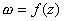可以看成几何上的“映射”（变换）（第二十一章§1，二），点<i>ω</i>（）称为点<i>z</i>的象（象点），点<i>z</i>称为点<i>ω</i>的原象（象源）.一般地，当点<i>z</i>在复平面<i>z</i>上画出一个图形<i>A</i>（或点集）时，相应地，它的象点<i>ω</i>在复平面<i>ω</i>上就画出一个图形（或点集）<i>B.</i>称<i>B</i>为<i>A</i>的象，<i>A</i>为<i>B</i>的原象.称函数把<i>A</i>映上<i>B.</i>

[单叶函数与多叶函数·反函数]&nbsp; 如果函数在点集<i>A</i>上单值的，并且对于点集<i>A</i>上的任意两个不同的点<i>z</i>1和<i>z</i>2,它们的象<i>ω</i>1=<i>f</i>(<i>z</i>1)和<i>ω</i>2=<i>f</i>(<i>z</i>2)也不同，那末称函数在点集<i>A</i>上是单叶的，如果点集<i>A</i>上至少有两个不同的点<i>z</i>1和<i>z</i>2使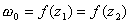，那末称函数在点集<i>A</i>上是多叶的.

&nbsp;&nbsp;&nbsp;
如果单值函数又是单叶的，它就表示<i>A</i>和<i>B</i>的点之间的一对一对应关系，并且对于<i>B</i>上的每一点<i>ω</i>，<i>A</i>上有一个且只有一个点<i>z</i>和它对应.记作

<pre>&nbsp;&nbsp;&nbsp;&nbsp;&nbsp;&nbsp;&nbsp;&nbsp;&nbsp;&nbsp;&nbsp;&nbsp;&nbsp;&nbsp;&nbsp;&nbsp;&nbsp;&nbsp;&nbsp;&nbsp;&nbsp;&nbsp; 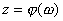</pre>

它称为函数的反函数（单值的）.

&nbsp;&nbsp;&nbsp;
如果函数在点集<i>A</i>上不是单叶的，那末它的反函数就是多值的了.

&nbsp;&nbsp;&nbsp;
[双方单值连续的映射定理]&nbsp; 设<i>ω</i>=<i>f</i>(<i>z</i>)是<i>z</i>平面区域<i>Σ</i>内的单值连续函数，如果它又是单叶的，那末<i>Σ</i>的象Δ仍是一个区域，而且反函数在Δ内连续.这种双方单值连续的映射称为拓扑映射或同胚映射.

&nbsp;&nbsp;&nbsp;
[复变函数的极限]&nbsp; 设<i>z</i>0是函数<i>f</i>(<i>z</i>)的定义域内的一点，如果对任意小的正数<i>ε</i>，都存在一个正数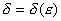，使得对于任意满足条件∣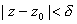的复数<i>z</i>（复数<i>z</i>0本身可能除外），都有

&nbsp;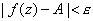

那末复数<i>A</i>（有限或无限）称为函数<i>ω</i>=<i>f</i>(<i>z</i>)当<i>z</i>趋于<i>z</i>0时的极限，记作&nbsp; 

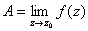

&nbsp;&nbsp;&nbsp;
[复变函数的连续性与一致连续性]&nbsp; 设<i>z</i>0是函数<i>f</i>(<i>z</i>)的定义域内的一点，如果函数<i>ω</i>=<i>f</i>(<i>z</i>)当<i>z</i>→<i>z</i>0时极限存在有限，而且同时满足 

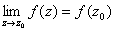

那末称函数<i>ω</i>=<i>f</i>(<i>z</i>)在点<i>z</i>0是连续的，如果函数<i>ω</i>=<i>f</i>(<i>z</i>)在区域<i>Σ</i>上每一点都连续,称函数<i>ω</i>=<i>f</i>(<i>z</i>)在区域<i>Σ</i>上是连续的.

&nbsp;&nbsp;&nbsp;
如果对于任意小的正数<i>ε</i>，都存在一个正数<i>δ</i>=<i>δ</i>(<i>ε</i>)，使得区域<i>Σ</i>内满足条件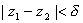的任意两点<i>z</i>1和<i>z</i>2，都有

∣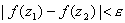

那末称函数<i>f</i>(<i>z</i>)在<i>Σ</i>上一致连续.

&nbsp;&nbsp;&nbsp;
函数在区域<i>Σ</i>上一致连续，一定在<i>Σ</i>上连续，反过来，函数在区域<i>Σ</i>上连续，不一定保证函数在<i>Σ</i>上一致连续.但是，如果<i>Σ</i>是有界闭区域（记作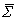）,那末上的连续性和一致连续性就等价了.同时，有界闭区域上连续函数<i>ω</i>=<i>f</i>(<i>z</i>)还有类似于微分学中闭区间上连续函数的另外两个性质:

&nbsp;&nbsp;&nbsp;
1o&nbsp;&nbsp;
如果函数<i>ω</i>=<i>f</i>(<i>z</i>)在有界闭区域上连续，那末存在一个正数<i>M</i>，使得对于上所有的<i>z</i>，都有

∣ 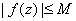

&nbsp;&nbsp;&nbsp;
2o&nbsp;&nbsp;&nbsp;
如果函数<i>ω</i>=<i>f</i>(<i>z</i>)在有界闭区域上连续，那末函数<i>f</i>(<i>z</i>)的模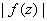在上可以达到最大值和最小值，也就是说，在上有两点<i>z</i>1和<i>z</i>2，使得对于上所有的z，都有

<pre>&nbsp;&nbsp;&nbsp;&nbsp;&nbsp;&nbsp;&nbsp;&nbsp;&nbsp;&nbsp; &nbsp;∣ 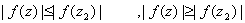∣</pre>

&nbsp;&nbsp;&nbsp;
[复变函数的导数]&nbsp; 设函数<i>ω</i>=<i>f</i>(<i>z</i>)定义在区域<i>Σ</i>上，<i>z</i>0是<i>Σ</i>内的一点，如果极限

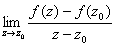

存在,而且有限，那末这个极限值就称为函数<i>f</i>(<i>z</i>)在点<i>z</i>0的导数，记作

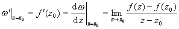

并且称函数在点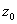可微（单演、全纯）.

&nbsp;&nbsp;&nbsp;
复变函数可微的定义与实变函数可微的定义在形式上是一样的，因此复变函数的求导数的一些法则、公式与实变函数的求导数的一些法则、公式在形式上也是一样的.但是另一方面，由于在复变函数的可微性定义中，动点<i>z</i>趋于<i>z</i>0点是在平面上，方式是任意的，它可沿任一曲线趋于<i>z</i>0，这表明复变函数可微的条件比实变函数可微的条件要求高，从而带来复变函数论不少独特的性质和应用.

&nbsp;&nbsp;&nbsp;
[复变函数的导数的几何意义（伸缩系数与旋转角）]&nbsp; 设<i>z</i>平面上通过<i>z</i>0的曲线<i>C</i>，经过映射<i>ω</i>=<i>f</i>(<i>z</i>)（可微）的象是<i>ω</i>平面上通过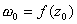的曲线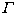，如果<i>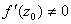</i>那末

&nbsp;&nbsp;&nbsp;
1o∣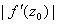称为映射<i>ω</i>=<i>f</i>(<i>z</i>)在<i>z</i>0的伸缩系数，它等于曲线上通过<i>ω</i>0的无穷小弦长与曲线<i>C</i>上通过<i>z</i>0的无穷小弦长之比的极限，它与曲线C和曲线的选择无关；

2o&nbsp;&nbsp; 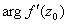称为映射<i>ω</i>=<i>f</i>(<i>z</i>)在<i>z</i>0的旋转角，如果把<i>z</i>平面与<i>ω</i>平面迭放在一起，使点<i>z</i>0与点<i>ω</i>0重合，<i>x</i>轴与<i>u</i>轴平行且正方向相同，那末就等于曲线<i>C</i>在<i>z</i>0的切线到曲线在对应点<i>ω</i>0的切线所转过的角度，它与曲线<i>C</i>和曲线的选择无关.

