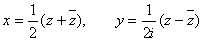

二、解析函数

一般地，复数函数<i>ω</i>=<i>f</i>(<i>z</i>)可以写成

<pre>&nbsp;&nbsp;&nbsp;&nbsp;&nbsp;&nbsp;&nbsp;&nbsp;&nbsp;&nbsp;&nbsp;&nbsp;&nbsp;&nbsp;&nbsp;&nbsp;&nbsp;&nbsp;&nbsp;&nbsp;&nbsp; </pre>

这样，对于一般的复变函数的讨论就等价于对两个双变量的实变函数的讨论.但是，在生产实践和科学实验中，常常遇到的是一类比较特殊的复变函数——解析函数.对于这一类函数，去研究复变函数<i>f</i>(<i>z</i>)本身比拆开来研究两个实变函数<i>u</i>(<i>x</i><i>,y</i>)和<i>v</i>(<i>x</i><i>,y</i>)更方便，得到的结论更简捷完整，便于应用.

&nbsp;&nbsp;&nbsp;
1、解析函数的定义与柯西-黎曼方程

&nbsp;&nbsp;&nbsp;
[解析函数与柯西-黎曼方程]&nbsp; 如果复变函数<i>f</i>(z<i>)</i>在点<i>z=z0</i>的一个充分小领域<a href="#None"
name="_ftnref1" title="">*</a>内点点可微，就称这个函数在点<i>z0</i>是解析的；如果函数<i>f</i>(<i>z</i>)在一个区域<i>Σ</i>内点点可微就称它在区域<i>Σ</i>内是解析的（正则，全纯）.

如果定义在区域<i>Σ</i>内的函数

在<i>Σ</i>内解析，那末<i>u</i>(<i>x,y</i>)和<i>v</i>(<i>x</i><i>,y</i>)在<i>Σ</i>内满足下面的柯西-黎曼方程

反过来，如果<i>u</i>(<i>x,y</i>)，<i>v</i>(<i>x</i><i>,y</i>)在<i>Σ</i>内满足上面的条件，并且可微，那末<i>f</i>(z)在<i>Σ</i>内解析.这时，解析函数<i>f</i>(<i>z</i>)的导数可以表示成下面四种形式之一：

&nbsp;&nbsp;&nbsp;
[调和函数]&nbsp; 在区域<i>Σ</i>内存在二阶连续偏导数的实变函数<i>u</i>(<i>x</i><i>,y</i>),如果在<i>Σ</i>内满足拉普拉斯方程

那末称函数<i>u</i><i>=u</i>(<i>x</i><i>,y</i>)是<i>Σ</i>内的调和函数.

&nbsp;&nbsp;&nbsp;
区域<i>Σ</i>内的解析函数<i>f</i>(<i>z</i>)的实部和虚部都是调和函数.

[形式导数]&nbsp; 将

<pre>&nbsp;&nbsp;&nbsp;&nbsp;&nbsp;&nbsp;&nbsp;&nbsp;&nbsp;&nbsp;&nbsp;&nbsp;&nbsp;&nbsp;&nbsp;&nbsp;&nbsp;&nbsp;&nbsp;&nbsp;&nbsp;&nbsp;&nbsp;&nbsp;&nbsp;&nbsp;&nbsp;&nbsp;&nbsp;&nbsp; </pre>

或

&nbsp;看作变量替换而引进形式导数

<pre>&nbsp;&nbsp;&nbsp;&nbsp;&nbsp;&nbsp;&nbsp;&nbsp;&nbsp;&nbsp;&nbsp;&nbsp;&nbsp;&nbsp;&nbsp;&nbsp;&nbsp;&nbsp;&nbsp;&nbsp;&nbsp;&nbsp;&nbsp;&nbsp;&nbsp;&nbsp;&nbsp;&nbsp;&nbsp;&nbsp;&nbsp; </pre><pre>&nbsp;&nbsp;&nbsp;&nbsp;&nbsp;&nbsp;&nbsp;&nbsp;&nbsp;&nbsp;&nbsp;&nbsp;&nbsp;&nbsp;&nbsp;&nbsp;&nbsp;&nbsp;&nbsp;&nbsp;&nbsp;&nbsp;&nbsp;&nbsp;&nbsp;&nbsp;&nbsp;&nbsp;&nbsp;&nbsp;&nbsp;&nbsp;</pre>

如果<i>f</i>(<i>x</i><i>,y</i>)是实变数<i>x</i>,<i>y</i>的有连续偏导数的函数，那末

<pre>&nbsp;&nbsp;&nbsp;&nbsp;&nbsp;&nbsp;&nbsp;&nbsp;&nbsp;&nbsp;&nbsp;&nbsp;&nbsp;&nbsp;&nbsp;&nbsp;&nbsp;&nbsp;&nbsp;&nbsp;&nbsp;&nbsp; </pre>

这样一来，柯西-黎曼方程可写成

<pre>&nbsp;&nbsp;&nbsp;&nbsp;&nbsp;&nbsp;&nbsp;&nbsp;&nbsp;&nbsp;&nbsp;&nbsp;&nbsp; &nbsp;&nbsp;&nbsp;&nbsp;&nbsp;&nbsp;&nbsp;&nbsp;&nbsp;&nbsp;&nbsp;&nbsp;&nbsp;&nbsp;&nbsp;&nbsp;&nbsp;&nbsp;&nbsp;&nbsp;&nbsp;&nbsp;&nbsp;</pre>

拉普拉斯方程可写成

<pre>&nbsp;&nbsp;&nbsp;&nbsp;&nbsp;&nbsp;&nbsp;&nbsp;&nbsp;&nbsp;&nbsp;&nbsp;&nbsp;&nbsp;&nbsp;&nbsp;&nbsp;&nbsp;&nbsp;&nbsp;&nbsp;&nbsp;&nbsp;&nbsp;&nbsp;&nbsp;&nbsp;&nbsp;&nbsp;&nbsp;&nbsp;&nbsp;&nbsp; </pre>

极坐标中的柯西-黎曼方程可写成

<pre>&nbsp;&nbsp;&nbsp;&nbsp;&nbsp;&nbsp;&nbsp;&nbsp;&nbsp;&nbsp;&nbsp;&nbsp;&nbsp;&nbsp;&nbsp;&nbsp;&nbsp;&nbsp;&nbsp;&nbsp;&nbsp;&nbsp; &nbsp;&nbsp;&nbsp;&nbsp;&nbsp;</pre>

 

 

<a href="#None" name="_ftn1" title="">*</a>&nbsp; 这里<i>z</i>0的邻域定义为以<i>z</i>0为中心，以<i>ρ</i>（<i>ρ</i>&gt;0）为半径的圆|<i>z- z</i>0|&lt;<i>ρ</i>的内部.

