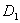
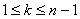

&nbsp;&nbsp;&nbsp;&nbsp;

&nbsp;&nbsp;&nbsp; 2、解析开拓

&nbsp;&nbsp;&nbsp;
[直接解析开拓]如果是两个有公共边界<i>Г</i>的单连通区域<a
href="bword://None" name="_ftnref1" title="">*</a>，和分别在和内单值解析，在<i>Г</i>和<i>Г</i>上连续，并且在<i>Г</i>上，那末称是经过<i>Г</i>向内的直接解析开拓（或延拓）（图10.1）。

&nbsp;&nbsp;&nbsp; [解析开拓与完全解析函数]设为单连通区域， 与有公共边界<i></i>,,对于任何<i>k</i><i></i>,在内单值解析. 与分别在和上连续,并且在上，那末称是<i>f</i>1(<i>z</i>)经过一串区域向内的解析开拓.

&nbsp;&nbsp;&nbsp;
考虑<i>f</i>1(<i>z</i>)经过所有可能的区域串的各种解析开拓，把所有这些解析开拓的值当作一个函数<i>F</i>(<i>z</i>)的值来看。这时称<i>F</i>(<i>z</i>)为完全解析函数，而组成它的那些单值解析函数，即<i>f</i>1(<i>z</i>)的各种解析开拓，称为<i>F</i>(<i>z</i>)的分支.

 

 

<a href="#None" name="_ftn1" title="">*</a> 单连通（或单联）区域就是区域中的任意简单闭曲线（见§3,二的脚注）可以在区域里连续地收缩成一点，或者直观地看成没有洞的区域。有多个洞的区域称为多连通区域.

