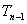

4、 黎曼面·支点与支线

&nbsp;&nbsp;&nbsp;
[<i>n</i>值函数的黎曼面]&nbsp; 有<i>n</i>个分支：

&nbsp;&nbsp;&nbsp;&nbsp;&nbsp;&nbsp;&nbsp;&nbsp;&nbsp;&nbsp;&nbsp;&nbsp;&nbsp;&nbsp;&nbsp;&nbsp;&nbsp;

的各个分支把除去正实轴的<i>z</i>平面相应地单值映射到下面各个扇形区域：

&nbsp;&nbsp;&nbsp;&nbsp;&nbsp;&nbsp;&nbsp;&nbsp;&nbsp;&nbsp;&nbsp;&nbsp;&nbsp;&nbsp;&nbsp;&nbsp;&nbsp;&nbsp;&nbsp;&nbsp;&nbsp;

所以，除去正实轴的<i>z</i>平面上的任一点在平面上的象点都有<i>n</i>个，这时，假设原来<i>z</i>平面上同一位置的<i>z</i>点，可以区别成<i>n</i>个不同的点，它们分别落在<i>n</i>叶沿正实轴剪开的<i>z</i>平面上：

&nbsp;&nbsp;&nbsp;&nbsp;&nbsp;&nbsp;&nbsp;&nbsp;&nbsp;&nbsp;&nbsp;&nbsp;&nbsp;

至于正实轴上的点，只要把<i>T</i>0的下岸（）与<i>T</i>1的上岸相粘接，再把<i>T</i>1的下岸与<i>T</i>2的上岸相粘接，……，最后把的下岸（）与<i>T</i>0的上岸（）相粘接，于是正实轴上的任一点也可以区分成个点了.这样相互粘接的叶沿正实轴剪开的平面，称它是的黎曼面，图10.2是<i>n</i>=4的情况。在它的黎曼面上是单值的了 .

&nbsp;&nbsp;&nbsp; 处是特殊的情况，它连接<i>n</i>叶平面.称它是<i>n</i>-1阶支点，也是阶支点.连接两个支点和的正实轴称为支线.

&nbsp;&nbsp;&nbsp; [多值函数的黎曼面]&nbsp; 函数有无穷多分支：

&nbsp;&nbsp;&nbsp;&nbsp;&nbsp;&nbsp;&nbsp;&nbsp;&nbsp;&nbsp;

与的黎曼面的想法类似，的黎曼面是由无穷多叶沿正实轴剪开的<i>z</i>平面粘接而成，图10.3&nbsp;&nbsp; 是它的示意图.

&nbsp;&nbsp;&nbsp;
函数在它的黎曼面上是单值的了.

&nbsp;&nbsp;&nbsp;
和都是的无穷阶支点.

&nbsp;&nbsp;&nbsp;
一般地，如果函数在区域<i>D</i>内不是单值的，可将区域的概念推广，使在新的区域内，函数变成单值的.这种推广了的区域，称为函数的黎曼面.

