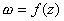

<b>§</b><b>2&nbsp;&nbsp; </b><b>保角映射</b>

一、&nbsp;&nbsp;&nbsp; 一、保角映射及其性质

&nbsp;&nbsp;&nbsp; [保角映射及其充分必要条件] 如果在区域内任一点的邻域里函数的映射满足条件：(i)伸缩性不变（§1，一），（ii）旋转角不变，并保持角的定向（§1，一），那末称函数的映射是区域内的保角映射（保角变换）.

&nbsp;&nbsp;&nbsp; 在区域内是保角映射的充分必要条件是：在内解析且导数在内处处不等于零.

&nbsp;&nbsp;&nbsp; [区域<i>D</i>内保角映射的性质]

&nbsp;&nbsp;&nbsp; 1o&nbsp;&nbsp;
<i>D</i>内任一无穷小圆周的象在相差一个高阶无穷小的程度内是圆周.

&nbsp;&nbsp;&nbsp; 2o&nbsp;&nbsp;
<i>D</i>内两曲线的夹角映射后保持不变（保角性）.

&nbsp;&nbsp;&nbsp; 3o&nbsp;&nbsp;
<i>D</i>内任一区域（包括<i>D</i>自身）的象是区域.

&nbsp;&nbsp;&nbsp; 4o&nbsp;&nbsp;
在<i>D</i>内任一点，不能达到极大值，也不能达到极小值.

5o&nbsp;&nbsp; <i>D</i>内任一点<i>z</i>，都各有一邻域，在这邻域里，是单叶的.

