

二、分式线性映射及其性质

&nbsp;&nbsp;&nbsp; 分式线性函数

<pre>&nbsp;&nbsp;&nbsp;&nbsp;&nbsp;&nbsp;&nbsp;&nbsp;&nbsp;&nbsp;&nbsp;&nbsp;&nbsp;&nbsp;&nbsp;&nbsp;&nbsp;&nbsp;&nbsp;&nbsp;&nbsp;&nbsp;&nbsp;&nbsp;&nbsp; 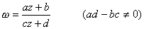</pre>

所实现的映射称为分式线性映射（分式线性变换）.它的逆映射

<pre>&nbsp;&nbsp;&nbsp;&nbsp;&nbsp;&nbsp;&nbsp;&nbsp;&nbsp;&nbsp;&nbsp;&nbsp;&nbsp;&nbsp;&nbsp;&nbsp;&nbsp;&nbsp;&nbsp;&nbsp;&nbsp;&nbsp;&nbsp;&nbsp;&nbsp; 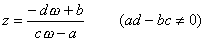</pre>

也是一个分式线性映射.规定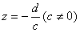与分别对应与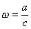，当<i>c</i>=0时，规定对应，那末分式线性映射确定了一个扩充平面与扩充平面之间的一个一对一的对应关系.同时，除了点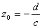是一阶极点外，在扩充平面上处处解析.

&nbsp;&nbsp;&nbsp;
反过来，如果函数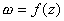在扩充平面上单叶，并且除了一点（这一点是函数的一阶极点）外处处解析，那末必是分式线性函数.

&nbsp;&nbsp;&nbsp; 分式线性映射具有性质：

&nbsp;&nbsp;&nbsp; 1o&nbsp; 在扩充平面上处处有保角性（通过处两直线的夹角定义为两直线经变换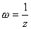后的两曲线在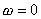处的夹角）.

&nbsp;&nbsp;&nbsp; 2o&nbsp; 在分式线性变换下，圆周仍变为圆周（直线当作半径无限大的圆周）.

&nbsp;&nbsp;&nbsp; 3o&nbsp; 关于圆或直线的对称点（见§2，三的脚注）映射后的象保持对称性.

&nbsp;&nbsp;&nbsp; 4o&nbsp; 存在唯一的分式线性映射把平面上的任意三点 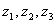分别映射到平面上的 任意三点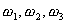，这样的分式线性映射是

<pre>&nbsp;&nbsp;&nbsp;&nbsp;&nbsp;&nbsp;&nbsp;&nbsp;&nbsp;&nbsp;&nbsp;&nbsp;&nbsp;&nbsp;&nbsp;&nbsp;&nbsp;&nbsp;&nbsp;&nbsp;&nbsp;&nbsp;&nbsp;&nbsp;&nbsp;&nbsp; 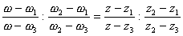</pre>

&nbsp;&nbsp;&nbsp; 5o&nbsp; 扩充平面上的任意一个圆，都可以找到一个分式线性映射将它映射到扩充平面上的任意一个圆.

6o&nbsp;
在分式线性映射下，四点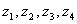的交比保持不变（的交比是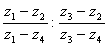）.注意，四点共圆（或共线）的充分必要条件是它们的交比为实数.

