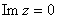
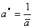

三、简单分式线性映射

<table class=MsoNormalTable border=1 cellspacing=0 cellpadding=0
 style='border-collapse:collapse;border:none'>
 <tr>
  <td width=350 valign=top style='width:262.25pt;border:solid windowtext 1.0pt;
  padding:0mm 5.4pt 0mm 5.4pt'>
  
图形

  </td>
  <td width=293 valign=top style='width:219.7pt;border:solid windowtext 1.0pt;
  border-left:none;padding:0mm 5.4pt 0mm 5.4pt'>
  
说明

  </td>
 </tr>
 <tr>
  <td width=350 valign=top style='width:262.25pt;border:solid windowtext 1.0pt;
  border-top:none;padding:0mm 5.4pt 0mm 5.4pt'>
  
[平移映射]

  
&nbsp;

  
&nbsp;&nbsp;&nbsp;&nbsp;&nbsp; 平面&nbsp;&nbsp;&nbsp;&nbsp;&nbsp;&nbsp;&nbsp;&nbsp;&nbsp;&nbsp;&nbsp;&nbsp;&nbsp;
  平面

  </td>
  <td width=293 valign=top style='width:219.7pt;border-top:none;border-left:
  none;border-bottom:solid windowtext 1.0pt;border-right:solid windowtext 1.0pt;
  padding:0mm 5.4pt 0mm 5.4pt'>
  
&nbsp;
  映射

  
&nbsp;&nbsp;&nbsp;&nbsp;&nbsp;
  &nbsp;&nbsp;&nbsp;&nbsp;&nbsp;（是复常数）

  
把图形平移一个复数

  </td>
 </tr>
 <tr>
  <td width=350 valign=top style='width:262.25pt;border:solid windowtext 1.0pt;
  border-top:none;padding:0mm 5.4pt 0mm 5.4pt'>
  
[伸缩与旋转映射]

  
&nbsp; 

  
&nbsp;&nbsp;&nbsp;&nbsp;&nbsp; 平面&nbsp;&nbsp;&nbsp;&nbsp;&nbsp;&nbsp;&nbsp;&nbsp;&nbsp;&nbsp;&nbsp;&nbsp;
  平面

  </td>
  <td width=293 valign=top style='width:219.7pt;border-top:none;border-left:
  none;border-bottom:solid windowtext 1.0pt;border-right:solid windowtext 1.0pt;
  padding:0mm 5.4pt 0mm 5.4pt'>
  
&nbsp; 映射

  
&nbsp;&nbsp;&nbsp;&nbsp;&nbsp; 

  
把模以原点为中心伸缩倍，再绕原点旋转一个角度

  </td>
 </tr>
 <tr>
  <td width=350 valign=top style='width:262.25pt;border:solid windowtext 1.0pt;
  border-top:none;padding:0mm 5.4pt 0mm 5.4pt'>
  
[反演映射]

  
&nbsp; 

  
&nbsp;&nbsp;&nbsp;&nbsp;&nbsp; 平面&nbsp;&nbsp;&nbsp;&nbsp;&nbsp;&nbsp;&nbsp;&nbsp;&nbsp;&nbsp;&nbsp;&nbsp;
  平面

  </td>
  <td width=293 valign=top style='width:219.7pt;border-top:none;border-left:
  none;border-bottom:solid windowtext 1.0pt;border-right:solid windowtext 1.0pt;
  padding:0mm 5.4pt 0mm 5.4pt'>
  
&nbsp; 映射&nbsp;&nbsp;&nbsp; 

  
把单位圆内（外）一点映射到圆外（内）一点（这两点同在一条过原点的射线上，而且它们的模互为倒数）而后再把这个象点映射到它关于实轴的对称点上.

  
&nbsp; 点和是不动点

  </td>
 </tr>
 <tr>
  <td width=350 valign=top style='width:262.25pt;border:solid windowtext 1.0pt;
  border-top:none;padding:0mm 5.4pt 0mm 5.4pt'>
  
[上半平面到上半平面（或下半平面）的映射]

  
&nbsp;

  
&nbsp;&nbsp;&nbsp;&nbsp;&nbsp; 平面&nbsp;&nbsp;&nbsp;&nbsp;&nbsp;&nbsp;&nbsp;&nbsp;&nbsp;&nbsp;
  平面

  
&nbsp;&nbsp;&nbsp;&nbsp;&nbsp;&nbsp;&nbsp;&nbsp;&nbsp;&nbsp;&nbsp;
  &nbsp;

  
&nbsp;

  
&nbsp;&nbsp;&nbsp;&nbsp;&nbsp; 平面&nbsp;&nbsp;&nbsp;&nbsp;&nbsp;&nbsp;&nbsp;&nbsp;&nbsp;&nbsp;&nbsp;&nbsp;
  平面

  
&nbsp;&nbsp;&nbsp;&nbsp;&nbsp;&nbsp;&nbsp;&nbsp;&nbsp;&nbsp;&nbsp;
  &nbsp;

  </td>
  <td width=293 valign=top style='width:219.7pt;border-top:none;border-left:
  none;border-bottom:solid windowtext 1.0pt;border-right:solid windowtext 1.0pt;
  padding:0mm 5.4pt 0mm 5.4pt'>
  
&nbsp; 映射

  
&nbsp;&nbsp; （i）当都是实数时，平面的实轴映射成平面的实轴

  
&nbsp;（ii）当时，把上半平面映射到上半平面（图（））.

  
&nbsp;（iii）当时，把上半平面映射到下半平面（图（b））.

  </td>
 </tr>
 <tr>
  <td width=350 valign=top style='width:262.25pt;border:solid windowtext 1.0pt;
  border-top:none;padding:0mm 5.4pt 0mm 5.4pt'>
  
图形

  </td>
  <td width=293 valign=top style='width:219.7pt;border-top:none;border-left:
  none;border-bottom:solid windowtext 1.0pt;border-right:solid windowtext 1.0pt;
  padding:0mm 5.4pt 0mm 5.4pt'>
  
说明

  </td>
 </tr>
 <tr>
  <td width=350 valign=top style='width:262.25pt;border:solid windowtext 1.0pt;
  border-top:none;padding:0mm 5.4pt 0mm 5.4pt'>
  
[上半平面到单位圆内的映射]

  
（映射到）

  
&nbsp; &nbsp;&nbsp;&nbsp;&nbsp;&nbsp;

  
&nbsp;&nbsp;&nbsp; 平面 &nbsp;&nbsp;&nbsp;&nbsp;&nbsp;&nbsp;&nbsp;&nbsp;&nbsp;&nbsp;&nbsp;&nbsp;&nbsp;&nbsp;&nbsp;平面

  </td>
  <td width=293 valign=top style='width:219.7pt;border-top:none;border-left:
  none;border-bottom:solid windowtext 1.0pt;border-right:solid windowtext 1.0pt;
  padding:0mm 5.4pt 0mm 5.4pt'>
  
&nbsp;
  映射（是实数，）把给定的上半平面的一点映射到单位圆的圆心，点映射到.

  
&nbsp; 与单位圆内的半径束相对应的是通过点和的那族圆周的弧（落在上半平面的）；与以为圆心的那族同心圆周相对应的是使和成一对对称点<a href="#None" name="_ftnref1"
  title="">*</a>的一族圆周

  </td>
 </tr>
 <tr>
  <td width=350 valign=top style='width:262.25pt;border:solid windowtext 1.0pt;
  border-top:none;padding:0mm 5.4pt 0mm 5.4pt'>
  
[单位圆内到单位圆内的映射]

  
（圆内一点映射到）

  
&nbsp; 

  
&nbsp;&nbsp;&nbsp; 平面&nbsp;&nbsp; &nbsp;&nbsp;&nbsp;&nbsp;&nbsp;&nbsp;&nbsp;&nbsp;平面

  </td>
  <td width=293 valign=top style='width:219.7pt;border-top:none;border-left:
  none;border-bottom:solid windowtext 1.0pt;border-right:solid windowtext 1.0pt;
  padding:0mm 5.4pt 0mm 5.4pt'>
  
&nbsp; 映射&nbsp;
  （是实数，）

  
&nbsp;把已知圆内一点映射到圆的圆心，把点关于单位圆周的对称点映射到关于单位圆的对称点，互相对应的曲线标在图中

  </td>
 </tr>
</table>

 

 

<a href="#None" name="_ftn1" title="">*</a>&nbsp; 点和关于圆周：对称，是指这两点都在同一条过点的射线上，并且满足等式

