

四、对称原理与多边形映射

&nbsp;&nbsp;&nbsp; [对称原理]&nbsp; 设和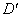是平面上关于它们公共边界（一段圆弧）对称的两个区域，而和是平面上关于它们公共边界（一段圆弧）对称的两个区域.

&nbsp;&nbsp;&nbsp; 如果函数满足下列条件：（i）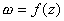将保角映射到；（ii）在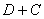上连续，将单叶映射到.那末存在一个函数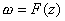具有性质：

&nbsp;&nbsp;&nbsp; 1o&nbsp; 把区域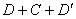保角映射到区域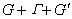.

&nbsp;&nbsp;&nbsp; 2o&nbsp; &nbsp;在内，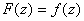.

&nbsp;&nbsp;&nbsp; 3o&nbsp; 将区域内关于对称的两点映射到区域内关于对称的两点.

&nbsp;&nbsp;&nbsp; [多边形映射]&nbsp; 多边形映射是把半平面映射到一个多边形的映射.

&nbsp;&nbsp;&nbsp; 设平面实轴上有个点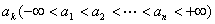，平面上一边形，顶点是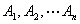，在点处的顶角是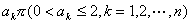，那末施瓦兹-克里斯托弗尔积分

&nbsp;&nbsp;&nbsp;&nbsp;&nbsp;&nbsp;&nbsp;&nbsp;&nbsp;&nbsp;&nbsp;&nbsp;&nbsp;&nbsp;&nbsp;&nbsp;&nbsp;&nbsp;&nbsp;
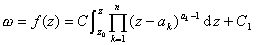

<table cellspacing=0 cellpadding=0 hspace=0 vspace=0>
 <tr>
  <td valign=top align=left style='padding-top:0mm;padding-right:9.0pt;
  padding-bottom:0mm;padding-left:9.0pt'>
  

  
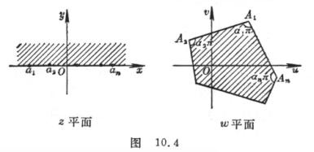

  

  </td>
 </tr>
</table>

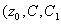是三个常数）把平面的上半平面映射到已给边形内部, 平面实轴上的个点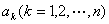分别映射到平面的边形的个顶点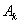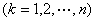（图10.4）.

&nbsp;&nbsp;&nbsp; 如果平面的无穷远点（设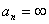）与边形一个顶点（设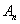）对应，那末映射简化成

<pre>&nbsp;&nbsp;&nbsp;&nbsp;&nbsp;&nbsp;&nbsp;&nbsp;&nbsp;&nbsp;&nbsp;&nbsp;&nbsp;&nbsp;&nbsp;&nbsp;&nbsp;&nbsp;&nbsp;&nbsp;&nbsp;&nbsp; 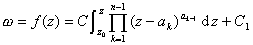</pre>

&nbsp;&nbsp;&nbsp; 例&nbsp;&nbsp; 求矩形映射把平面的上半平面映射到平面上的一个矩形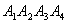的内部（图10.5）.

<table cellspacing=0 cellpadding=0 hspace=0 vspace=0>
 <tr>
  <td valign=top align=left style='padding-top:0mm;padding-right:9.0pt;
  padding-bottom:0mm;padding-left:9.0pt'>
  

  
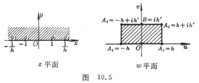

  

  </td>
 </tr>
</table>

&nbsp;&nbsp;
<b>解</b> 首先考虑平面的第一象限映射到矩形内部的右半部分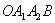.同时让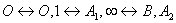的原象记为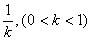.把这个映射关于轴的正半轴应用对称原理，就有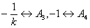，同时根据施瓦兹-克里斯托弗尔积分，所求的映射就是

<pre>&nbsp;&nbsp;&nbsp;&nbsp;&nbsp;&nbsp;&nbsp;&nbsp;&nbsp;&nbsp;&nbsp;&nbsp;&nbsp;&nbsp;&nbsp;&nbsp;&nbsp;&nbsp; 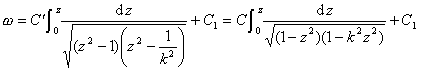</pre>

由于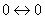，所以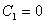，又由于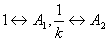.所以

<pre align=left>&nbsp;&nbsp;&nbsp;&nbsp;&nbsp;&nbsp;&nbsp;&nbsp;&nbsp;&nbsp;&nbsp;&nbsp;&nbsp;&nbsp;&nbsp;&nbsp;&nbsp;&nbsp;&nbsp;&nbsp;&nbsp;&nbsp;&nbsp; 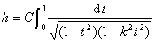&nbsp;&nbsp;&nbsp;&nbsp;&nbsp;&nbsp;&nbsp;&nbsp;&nbsp;&nbsp;&nbsp;&nbsp;&nbsp;&nbsp;&nbsp;&nbsp;&nbsp;&nbsp;&nbsp;&nbsp;&nbsp;&nbsp;&nbsp;&nbsp;&nbsp;&nbsp;&nbsp;&nbsp;&nbsp;&nbsp;&nbsp;(1)</pre><pre>&nbsp;&nbsp;&nbsp;&nbsp;&nbsp;&nbsp;&nbsp;&nbsp;&nbsp;&nbsp; 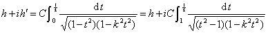</pre><pre>即&nbsp;&nbsp;&nbsp;&nbsp;&nbsp;&nbsp;&nbsp;&nbsp;&nbsp;&nbsp;&nbsp;&nbsp;&nbsp;&nbsp;&nbsp;&nbsp;&nbsp;&nbsp;&nbsp;&nbsp;&nbsp;&nbsp;&nbsp;&nbsp; 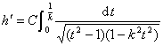&nbsp;&nbsp;&nbsp;&nbsp;&nbsp;&nbsp;&nbsp;&nbsp;&nbsp;&nbsp;&nbsp;&nbsp;&nbsp;&nbsp;&nbsp;&nbsp;&nbsp;&nbsp;&nbsp;&nbsp;&nbsp;&nbsp;&nbsp;&nbsp;&nbsp;&nbsp;&nbsp;&nbsp;&nbsp;&nbsp;&nbsp;(2)</pre>

&nbsp;&nbsp;&nbsp; 设&nbsp;&nbsp; 常数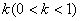已知，适当选择矩形的长和宽（即和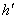），使（1）、（2）式中的常数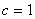.

<pre>&nbsp;&nbsp;&nbsp;&nbsp;&nbsp;&nbsp;&nbsp;&nbsp;&nbsp;&nbsp;&nbsp;&nbsp;&nbsp;&nbsp;&nbsp;&nbsp;&nbsp;&nbsp;&nbsp;&nbsp;&nbsp;&nbsp;&nbsp;&nbsp;&nbsp;&nbsp;&nbsp; </pre>

这是第一类椭圆积分（第十二章§1，十）.

