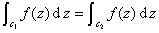
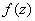
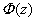
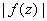
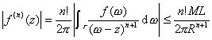

&nbsp;

二、解析函数的积分的性质

&nbsp;&nbsp;&nbsp;
[柯西积分定理]&nbsp; 柯西积分定理有下面几种叙述形式：

&nbsp;&nbsp;&nbsp;
1o&nbsp; 如果函数在一个单连通区域内解析 ，那末沿内任一条简单闭曲线<a href="#None" name="_ftnref1"
title="">*</a><a href="#None" name="_ftnref2" title="">*</a>的积分（图10.6（<i>a</i>））都等于零，即

<pre>&nbsp;&nbsp;&nbsp;&nbsp;&nbsp;&nbsp;&nbsp;&nbsp;&nbsp;&nbsp;&nbsp;&nbsp;&nbsp;&nbsp;&nbsp;&nbsp;&nbsp;&nbsp; </pre>

&nbsp;&nbsp;&nbsp;
2o&nbsp; 如果函数在一个多连通区域内解析，是内任意两条围绕同一洞的闭曲线（图10.6（<i>b</i>）），那末

<pre>&nbsp;&nbsp;&nbsp;&nbsp;&nbsp;&nbsp;&nbsp;&nbsp;&nbsp;&nbsp;&nbsp;&nbsp;&nbsp;&nbsp;&nbsp;&nbsp;&nbsp;&nbsp;&nbsp; </pre>

&nbsp;&nbsp;&nbsp;
3o&nbsp; 如果函数在一个单连通区域内解析 ，在的包<a href="#None" name="_ftnref3" title="">*</a>上连续，那末沿区域边界的积分等于零（图10.7（<i>a</i>）），即

<pre>&nbsp;&nbsp;&nbsp;&nbsp;&nbsp;&nbsp;&nbsp;&nbsp;&nbsp;&nbsp;&nbsp;&nbsp;&nbsp;&nbsp;&nbsp;&nbsp;&nbsp;&nbsp;&nbsp;&nbsp; </pre>

&nbsp;&nbsp;&nbsp;
4o&nbsp; 如果函数在多连通区域内解析，在上连续，那末沿区域边界的积分（图10.7（<i>b</i>））等于零，即

<pre>&nbsp;&nbsp;&nbsp;&nbsp;&nbsp;&nbsp;&nbsp;&nbsp;&nbsp;&nbsp;&nbsp;&nbsp;&nbsp;&nbsp;&nbsp;&nbsp;&nbsp;&nbsp;&nbsp;&nbsp;&nbsp; </pre>

&nbsp;&nbsp;&nbsp;
[不定积分]&nbsp; 导数等于的函数都称为的不定积分（原函数）.

&nbsp;&nbsp;&nbsp; 根据柯西定理，单连通区域内的解析函数沿区域内的任意一条逐段光滑曲线的积分只和曲线的两个端点与有关，与积分的路线无关（图10.8），所以可以记作

<table cellspacing=0 cellpadding=0 hspace=0 vspace=0>
 <tr>
  <td valign=top align=left style='padding-top:0mm;padding-right:9.0pt;
  padding-bottom:0mm;padding-left:9.0pt'>
  

  

  

  </td>
 </tr>
</table>

<pre style='line-height:12.0pt'>&nbsp;&nbsp;&nbsp;&nbsp;&nbsp;&nbsp;&nbsp;&nbsp;&nbsp;&nbsp;&nbsp;&nbsp;&nbsp;&nbsp;&nbsp;&nbsp;&nbsp;&nbsp;&nbsp;&nbsp;&nbsp; </pre>

&nbsp;&nbsp;&nbsp; 设是的任意一个不定积分，那末

<pre style='line-height:12.0pt' align=left>&nbsp;&nbsp;&nbsp;&nbsp;&nbsp;&nbsp;&nbsp;&nbsp;&nbsp;&nbsp;&nbsp;&nbsp;&nbsp;&nbsp;&nbsp;&nbsp;&nbsp;&nbsp;&nbsp;&nbsp;&nbsp; </pre>

&nbsp;&nbsp;&nbsp; [柯西积分公式]&nbsp; 如果函数在简单闭曲线所围成的区域<i>D</i>内解析，在上连续，那末对于<i>D</i>内的任一点，有

<pre>&nbsp;&nbsp;&nbsp;&nbsp;&nbsp;&nbsp;&nbsp;&nbsp;&nbsp;&nbsp;&nbsp;&nbsp;&nbsp;&nbsp;&nbsp;&nbsp;&nbsp;&nbsp;&nbsp;&nbsp;&nbsp;&nbsp;&nbsp; &nbsp;&nbsp;&nbsp;&nbsp;&nbsp;（取正方向）</pre>

这个公式说明了解析函数在区域内任一点的数值可用边界上的数值来确定，也说明了解析函数在区域内部的值和边界值之间有着密切的关系，这在应用上有着重要的意义（图10.9（<i>a</i>））.

柯西积分公式对于有限条简单闭曲线所围成的多连通区域也成立（图10.9（<i>b</i>））. 

&nbsp;&nbsp;&nbsp; 柯西积分公式对于无界区域也成立（图10.9（<i>c</i>））：如果无界区域（包含在内，的边界是有限条简单闭曲线，函数在内除了点外是解析的，而在上除了点外连续，同时存在，则对内任一点有

<pre align=left>&nbsp;&nbsp;&nbsp;&nbsp;&nbsp;&nbsp;&nbsp;&nbsp;&nbsp;&nbsp;&nbsp;&nbsp;&nbsp;&nbsp;&nbsp;&nbsp;&nbsp;&nbsp;&nbsp;&nbsp;&nbsp;&nbsp;&nbsp;&nbsp; </pre><pre align=left>&nbsp;&nbsp;&nbsp;&nbsp;&nbsp;&nbsp;&nbsp;&nbsp;&nbsp;&nbsp;&nbsp;&nbsp;&nbsp;&nbsp;&nbsp;&nbsp;&nbsp;&nbsp;&nbsp;&nbsp;&nbsp;&nbsp;&nbsp;&nbsp;&nbsp;&nbsp;&nbsp;&nbsp;&nbsp;&nbsp;&nbsp;&nbsp;&nbsp;&nbsp;&nbsp;&nbsp;&nbsp;&nbsp;&nbsp;&nbsp;&nbsp;&nbsp;&nbsp;&nbsp;&nbsp;&nbsp;&nbsp;&nbsp;&nbsp;&nbsp;&nbsp;&nbsp;&nbsp;&nbsp;&nbsp;&nbsp;的方向是使在它的左边)</pre>

&nbsp;&nbsp;&nbsp;
[柯西型积分] 设是一条闭或非闭的逐段光滑曲线，是上的连续函数，那末对于不在上的任一点，积分

<pre align=left>&nbsp;&nbsp;&nbsp;&nbsp;&nbsp;&nbsp;&nbsp;&nbsp;&nbsp;&nbsp;&nbsp;&nbsp;&nbsp;&nbsp;&nbsp;&nbsp;&nbsp;&nbsp;&nbsp;&nbsp;&nbsp;&nbsp;&nbsp;&nbsp;&nbsp;&nbsp;&nbsp; </pre>

是的单值函数，称为关于的柯西积型分，记作.

&nbsp;&nbsp;&nbsp;
柯西型积分在任一不包含曲线的点的单连通区域内解析，并且它的高阶导数为

<pre>&nbsp;&nbsp;&nbsp;&nbsp;&nbsp;&nbsp;&nbsp;&nbsp;&nbsp;&nbsp;&nbsp;&nbsp;&nbsp;&nbsp;&nbsp;&nbsp;&nbsp;&nbsp;&nbsp;&nbsp;&nbsp;&nbsp; </pre>

<table cellspacing=0 cellpadding=0 hspace=0 vspace=0>
 <tr>
  <td valign=top align=left style='padding-top:0mm;padding-right:9.0pt;
  padding-bottom:0mm;padding-left:9.0pt'>
  

  

  

  </td>
 </tr>
</table>

&nbsp;&nbsp;&nbsp;
[平均值定理] 如果函数在一个以为圆心，为半径的圆内解析，在圆上连续，那末函数在圆心处的数值等于在圆周上的数值的算术平均值，即

<pre>&nbsp;&nbsp;&nbsp;&nbsp;&nbsp;&nbsp;&nbsp;&nbsp;&nbsp;&nbsp;&nbsp;&nbsp;&nbsp;&nbsp;&nbsp;&nbsp;&nbsp;&nbsp;&nbsp;&nbsp;&nbsp;&nbsp; </pre>

&nbsp;&nbsp;&nbsp;
[最大模定理]&nbsp; 如果函数在有界区域内解析，在上连续，并设在上的最大值是，那末在的边界上存在一点，使，面对于内所有的

<pre>&nbsp;&nbsp;&nbsp;&nbsp;&nbsp;&nbsp;&nbsp;&nbsp;&nbsp;&nbsp;&nbsp;&nbsp;&nbsp;&nbsp;&nbsp;&nbsp;&nbsp;&nbsp;&nbsp;&nbsp; </pre>

&nbsp;&nbsp;&nbsp;
[高阶导数定理] 如果函数在区域内解析，在上连续，那末它在内的每点处存在各阶导数，且有

<pre>&nbsp;&nbsp;&nbsp;&nbsp;&nbsp;&nbsp;&nbsp;&nbsp;&nbsp;&nbsp;&nbsp;&nbsp;&nbsp;&nbsp;&nbsp;&nbsp;&nbsp;&nbsp; &nbsp;&nbsp;&nbsp;（是的边界）</pre>

&nbsp;&nbsp;&nbsp;
这个定理说明了，只要存在，那末高阶导数也存在，这是实变函数一般不具有的性质.

&nbsp;&nbsp;&nbsp;
[柯西不等式] 如果函数在区域内解析，在上连续，并设，点到的边界的最短距离为，的长度为，那末

<pre>&nbsp;&nbsp;&nbsp;&nbsp;&nbsp;&nbsp;&nbsp;&nbsp;&nbsp;&nbsp;&nbsp;&nbsp;&nbsp;&nbsp;&nbsp;&nbsp;&nbsp; </pre>

特别，当是圆时，有不等式

<pre>&nbsp;&nbsp;&nbsp;&nbsp;&nbsp;&nbsp;&nbsp;&nbsp;&nbsp;&nbsp;&nbsp;&nbsp;&nbsp;&nbsp;&nbsp;&nbsp;&nbsp;&nbsp;&nbsp;&nbsp; </pre>

&nbsp;&nbsp;
[刘维尔定理] 如果函数在全平面解析而且有界，那末它一定等于常数.

&nbsp;&nbsp;
[莫累拉定理] 如果函数在一单连通区域内连续，并且沿着内任一条简单闭曲线的积分都等于零，那末在区域内解析.

&nbsp;&nbsp;
[调和函数的泊松公式] 设在圆内调和，在闭圆上连续，是圆内任一点，那末 

<pre align=left>&nbsp;&nbsp;&nbsp;&nbsp;&nbsp;&nbsp;&nbsp;&nbsp;&nbsp;&nbsp;&nbsp;&nbsp;&nbsp;&nbsp;&nbsp;&nbsp;&nbsp;&nbsp;&nbsp; </pre>

在极坐标系中，有形式：

<pre align=left>&nbsp;&nbsp;&nbsp;&nbsp;&nbsp;&nbsp;&nbsp;&nbsp;&nbsp;&nbsp;&nbsp;&nbsp;&nbsp;&nbsp; </pre>

 

 

<a href="#None" name="_ftn1" title="">*</a> * 一连续曲线：的两端点重合，即，同时对于有，称为简单闭曲线，规定曲线的正方向为反时针方向，曲线将平面分成两个区域，一个有界部分称为的内部，无界部分称为的外部.

&nbsp;

<a href="#None" name="_ftn3" title="">*</a>&nbsp; 包的定义见第二十一章§3，二.

